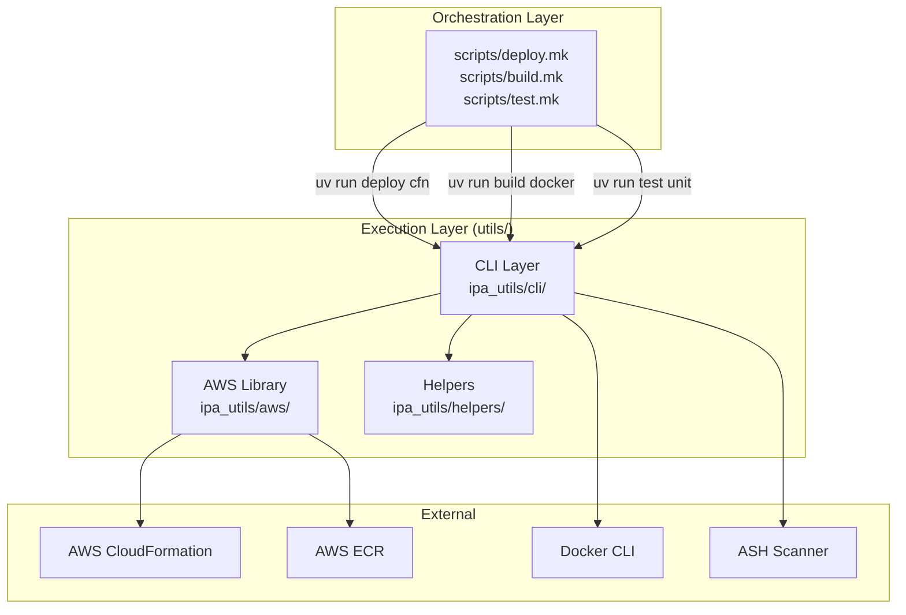

# Execution Layer (`utils/`)

The Execution Layer is a set of Python CLI utilities that perform infrastructure operations against AWS. Generated Makefiles invoke these commands via `uv run`. The same commands work identically on a builder's local machine and in CodeBuild CI/CD pipelines.

## How It Works



Three entry points are registered in `utils/pyproject.toml` under `[project.scripts]`:

| Entry Point | Module | Commands |
|---|---|---|
| `deploy` | `ipa_utils.cli.deploy` | `cfn`, `cfn-delete`, `cfn-outputs`, `cfn-status`, `cfn-events`, `cfn-generate` |
| `build` | `ipa_utils.cli.build` | `docker` |
| `test` | `ipa_utils.cli.test_cmd` | `unit`, `security`, `cfn-lint` |

The `test` entry point maps to `test_cmd.py` (not `test.py`) to avoid a collision with Python's stdlib `test` package.

## Architecture: CLI ↔ Library Separation

The codebase enforces a strict boundary between CLI parsing and business logic:

```
ipa_utils/
├── cli/              # Thin CLI layer — click decorators, argument parsing, output formatting
│   ├── deploy.py     # @click.group() with subcommands
│   ├── build.py
│   └── test_cmd.py
├── aws/              # Business logic — boto3 operations, no click imports (except ClickException)
│   ├── cloudformation.py   # Stack CRUD, polling, output retrieval
│   ├── ecr.py              # ECR auth, docker build/push
│   └── cfn_template.py     # Dynamic template generation
└── helpers/
    └── output.py     # stdout/stderr formatting (info, error, result, table)
```

**CLI modules** (`cli/`) handle:
- Click decorators for argument parsing
- Calling library functions with parsed arguments
- Formatting output for human or machine consumption

**AWS modules** (`aws/`) handle:
- boto3 API operations
- Idempotency logic (create vs. update, rollback recovery)
- Polling and waiting

This separation means you can import and call library functions directly in tests or other Python code without going through the CLI.

## Key Implementation Details

### Idempotent Stack Deployment

`cloudformation.create_or_update_stack()` in `utils/ipa_utils/aws/cloudformation.py` implements the core idempotency logic:

```python
# Simplified flow
status = get_stack_status(session, stack_name)

if status == "ROLLBACK_COMPLETE":
    delete_stack(session, stack_name, wait=True)  # Clean up failed stack
    status = None

if status is None:
    client.create_stack(**kwargs)        # New stack
elif status.endswith("_COMPLETE"):
    client.update_stack(**kwargs)        # Existing stack — update
    # Catches "No updates are to be performed" as success
```

This means `deploy cfn` is always safe to run — it handles create, update, rollback recovery, and no-op cases.

### Custom Polling (Not boto3 Waiters)

The `_wait_for_stack()` function uses a custom polling loop instead of boto3 waiters. boto3 waiters have a fixed ~30 minute timeout that can't be configured; the custom loop supports a configurable timeout (default 60 minutes) needed for slow resources like CloudFront distributions.

### Inter-Stack Wiring via Outputs

The `cfn-outputs` command enables Makefiles to wire stack outputs as parameters to dependent stacks:

```makefile
deploy-lambda: deploy-dynamodb deploy-cognito
	$(eval TABLE := $(shell uv run deploy cfn-outputs \
		--stack-name $(APP_NAMESPACE)-$(APP_ENV)-dynamodb --output-key TableName))
	$(eval POOL_ARN := $(shell uv run deploy cfn-outputs \
		--stack-name $(APP_NAMESPACE)-$(APP_ENV)-cognito --output-key UserPoolArn))
	uv run deploy cfn \
		--stack-name $(APP_NAMESPACE)-$(APP_ENV)-lambda \
		--template infra/cfn/lambda.yml \
		--parameter-overrides TableName=$(TABLE) UserPoolArn=$(POOL_ARN)
```

When `--output-key` is specified, the command prints the raw value only (no key prefix), making it suitable for `$(shell ...)` capture.

### Credential Resolution

Commands never read `.env` or manage credentials. All AWS operations go through boto3's default credential chain:

1. Environment variables (`AWS_ACCESS_KEY_ID`, `AWS_SECRET_ACCESS_KEY`)
2. AWS CLI profile (via `--profile` option or `AWS_PROFILE` env var)
3. Instance/container role (CodeBuild execution role in CI/CD)

The `--profile` option creates a named boto3 session; omitting it uses the default chain.

### Output Convention

All commands follow a consistent output pattern defined in `utils/ipa_utils/helpers/output.py`:

- **stdout** — Machine-consumable results (stack outputs, status strings, file paths)
- **stderr** — Human-readable progress and errors (via `click.echo(..., err=True)`)
- **Exit 0** — Success
- **Exit 1** — Failure with actionable error message

This matters because Makefiles use `$(shell ...)` to capture stdout, so progress messages must not pollute it.

## Adding a New Command

1. **Add the library function** in `ipa_utils/aws/` — implement the business logic
2. **Add the CLI subcommand** in `ipa_utils/cli/` — decorate with `@<group>.command()`
3. **Write tests** in `tests/` — use moto for AWS mocking, CliRunner for CLI testing
4. **Update docs** — `utils/CLAUDE.md` (agent reference) and `utils/README.md` (human reference)

Example: adding a `deploy cfn-validate` subcommand:

```python
# ipa_utils/cli/deploy.py
@main.command("cfn-validate")
@click.option("--template", required=True, type=click.Path(exists=True))
@click.option("--region", default=None, envvar="AWS_DEFAULT_REGION")
@click.option("--profile", default=None)
def cfn_validate(template: str, region: str | None, profile: str | None) -> None:
    """Validate a template against the CloudFormation API."""
    session = get_boto3_session(profile=profile, region=region)
    # Call library function...
```

## Testing

Tests live in `utils/tests/` and run via:

```bash
cd utils/
uv run pytest tests/ -v
```

### Test Stack

| Tool | Purpose |
|---|---|
| **pytest** | Test runner |
| **moto** (`mock_aws`) | AWS service mocking — CloudFormation, ECR, IAM, STS |
| **click.testing.CliRunner** | CLI invocation testing without subprocess |
| **unittest.mock** | Mocking subprocess calls (Docker CLI, ASH) |

### Conventions

- **One test file per subcommand** — `test_deploy_cfn.py`, `test_deploy_cfn_delete.py`, etc.
- **Shared fixtures** in `tests/conftest.py` — `cli_runner`, `aws_session`, `cfn_client`, `template_path`
- **Library tests** test the `ipa_utils/aws/` functions directly with moto
- **CLI tests** test through CliRunner to verify argument parsing and output formatting
- **Test fixture template** at `tests/fixtures/simple-stack.yml` — a minimal valid DynamoDB CloudFormation template

### Example Test Pattern

```python
# tests/test_deploy_cfn_status.py
from moto import mock_aws
from ipa_utils.aws.cloudformation import create_or_update_stack, get_stack_status

class TestGetStackStatus:
    @mock_aws
    def test_existing_stack(self, aws_session, template_path):
        create_or_update_stack(session=aws_session, stack_name="test", template_path=template_path)
        status = get_stack_status(aws_session, "test")
        assert status == "CREATE_COMPLETE"

    @mock_aws
    def test_nonexistent_stack(self, aws_session):
        status = get_stack_status(aws_session, "nonexistent")
        assert status is None
```

## Dependencies

| Package | Purpose | Layer |
|---|---|---|
| `boto3` | AWS SDK for CloudFormation, ECR, STS | Runtime |
| `click` | CLI framework (groups, subcommands, options) | Runtime |
| `pyyaml` | Template parsing and generation | Runtime |
| `cfn-lint` | CloudFormation template validation | Runtime |
| `pytest` | Test runner | Dev |
| `moto` | AWS service mocking | Dev |
| `pytest-cov` | Coverage reporting | Dev |

External tools (not Python packages):
- **Docker CLI** — required by `build docker`
- **ASH** — required by `test security` (graceful error if missing)

## References

- [utils/README.md](/utils/README.md) — Full CLI reference with all options and examples
- [utils/CLAUDE.md](/utils/CLAUDE.md) — Agent quick reference
- [Technical Specification](/.context/aicode-technical.md) — Authoritative CLI interface contract (lines 287–297)
- [Feature Spec](/docs/working/specs/utils-uv-commands/README.md) — Requirements and scope
