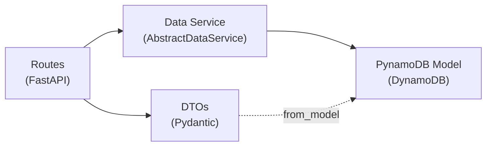

# Data Access Using PynamoDB ORM

DynamoDB data access in app-lib follows a three-layer pattern: **PynamoDB models** define the table schema, **data services** implement a generic CRUD interface, and **DTOs** translate between DynamoDB types and REST API shapes. All three layers live inside each feature directory.

## Overview



A feature's data access stack consists of four files:

| File | Layer | Responsibility |
|------|-------|---------------|
| `model/{name}_table.py` | PynamoDB Model | Declares the DynamoDB table schema and naming |
| `service/{name}_data_service.py` | Data Service | Implements `AbstractDataService[T]` with CRUD operations |
| `routes/{name}_dto.py` | DTOs | Converts PynamoDB models to Pydantic response objects |
| `routes/{name}_routes.py` | Routes | Instantiates the data service and exposes REST endpoints |

Routes call the data service for persistence. DTOs convert PynamoDB model instances (which use `Decimal` for numbers) into JSON-safe Pydantic objects via a `from_model()` classmethod.

## Key Concepts

### Table Naming Convention

Every PynamoDB model uses `PynamodbUtil.env_table_name()` to derive its DynamoDB table name at import time:

```python
# common/util/pynamodb_util.py
table_name = f"{APP_NAMESPACE}_{APP_ENV}_{base_name}"
# Example: "myapp_dev_passengers"
```

| `APP_NAMESPACE` | `APP_ENV` | `base_name` | Result |
|-----------------|-----------|-------------|--------|
| `myapp` | `dev` | `passengers` | `myapp_dev_passengers` |
| `myapp` | `prod` | `jobs` | `myapp_prod_jobs` |
| *(empty)* | `dev` | `passengers` | `dev_passengers` |

The utility reads both variables from `os.environ`. `APP_ENV` defaults to `"dev"` when unset. These values originate from the `.env` file and the CloudFormation tier stacks set them in the deployed Lambda configuration.

:::warning
Never hardcode a DynamoDB table name in a PynamoDB model. Always use `PynamodbUtil.env_table_name()`. Hardcoded names break multi-environment deployments.
:::

### AbstractDataService\[T\]

All feature data services extend `AbstractDataService[T]` from `common/data/`. This generic interface defines six CRUD operations:

| Method | Signature | Semantics |
|--------|-----------|-----------|
| `get` | `(id: str) -> Optional[T]` | Lookup by primary key; returns `None` if not found |
| `save` | `(entity: T) -> None` | Upsert — creates or overwrites |
| `delete` | `(id: str) -> bool` | Delete by key; returns `True` if deleted, `False` if not found |
| `list` | `(limit: int = 100) -> list[T]` | Table scan up to `limit` |
| `query` | `(limit: int = 100, **filters) -> list[T]` | Scan with in-memory filter |
| `count` | `() -> int` | Total item count |

The interface is backend-agnostic — `T` can be a PynamoDB model, Pydantic model, or any Python object. DynamoDB is the current implementation. The abstraction supports swapping to PostgreSQL or an in-memory store without changing route code.

### Decimal Conversion in DTOs

PynamoDB returns `Decimal` for all `NumberAttribute` values. JSON serialization requires explicit conversion to `int` or `float`. Each feature's DTO defines a `from_model()` classmethod that handles this:

```python
# features/passengers/routes/passenger_dto.py
class TitanicPassengerResponse(BaseModel):
    model_config = ConfigDict(from_attributes=True)

    pclass: int
    age: float | None = None
    # ...

    @classmethod
    def from_model(cls, model) -> "TitanicPassengerResponse":
        return cls(
            pclass=int(model.pclass),
            age=float(model.age) if model.age is not None else None,
            # ...
        )
```

Use `int()` for integer attributes and `float()` for decimal attributes. Check `is not None` before converting nullable fields to avoid `TypeError`.

## Usage

### Defining a PynamoDB Model

Each feature defines its model in `features/{name}/model/{name}_table.py`:

```python
# features/passengers/model/passenger_table.py
from pynamodb.attributes import NumberAttribute, UnicodeAttribute
from pynamodb.models import Model

from app_lib.common.util.pynamodb_util import PynamodbUtil


class TitanicPassengerTable(Model):
    class Meta:
        table_name = PynamodbUtil.env_table_name("passengers")

    id = UnicodeAttribute(hash_key=True)
    name = UnicodeAttribute()
    pclass = NumberAttribute()
    survived = NumberAttribute()
    sex = UnicodeAttribute()
    age = NumberAttribute(null=True)
    # ... additional attributes
```

- The `hash_key=True` attribute is the DynamoDB partition key.
- Use `UnicodeAttribute` for strings and `NumberAttribute` for numbers. Both support `null=True` for optional fields.
- The `Meta.table_name` must always use `PynamodbUtil.env_table_name()`.

### Implementing a Data Service

Each feature implements `AbstractDataService[T]` in `features/{name}/service/{name}_data_service.py`:

```python
# features/passengers/service/passenger_data_service.py
from app_lib.common.data.abstract_data_service import AbstractDataService
from app_lib.features.passengers.model.passenger_table import TitanicPassengerTable


class TitanicPassengerDataService(AbstractDataService[TitanicPassengerTable]):
    def get(self, id: str):
        try:
            return TitanicPassengerTable.get(id)
        except TitanicPassengerTable.DoesNotExist:
            return None

    def save(self, entity):
        entity.save()

    def delete(self, id: str):
        item = self.get(id)
        if item:
            item.delete()
            return True
        return False

    def list(self, limit=100):
        return list(TitanicPassengerTable.scan(limit=limit))

    def query(self, limit=100, **filters):
        items = TitanicPassengerTable.scan(limit=limit)
        if not filters:
            return list(items)
        return [
            i for i in items
            if all(getattr(i, k, None) == v for k, v in filters.items())
        ]

    def count(self):
        return TitanicPassengerTable.count()
```

Implementation patterns:

- **`get()`** — Catch `DoesNotExist` and return `None`. Do not let the PynamoDB exception propagate to the route layer.
- **`delete()`** — Perform a get-then-delete because PynamoDB requires the model instance to call `.delete()`.
- **`list()` and `query()`** — Use `scan()`, which reads the full table. This is appropriate for POC-scale datasets. For larger tables, add a Global Secondary Index (GSI) and use `YourTable.query()` with a hash key condition.
- **`query()`** — Apply `**filters` as in-memory attribute matching after the scan.

### Using a Data Service in Routes

To use a data service in a FastAPI route, instantiate it at module level and call its methods:

```python
# features/passengers/routes/passenger_routes.py
from app_lib.features.passengers.service.passenger_data_service import (
    TitanicPassengerDataService,
)

router = APIRouter(prefix="/api/v1", tags=["passengers"])
data_service = TitanicPassengerDataService()

@router.get("/passengers")
def list_passengers(limit: int = 100):
    passengers = data_service.list(limit=limit)
    return [TitanicPassengerResponse.from_model(p) for p in passengers]

@router.get("/passengers/{ticket:path}")
def get_passenger(ticket: str):
    passenger = data_service.get(ticket)
    if not passenger:
        raise HTTPException(status_code=404)
    return TitanicPassengerResponse.from_model(passenger)
```

Route handlers convert PynamoDB models to DTOs via `from_model()` before returning them. This keeps the `Decimal` conversion logic in one place.

## Extending / Maintaining

### Adding a New Table

1. Create the PynamoDB model in `features/{name}/model/{name}_table.py` using `PynamodbUtil.env_table_name()`.
2. Implement `AbstractDataService[YourTable]` in `features/{name}/service/{name}_data_service.py`.
3. Create Pydantic DTOs with a `from_model()` classmethod in `features/{name}/routes/{name}_dto.py`.
4. Enable the DynamoDB table in the appropriate CloudFormation tier stack via a feature flag (e.g., `EnablePassengersTable=true` on the backend stack, `EnableJobsTable=true` on the queue stack).

See `features/CLAUDE.md` for the full feature-addition recipe.

### Key Files

| File | Purpose |
|------|---------|
| `common/data/abstract_data_service.py` | Generic CRUD interface |
| `common/util/pynamodb_util.py` | `env_table_name()` table naming utility |
| `features/{name}/model/{name}_table.py` | PynamoDB model (schema and table config) |
| `features/{name}/service/{name}_data_service.py` | Data service (CRUD implementation) |
| `features/{name}/routes/{name}_dto.py` | Pydantic DTOs with `from_model()` |

### Testing Data Services

Tests mock PynamoDB model methods using `unittest.mock.patch.object`. No live DynamoDB connection is needed:

```python
# tests/features/passengers/test_passenger_data_service.py
@patch.object(TitanicPassengerTable, "get")
def test_get_not_found(mock_get, repository):
    mock_get.side_effect = TitanicPassengerTable.DoesNotExist
    result = repository.get("INVALID")
    assert result is None

@patch.object(TitanicPassengerTable, "scan")
def test_query_by_class(mock_scan, repository, mock_passenger):
    mock_scan.return_value = [mock_passenger]
    result = repository.query(pclass=1, limit=10)
    assert len(result) == 1
```

Patch the model class methods (`get`, `scan`, `count`), not the service methods. This validates that the service correctly delegates to PynamoDB.

## Known Issues

- **`query()` uses table scan with in-memory filtering.** This works for POC-scale datasets but does not scale. For production workloads, add GSIs to the CloudFormation template and use PynamoDB `Model.query()` with hash key conditions instead of `Model.scan()`.
- **No pagination support.** `list()` and `query()` accept a `limit` parameter but do not return a continuation token. Add `last_evaluated_key` handling if paginated responses are needed.

## References

- [PynamoDB documentation](https://pynamodb.readthedocs.io/)
- `app-lib/src/app_lib/common/data/abstract_data_service.py` — interface definition
- `app-lib/src/app_lib/common/util/pynamodb_util.py` — table naming utility
- `app-lib/src/app_lib/features/passengers/` — reference implementation
- `app-lib/src/app_lib/features/CLAUDE.md` — feature-addition recipe
