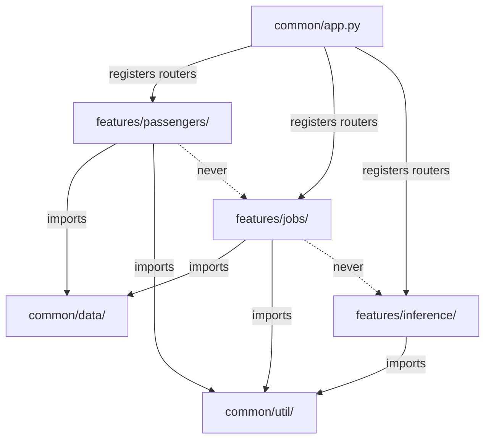

# Feature-Centric Directory Structure

The `app-lib/` codebase organizes code by business feature rather than by technical layer. Each feature is a self-contained directory under `features/` with its own model, service, routes, and optional utilities. Shared infrastructure lives in `common/`.

## Overview

Two top-level packages divide the codebase by responsibility: `common/` holds shared infrastructure, `features/` holds self-contained business features.

```
src/app_lib/
├── common/               # Shared infrastructure (app, auth, data layer, utilities)
│   ├── app.py            # FastAPI app — middleware + feature router registration
│   ├── auth.py           # JWT auth middleware
│   ├── data/             # AbstractDataService[T] — generic CRUD interface
│   ├── lambda/           # Lambda entry points (copied to container root at build)
│   ├── service/          # Shared services (inference, etc.)
│   └── util/             # Path resolution, PynamoDB naming, observability, Jinja2
│
├── features/             # Business features (self-contained)
│   ├── passengers/       # CRUD demo — reference implementation
│   ├── jobs/             # SQS background job submission and tracking
│   └── inference/        # Stateless streaming inference via Bedrock
│
└── assets/               # Static datasets and templates
```

Every feature follows the same internal layout:

```
features/{name}/
├── __init__.py                  # Docstring: what this feature does, how to remove it
├── model/
│   └── {name}_table.py          # PynamoDB model
├── service/
│   └── {name}_data_service.py   # Extends AbstractDataService[T]
├── routes/
│   ├── {name}_routes.py         # FastAPI router (prefix="/api/v1")
│   └── {name}_dto.py            # Pydantic request/response DTOs
└── util/                        # Feature-specific utilities (optional)
```

Not every feature requires all subdirectories. The `inference` feature has only `routes/` because it is stateless. The structure adapts to the complexity of the feature.

Three features exist today:

| Feature | Directory | Purpose | Subdirectories |
|---------|-----------|---------|----------------|
| Passengers | `features/passengers/` | Titanic passenger CRUD demo — reference implementation | `model/`, `service/`, `routes/`, `util/` |
| Jobs | `features/jobs/` | SQS background job submission and tracking | `model/`, `service/`, `routes/` |
| Inference | `features/inference/` | Stateless streaming inference via Bedrock Converse API | `routes/` only |

## Key Concepts

### Dependency Rules

Three rules govern how modules import from each other:

1. **Features import from `common/`** — shared infrastructure is the foundation.
2. **Features never import from other features** — no cross-feature coupling.
3. **`common/` never imports from `features/`** — except `app.py` (router registration) and `lambda/s3_handler.py` (feature service usage).



### Registration Point

`common/app.py` is the single integration point. Features connect to the application via two lines — an import and a router registration:

```python
# Feature routers — delete import + include_router to disconnect a feature
from app_lib.features.passengers.routes.passenger_routes import (
    router as passengers_router,
)
# ...
app.include_router(passengers_router)
```

### Data Layer Contract

Features that persist data extend `AbstractDataService[T]` from `common/data/`. This generic interface defines six operations: `get`, `save`, `delete`, `list`, `query`, and `count`. The current implementation uses PynamoDB (DynamoDB), but the abstraction supports swapping backends.

All PynamoDB models must use `PynamodbUtil.env_table_name()` for table naming. This prefixes the base name with `{APP_NAMESPACE}_{APP_ENV}_`, ensuring namespace isolation across environments.

### Test Mirroring

Tests mirror the source directory structure:

```
tests/
├── features/
│   ├── passengers/       # Mirrors src/app_lib/features/passengers/
│   ├── jobs/             # Mirrors src/app_lib/features/jobs/
│   └── inference/        # Mirrors src/app_lib/features/inference/
├── common/
│   └── util/             # Mirrors src/app_lib/common/util/
└── conftest.py           # Shared fixtures
```

### Key Files

| File | Role |
|------|------|
| `common/app.py` | Router registration — the only file that touches all features |
| `common/data/abstract_data_service.py` | CRUD contract — all data services implement this |
| `common/util/pynamodb_util.py` | DynamoDB table naming — all models depend on this |

### Non-Obvious Coupling

- **Lambda handlers** in `common/lambda/` are `COPY`ed to the container root by the Dockerfile. They import modules by name, not by package path. Moving them changes the build.
- **`PathUtil.lib_root()`** resolves via three `.parent` hops from `common/util/path_util.py`. Moving that file requires adjusting the traversal depth.
- **OpenAPI codegen** (`npm run codegen` in `web-client/`) generates typed RTK Query hooks from the FastAPI app's `/openapi.json`. Adding or changing routes in a feature automatically surfaces in the generated API client after re-running codegen.

## Usage

### Adding a New Feature

1. Create the directory structure under `features/{name}/` with `__init__.py` files in each subdirectory.

2. Define a PynamoDB model using `PynamodbUtil.env_table_name()`:

   ```python
   # features/{name}/model/{name}_table.py
   from pynamodb.models import Model
   from app_lib.common.util.pynamodb_util import PynamodbUtil

   class YourTable(Model):
       class Meta:
           table_name = PynamodbUtil.env_table_name("your_table")
   ```

3. Implement a data service extending `AbstractDataService[T]`:

   ```python
   # features/{name}/service/{name}_data_service.py
   from app_lib.common.data.abstract_data_service import AbstractDataService

   class YourDataService(AbstractDataService[YourTable]):
       def get(self, id: str):
           try:
               return YourTable.get(id)
           except YourTable.DoesNotExist:
               return None
       # ... implement save, delete, list, query, count
   ```

4. Create a FastAPI router with Pydantic DTOs:

   ```python
   # features/{name}/routes/{name}_routes.py
   from fastapi import APIRouter

   router = APIRouter(prefix="/api/v1", tags=["{name}"])
   ```

5. Register in `common/app.py` — add the import and `app.include_router()` call alongside existing registrations.

6. Add tests in `tests/features/{name}/` mirroring the feature structure.

7. Enable a DynamoDB table via feature flag in the appropriate tier stack if the feature requires persistence (for example, `EnablePassengersTable=true` on the backend tier).

### Removing a Feature

1. Delete the feature directory (`features/{name}/`).
2. Remove the two registration lines from `common/app.py`.
3. Delete the test directory (`tests/features/{name}/`).
