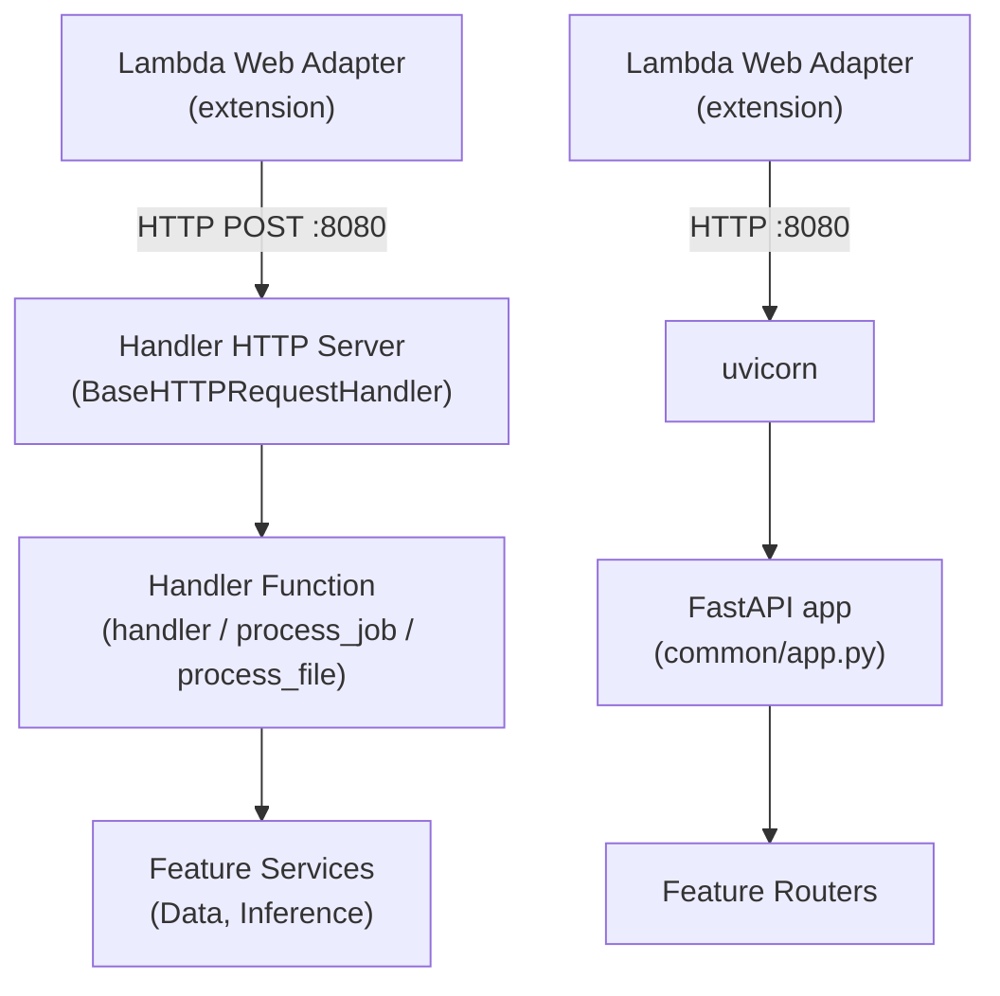

# Lambda Handlers

Lambda handlers in `app-lib/src/app_lib/common/lambda/` are the entry points for all AWS Lambda functions in an IPA project. A single container image serves all handler types — the deployed Lambda selects its entry point via the `CMD` override at deploy time.

## Overview



All handlers use **Lambda Web Adapter (LWA)** — an AWS-provided Lambda extension that proxies the Lambda runtime API to a local HTTP server on port 8080. This decouples application code from the Lambda runtime, allowing the same container image to run locally or in Lambda without code changes.

| Handler | File | Entry Point | Trigger |
|---------|------|-------------|---------|
| REST API | `api_lambda_handler.py` | `uvicorn api_lambda_handler:app` | API Gateway HTTP |
| Generic event | `lambda_handler.py` | `python lambda_handler.py` | Any Lambda event |
| SQS worker | `sqs_handler.py` | `python sqs_handler.py` | SQS queue |
| S3 processor | `s3_handler.py` | `python s3_handler.py` | S3 via SQS |

## Key Concepts

### Lambda Web Adapter Pattern

Lambda Web Adapter converts Lambda invocations into HTTP requests to `localhost:8080`. This means every handler — whether it serves REST API traffic or processes SQS messages — runs as an HTTP server inside the container.

The adapter is installed in the container image at build time:

```dockerfile
# infra/containers/rest-lambda/Dockerfile
COPY --from=public.ecr.aws/awsguru/aws-lambda-adapter:1.0.0-rc1 \
     /lambda-adapter /opt/extensions/lambda-adapter
```

For event-based handlers (SQS, S3, generic), LWA operates in **pass-through mode**: the raw Lambda event is POSTed as JSON to the handler's HTTP endpoint. This requires the environment variable `AWS_LWA_PASS_THROUGH_PATH=/events`.

For the REST API handler, LWA proxies API Gateway HTTP requests directly to uvicorn.

### HTTP Bridge Pattern

Event handlers (all except REST) use the same bridge pattern: a `BaseHTTPRequestHandler` subclass that receives the Lambda event as an HTTP POST, calls the handler function, and returns a JSON response.

```python
# common/lambda/lambda_handler.py
class _Handler(BaseHTTPRequestHandler):
    def do_POST(self):
        length = int(self.headers.get("Content-Length", 0))
        body = self.rfile.read(length) if length else b"{}"
        event = json.loads(body)
        result = handler(event)
        response_body = json.dumps(result).encode()
        self.send_response(200)
        self.send_header("Content-Type", "application/json")
        self.send_header("Content-Length", str(len(response_body)))
        self.end_headers()
        self.wfile.write(response_body)

    def do_GET(self):
        """Health check for Lambda Web Adapter readiness."""
        self.send_response(200)
        self.end_headers()

    def log_message(self, format, *args):
        """Suppress default stderr logging — loguru handles it."""
        pass

if __name__ == "__main__":
    server = HTTPServer(("0.0.0.0", 8080), _Handler)
    server.serve_forever()
```

Every event handler implements three methods:

- **`do_POST`** — Receives the Lambda event, calls the handler function, returns JSON.
- **`do_GET`** — Returns 200 for LWA's readiness probe.
- **`log_message`** — Suppressed so loguru handles all logging.

### Container Image and Entry Points

A single Dockerfile (`infra/containers/rest-lambda/Dockerfile`) builds one image for all handler types. Handler files are copied to the container root so they are importable as top-level modules:

```dockerfile
# Copy Lambda entry points to container root
COPY app-lib/src/app_lib/common/lambda/ ./

# Default: REST API via uvicorn
CMD ["python", "-m", "uvicorn", "api_lambda_handler:app", \
     "--host", "0.0.0.0", "--port", "8080"]
```

The default `CMD` starts the REST API handler. To deploy a different handler, override `CMD` via the CloudFormation `ImageCommand` parameter:

| Handler | CMD Override |
|---------|-------------|
| REST API | `python -m uvicorn api_lambda_handler:app --host 0.0.0.0 --port 8080` (default) |
| Generic event | `python lambda_handler.py` |
| SQS worker | `python sqs_handler.py` |
| S3 processor | `python s3_handler.py` |

## Handler Reference

### REST API Handler

`api_lambda_handler.py` is the simplest handler — it re-exports the FastAPI `app` from `common/app.py`. Uvicorn serves the app, and LWA proxies API Gateway requests to it.

```python
# common/lambda/api_lambda_handler.py
from app_lib.common.app import app  # noqa: F401
```

The entire middleware stack (CORS, JWT auth, observability) and all feature routers are included via the FastAPI app. See [REST API](rest-api.md) for details on routes, middleware, and DTOs.

### Generic Event Handler

`lambda_handler.py` is a template for custom event processing. The demo implementation supports two actions:

```python
# common/lambda/lambda_handler.py
def handler(event, context=None):
    action = event.get("action", "echo")

    if action == "echo":
        return {
            "statusCode": 200,
            "body": json.dumps({"action": "echo", "data": event.get("data")}),
        }

    if action == "info":
        info = {
            "action": "info",
            "function_name": os.environ.get("AWS_LAMBDA_FUNCTION_NAME"),
            "memory_limit_mb": os.environ.get("AWS_LAMBDA_FUNCTION_MEMORY_SIZE"),
        }
        return {"statusCode": 200, "body": json.dumps(info)}

    return {"statusCode": 400, "body": json.dumps({"error": f"Unknown action: {action}"})}
```

To customize, replace the action dispatch logic in `handler()` with your own event processing. The HTTP bridge and server startup code do not need changes.

### SQS Worker Handler

`sqs_handler.py` processes background jobs from an SQS queue. Each SQS message contains a `job_id`. The handler loads the job from DynamoDB, runs Bedrock inference, and writes the result back.

**State transitions:** `PENDING` → `PROCESSING` → `COMPLETED` | `FAILED`

```python
# common/lambda/sqs_handler.py
def process_job(job_id: str):
    job = job_service.get(job_id)
    if not job:
        logger.error(f"Job not found: {job_id}")
        return

    job.status = "PROCESSING"
    job_service.save(job)

    try:
        input_data = json.loads(job.input_data)
        passenger = passenger_service.get(input_data["ticket"])
        result = analysis_service.analyze(passenger_dict)

        passenger.analysis = json.dumps(result)
        passenger_service.save(passenger)

        job.status = "COMPLETED"
    except Exception as e:
        logger.error(f"Job {job_id} failed: {e}")
        job.status = "FAILED"
        job.error = str(e)

    job_service.save(job)
```

The `do_POST` method iterates over SQS records and calls `process_job()` for each:

```python
def do_POST(self):
    # ...
    for record in body.get("Records", []):
        msg = json.loads(record["body"])
        process_job(msg["job_id"])
```

**Environment variables required:** `AWS_LWA_PASS_THROUGH_PATH=/events`

### S3 Processor Handler

`s3_handler.py` processes S3 file uploads delivered via SQS notifications. SQS records contain a nested S3 event that must be unwrapped:

```
SQS Record → body (JSON string) → S3 Event → Records[] → bucket + key
```

```python
# common/lambda/s3_handler.py
def do_POST(self):
    # ...
    for sqs_record in body.get("Records", []):
        s3_event = json.loads(sqs_record["body"])
        for s3_record in s3_event.get("Records", []):
            total += handle_s3_event(s3_record)
```

The demo implementation downloads CSV files from S3 and processes each row through a data service:

```python
def process_file(bucket: str, key: str) -> int:
    response = s3.get_object(Bucket=bucket, Key=key)
    content = response["Body"].read().decode("utf-8")

    reader = csv.DictReader(io.StringIO(content))
    processed = 0
    for row in reader:
        ticket = row.get("ticket")
        if not ticket:
            continue
        passenger = passenger_service.get(ticket)
        if passenger:
            passenger.analysis = json.dumps(result)
            passenger_service.save(passenger)
            processed += 1
    return processed
```

**Environment variables required:** `AWS_LWA_PASS_THROUGH_PATH=/events`

## Usage

### Running Locally

To run any handler locally without Lambda:

```bash
# REST API handler
cd app-lib && python -m uvicorn app_lib.common.lambda.api_lambda_handler:app --reload --port 8080

# Event handler (generic, SQS, or S3)
cd app-lib && python src/app_lib/common/lambda/lambda_handler.py
```

Event handlers listen on `http://localhost:8080`. Send test events with `curl`:

```bash
# Generic handler — echo action
curl -X POST http://localhost:8080 \
  -H "Content-Type: application/json" \
  -d '{"action": "echo", "data": {"message": "hello"}}'

# SQS handler — simulate SQS event
curl -X POST http://localhost:8080 \
  -H "Content-Type: application/json" \
  -d '{"Records": [{"body": "{\"job_id\": \"test-123\"}"}]}'
```

### Creating a New Event Handler

1. Copy `lambda_handler.py` to a new file in `common/lambda/` (e.g., `my_handler.py`).

2. Replace the `handler()` function with your processing logic:

   ```python
   def handler(event, context=None):
       # Your event processing here
       return {"statusCode": 200, "body": json.dumps({"result": "ok"})}
   ```

3. The `_Handler` class and `__main__` block can remain unchanged — they work for any handler function that accepts an event dict and returns a response dict.

4. Deploy by overriding the `CMD` in the CloudFormation template:

   ```yaml
   ImageCommand: "python,my_handler.py"
   ```

5. Set the environment variable for LWA pass-through mode:

   ```yaml
   AWS_LWA_PASS_THROUGH_PATH: /events
   ```

## Extending / Maintaining

### Key Files

| File | Purpose |
|------|---------|
| `app-lib/src/app_lib/common/lambda/api_lambda_handler.py` | REST API entry point |
| `app-lib/src/app_lib/common/lambda/lambda_handler.py` | Generic event handler template |
| `app-lib/src/app_lib/common/lambda/sqs_handler.py` | SQS job processor |
| `app-lib/src/app_lib/common/lambda/s3_handler.py` | S3 file processor |
| `infra/containers/rest-lambda/Dockerfile` | Container build with LWA |
| `app-lib/src/app_lib/common/app.py` | FastAPI app (used by REST handler) |

### Non-Obvious Coupling

- **Container root copy** — The Dockerfile copies `common/lambda/` contents to the container root (`/app/`). Handlers import `app_lib` modules by package path (e.g., `from app_lib.common.app import app`), but the handler files themselves are invoked as top-level scripts. Adding a new handler file requires no Dockerfile change — the directory-level `COPY` picks it up automatically.
- **LWA pass-through mode** — Event handlers require `AWS_LWA_PASS_THROUGH_PATH=/events`. Without this, LWA attempts to parse the Lambda event as an HTTP request, which fails for SQS/S3 events. The REST handler does not use this variable.
- **Service initialization** — SQS and S3 handlers instantiate feature services (e.g., `JobDataService`, `TitanicPassengerDataService`) at module level. These services create PynamoDB connections on import, so the `APP_NAMESPACE` and `APP_ENV` environment variables must be set before the handler starts.

## References

- `app-lib/src/app_lib/common/lambda/` — handler source files
- `infra/containers/rest-lambda/Dockerfile` — container image build
- [REST API](rest-api.md) — FastAPI routes, middleware, and DTOs
- [Data Access Using PynamoDB ORM](data-access-pynamodb.md) — data service layer used by handlers
- [Feature-Centric Directory Structure](feature-centric-directory-structure.md) — feature layout and conventions
- [Lambda Web Adapter documentation](https://github.com/awslabs/aws-lambda-web-adapter)
