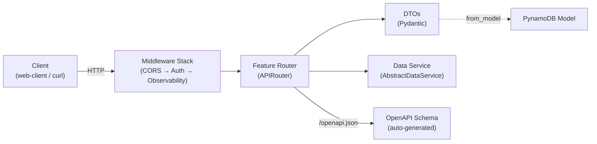

# REST API

Routes in app-lib are FastAPI routers organized by feature. Each feature defines its own router, Pydantic DTOs, and error handling in `features/{name}/routes/`. Shared concerns — authentication, CORS, observability — are middleware on the central `FastAPI` app in `common/app.py`.

## Overview



A request flows through the middleware stack, reaches a feature router, and returns a Pydantic DTO. The same router definitions also generate the OpenAPI schema that `web-client` uses for typed codegen.

| Concern | Pattern | Location |
|---------|---------|----------|
| Route definition | `APIRouter(prefix="/api/v1", tags=[...])` | `features/*/routes/*_routes.py` |
| Request bodies | Pydantic `BaseModel` with `Field()` validation | `features/*/routes/*_dto.py` |
| Response bodies | Pydantic `BaseModel` with `from_model()` classmethod | `features/*/routes/*_dto.py` |
| SSE streaming | Async generator + `StreamingResponse` | `features/*/routes/*_sse_routes.py` |
| Authentication | `JWTAuthMiddleware` with public path whitelist | `common/auth.py` |
| CORS | `CORSMiddleware` with env-based origins | `common/app.py` |
| Error handling | `HTTPException(status_code=..., detail=...)` | Route handlers |
| OpenAPI | Automatic at `/docs` and `/openapi.json` | Built-in FastAPI |

## Key Concepts

### Router Convention

Every feature router uses the same prefix and tag pattern:

```python
# features/passengers/routes/passenger_routes.py
from fastapi import APIRouter

router = APIRouter(prefix="/api/v1", tags=["passengers"])
```

- **Prefix** — Always `/api/v1`. All feature routes share this prefix.
- **Tags** — The feature name, used to group endpoints in the OpenAPI schema and Swagger UI.
- **Router variable** — Named `router` or `{feature}_router` (e.g., `job_router`).

SSE routes use a separate router with prefix `/api/v1/sse`:

```python
# features/jobs/routes/job_sse_routes.py
job_sse_router = APIRouter(prefix="/api/v1/sse", tags=["sse"])
```

### Request and Response DTOs

DTOs are Pydantic models in `features/{name}/routes/{name}_dto.py`. Each feature defines separate models for requests and responses:

```python
# features/passengers/routes/passenger_dto.py
from pydantic import BaseModel, ConfigDict, Field

class TitanicPassengerCreate(BaseModel):
    """Request body for creating/updating a passenger."""
    ticket: str
    name: str
    pclass: int = Field(ge=1, le=3)
    survived: int = Field(ge=0, le=1)
    sex: str
    age: float | None = None
    fare: float | None = None

class TitanicPassengerResponse(BaseModel):
    """Response body for a passenger record."""
    model_config = ConfigDict(from_attributes=True)

    ticket: str
    name: str
    pclass: int
    survived: int
    # ...

    @classmethod
    def from_model(cls, model) -> "TitanicPassengerResponse":
        return cls(
            ticket=model.id,
            pclass=int(model.pclass),
            fare=float(model.fare) if model.fare is not None else None,
            # ...
        )
```

Conventions:

- **Request DTOs** end in `Create` (e.g., `JobCreate`, `TitanicPassengerCreate`).
- **Response DTOs** end in `Response` and include a `from_model()` classmethod that converts a PynamoDB model to a Pydantic object, handling `Decimal` → `int`/`float` conversion.
- **Optional fields** use `| None = None` syntax.
- **Field validation** uses `Field()` with constraints: `ge=`, `le=`, `min_length=`, `max_length=`.

See [Data Access Using PynamoDB ORM](data-access-pynamodb.md#decimal-conversion-in-dtos) for details on Decimal conversion.

### Request Validation

FastAPI validates requests automatically from the type annotations on route handler parameters.

**Request bodies** — annotated as a DTO type, parsed and validated from JSON:

```python
@router.post("/passengers", response_model=TitanicPassengerResponse, status_code=201)
def create_passenger(body: TitanicPassengerCreate):
    # body is guaranteed to be a valid TitanicPassengerCreate
```

**Query parameters** — annotated with `Query()` for defaults and constraints:

```python
@router.get("/passengers", response_model=list[TitanicPassengerResponse])
def list_passengers(
    limit: int = Query(default=100, ge=1, le=2000),
    pclass: int | None = Query(default=None),
    survived: int | None = Query(default=None),
    sex: str | None = Query(default=None),
):
    filters = {k: v for k, v in {"pclass": pclass, "survived": survived, "sex": sex}.items() if v is not None}
    results = data_service.query(limit=limit, **filters)
    return [TitanicPassengerResponse.from_model(r) for r in results]
```

**Path parameters** — extracted from the URL. Use `{param:path}` for values that may contain slashes:

```python
@router.get("/passengers/{ticket:path}", response_model=TitanicPassengerResponse)
def get_passenger(ticket: str):
```

Invalid requests return a `422 Unprocessable Entity` response with field-level error details. This is automatic — no explicit validation code is needed.

### Response Handling

Route handlers specify the response shape and status code explicitly:

```python
@router.post("/jobs", response_model=JobResponse, status_code=202)
def submit_job(body: JobCreate):
    job = JobTable(id=str(uuid.uuid4()), ...)
    job_service.save(job)
    return JobResponse.from_model(job)
```

Status codes used across the codebase:

| Code | Meaning | When Used |
|------|---------|-----------|
| `200` | OK | GET, PUT (default — implicit) |
| `201` | Created | POST creating a new resource |
| `202` | Accepted | POST submitting an async job |
| `404` | Not Found | Resource lookup returned `None` |
| `422` | Unprocessable Entity | Pydantic validation failure (automatic) |
| `500` | Internal Server Error | Unhandled exception (caught by `ObservabilityMiddleware`) |
| `503` | Service Unavailable | DynamoDB table or SQS queue not configured |

### Error Handling

Route handlers raise `HTTPException` for client errors:

```python
@router.get("/passengers/{ticket:path}", response_model=TitanicPassengerResponse)
def get_passenger(ticket: str):
    passenger = data_service.get(ticket)
    if not passenger:
        raise HTTPException(status_code=404, detail=f"Passenger not found: {ticket}")
    return TitanicPassengerResponse.from_model(passenger)
```

Infrastructure errors (DynamoDB table unavailable, SQS not configured) return 503:

```python
if not _sqs_configured():
    raise HTTPException(status_code=503, detail="SQS queue not configured")
```

Unhandled exceptions are caught by `ObservabilityMiddleware` in `common/app.py`, which logs the error and returns a generic 500 response:

```python
class ObservabilityMiddleware(BaseHTTPMiddleware):
    async def dispatch(self, request, call_next):
        try:
            return await call_next(request)
        except Exception as exc:
            log_exception(exc, path=request.url.path, method=request.method)
            return JSONResponse(status_code=500, content={"detail": "Internal server error"})
```

### Middleware Stack

Three middleware layers wrap all routes, applied in `common/app.py`:

1. **CORS** — Configurable allowed origins via `CORS_ALLOWED_ORIGINS` environment variable (comma-separated). Defaults to `"*"` for local development.

2. **JWT Authentication** — `JWTAuthMiddleware` in `common/auth.py` validates Bearer tokens on all routes except public paths. Enabled by default (`AUTH_ENABLED=true`). Set to `false` for local development without a deployed Cognito stack.

   | Environment Variable | Purpose | Default |
   |---------------------|---------|---------|
   | `AUTH_ENABLED` | Enable/disable JWT validation | `true` |
   | `OIDC_ISSUER` (or `AUTH_ISSUER`) | OIDC provider URL | — |
   | `OIDC_CLIENT_ID` (or `AUTH_AUDIENCE`) | Expected audience | — |

   Public paths exempt from authentication:

   | Path | Purpose |
   |------|---------|
   | `/health` | Health check |
   | `/version` | Version info |
   | `/docs` | Swagger UI |
   | `/openapi.json` | OpenAPI schema |

   Validated JWT claims are stored in `request.state.user` for use in route handlers.

3. **Observability** — `ObservabilityMiddleware` catches unhandled exceptions and emits structured error logs.

### SSE Streaming

Server-Sent Events routes use an async generator with `StreamingResponse`. Two patterns exist:

**Polling-based SSE** (jobs) — polls DynamoDB and streams status updates:

```python
# features/jobs/routes/job_sse_routes.py
@job_sse_router.get("/jobs/{job_id}")
async def sse_job_status(job_id: str):
    async def generate():
        last_status = None
        while True:
            job = _job_service.get(job_id)
            if not job:
                yield f"data: {json.dumps({'error': 'Job not found'})}\n\n"
                return
            if job.status != last_status:
                last_status = job.status
                payload = JobResponse.from_model(job).model_dump()
                yield f"data: {json.dumps(payload)}\n\n"
            if job.status in ("COMPLETED", "FAILED"):
                return
            await asyncio.sleep(1.5)

    return StreamingResponse(generate(), media_type="text/event-stream")
```

**Proxy-based SSE** (inference) — wraps a Bedrock `converse_stream` call:

```python
# features/inference/routes/inference_sse_routes.py
@inference_sse_router.post("/inference/converse")
async def inference_converse_stream(body: ConverseRequest):
    async def generate():
        response = client.converse_stream(modelId=body.model_id, ...)
        for event in response.get("stream"):
            if "contentBlockDelta" in event:
                text = event["contentBlockDelta"]["delta"]["text"]
                yield f"data: {json.dumps({'text': text})}\n\n"
        yield "data: [DONE]\n\n"

    return StreamingResponse(generate(), media_type="text/event-stream")
```

SSE conventions:

- Each data line follows the format `data: {json}\n\n` (two trailing newlines).
- Streams terminate with `data: [DONE]\n\n`.
- Error events are JSON objects: `{"error": "message"}`.
- SSE routes use prefix `/api/v1/sse` and tag `"sse"`.

### Router Registration

`common/app.py` is the single point where feature routers connect to the application. Each feature requires one import and one `include_router()` call:

```python
# common/app.py
from app_lib.features.passengers.routes.passenger_routes import router as passengers_router
from app_lib.features.jobs.routes.job_routes import job_router
from app_lib.features.jobs.routes.job_sse_routes import job_sse_router
from app_lib.features.inference.routes.inference_sse_routes import inference_sse_router

app.include_router(passengers_router)
app.include_router(job_router)
app.include_router(job_sse_router)
app.include_router(inference_sse_router)
```

### OpenAPI and Codegen

FastAPI generates an OpenAPI 3.0 schema automatically from route definitions, type annotations, and Pydantic models. The schema is served at:

- `/openapi.json` — raw schema (JSON)
- `/docs` — interactive Swagger UI

Both endpoints are in the public path whitelist and do not require authentication.

The `root_path` setting (`API_STAGE_PREFIX` environment variable) adjusts the schema for API Gateway stage prefixes in deployed environments.

`web-client` consumes this schema to generate typed RTK Query hooks via `npm run codegen`. Adding or changing a route in app-lib automatically surfaces in the generated API client after re-running codegen. See [Feature-Centric Directory Structure](feature-centric-directory-structure.md#non-obvious-coupling) for details on this coupling.

## Usage

### Adding a REST Route

1. Create the DTO file with request and response models:

   ```python
   # features/{name}/routes/{name}_dto.py
   from pydantic import BaseModel, ConfigDict, Field

   class YourCreate(BaseModel):
       name: str = Field(..., min_length=1)
       description: str | None = None

   class YourResponse(BaseModel):
       model_config = ConfigDict(from_attributes=True)

       id: str
       name: str
       description: str | None = None

       @classmethod
       def from_model(cls, model) -> "YourResponse":
           return cls(id=model.id, name=model.name, description=model.description)
   ```

2. Create the router file:

   ```python
   # features/{name}/routes/{name}_routes.py
   from fastapi import APIRouter, HTTPException, Query

   from app_lib.features.{name}.routes.{name}_dto import YourCreate, YourResponse
   from app_lib.features.{name}.service.{name}_data_service import YourDataService

   router = APIRouter(prefix="/api/v1", tags=["{name}"])
   data_service = YourDataService()

   @router.get("/{name}s", response_model=list[YourResponse])
   def list_items(limit: int = Query(default=100, ge=1, le=1000)):
       results = data_service.list(limit=limit)
       return [YourResponse.from_model(r) for r in results]

   @router.get("/{name}s/{item_id}", response_model=YourResponse)
   def get_item(item_id: str):
       item = data_service.get(item_id)
       if not item:
           raise HTTPException(status_code=404, detail=f"Not found: {item_id}")
       return YourResponse.from_model(item)

   @router.post("/{name}s", response_model=YourResponse, status_code=201)
   def create_item(body: YourCreate):
       item = YourTable(id=str(uuid.uuid4()), **body.model_dump())
       data_service.save(item)
       return YourResponse.from_model(item)
   ```

3. Register the router in `common/app.py`:

   ```python
   from app_lib.features.{name}.routes.{name}_routes import router as {name}_router

   app.include_router({name}_router)
   ```

4. Run codegen in `web-client/` to generate typed API hooks:

   ```bash
   cd web-client && npm run codegen
   ```

### Adding an SSE Route

1. Create a separate router file with prefix `/api/v1/sse`:

   ```python
   # features/{name}/routes/{name}_sse_routes.py
   from fastapi import APIRouter
   from fastapi.responses import StreamingResponse
   import asyncio, json

   sse_router = APIRouter(prefix="/api/v1/sse", tags=["sse"])

   @sse_router.get("/{name}/{item_id}")
   async def stream_status(item_id: str):
       async def generate():
           # ... yield SSE events
           yield f"data: {json.dumps(payload)}\n\n"
           yield "data: [DONE]\n\n"

       return StreamingResponse(generate(), media_type="text/event-stream")
   ```

2. Register the SSE router separately in `common/app.py` alongside the REST router.

### Testing Routes

Tests use `FastAPI.TestClient` with auth disabled and mocked data services:

```python
# tests/features/{name}/test_{name}_routes.py
import pytest
from unittest.mock import MagicMock, patch
from fastapi.testclient import TestClient

@pytest.fixture
def client():
    with patch.dict("os.environ", {"AUTH_ENABLED": "false"}):
        from app_lib.common.app import app
        return TestClient(app)

@patch("app_lib.features.{name}.routes.{name}_routes.data_service")
def test_get_item(mock_service, client):
    mock_item = MagicMock()
    mock_item.id = "abc-123"
    mock_item.name = "Test"
    mock_service.get.return_value = mock_item

    resp = client.get("/api/v1/{name}s/abc-123")
    assert resp.status_code == 200
    assert resp.json()["id"] == "abc-123"
```

Mock the data service at the module where it is used (`features.{name}.routes.{name}_routes.data_service`), not at the class definition. For SSE routes, parse the response text for `data:` lines:

```python
def _parse_sse_events(text: str) -> list[str]:
    return [line[6:] for line in text.split("\n") if line.startswith("data: ")]
```

## Extending / Maintaining

### Key Files

| File | Purpose |
|------|---------|
| `common/app.py` | FastAPI app — middleware stack + router registration |
| `common/auth.py` | JWT authentication middleware |
| `features/*/routes/*_routes.py` | Feature route handlers |
| `features/*/routes/*_sse_routes.py` | Feature SSE streaming routes |
| `features/*/routes/*_dto.py` | Pydantic request/response DTOs |

### Non-Obvious Coupling

- **OpenAPI codegen** — `web-client` generates typed hooks from `/openapi.json`. Any route change (new endpoint, renamed path, changed DTO field) requires re-running `npm run codegen` in `web-client/` to update the generated API client.
- **`root_path` and API Gateway** — The `API_STAGE_PREFIX` environment variable sets `root_path` on the FastAPI app. In deployed environments, API Gateway adds a stage prefix (e.g., `/prod`) that must match. An incorrect `root_path` causes the OpenAPI schema to generate wrong URLs.
- **Public paths whitelist** — Adding a new unauthenticated endpoint requires updating `PUBLIC_PATHS` in `common/auth.py`. Forgetting this returns 401 for endpoints that should be open.

## Known Issues

- **No pagination.** List endpoints accept a `limit` parameter but do not return a cursor or continuation token. Implement `last_evaluated_key` handling in the data service and return it as a response header or field if paginated responses are needed.
- **SSE polling interval is fixed.** The job status SSE route polls DynamoDB every 1.5 seconds. This interval is hardcoded in the route handler. For production use, consider configurable intervals or DynamoDB Streams.

## References

- [FastAPI documentation](https://fastapi.tiangolo.com/)
- [Pydantic documentation](https://docs.pydantic.dev/)
- `app-lib/src/app_lib/common/app.py` — FastAPI app and middleware
- `app-lib/src/app_lib/common/auth.py` — JWT authentication middleware
- `app-lib/src/app_lib/features/passengers/routes/` — reference CRUD implementation
- `app-lib/src/app_lib/features/jobs/routes/` — job submission + SSE streaming
- `app-lib/src/app_lib/features/inference/routes/` — Bedrock inference SSE streaming
