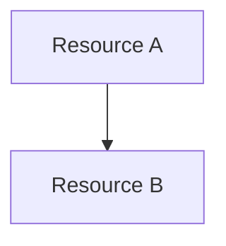

# Documentation Structure and Authoring Guide

This document is the authoritative reference for the IPA Docusaurus site's structure, conventions, and authoring procedures. It is written for developers and contributors who author or extend documentation in the Innovation Patterns repository.

After reading this document, a contributor can add a new document to any section, create a new section or category, modify existing documentation, and follow the project's conventions without external guidance.

The document is organized into the following sections:

- **[Site Architecture](#site-architecture)** — How the Docusaurus site is organized and how autogenerated sidebars work
- **[Common Conventions](#common-conventions)** — Front matter, sidebar ordering, landing pages, and naming rules that apply everywhere
- **[Section Reference](#section-reference)** — Per-section purpose, intended structure, content conventions, and templates
- **[Writing Conventions](#writing-conventions)** — Condensed voice, tone, and formatting rules for quick reference
- **[Adding New Content](#adding-new-content)** — Procedures for adding documents, categories, and top-level sections
- **[Modifying and Restructuring](#modifying-and-restructuring)** — Procedures for editing, moving, and reorganizing existing documentation

## Site Architecture

The documentation site runs on Docusaurus 3 and follows a **convention-over-configuration** principle: new documents render automatically via front matter alone, with no manual sidebar entries required [1][2]. The site serves from the root path (`routeBasePath: '/'`), so URLs have no `/docs/` prefix [1]. Mermaid diagrams are enabled globally (`markdown.mermaid: true`) and can be used in any document [1].

An **autogenerated sidebar** is a Docusaurus feature that scans a directory and builds the left-hand navigation tree from the file system. Each top-level content section maps to one autogenerated sidebar defined in `sidebars.ts` [2]. Docusaurus derives navigation labels from directory names and front matter titles, and sorts entries alphabetically by default. Authors control the rendered site by placing files in the correct directory and adding front matter — no sidebar configuration files are needed for individual documents.

The site excludes certain metadata files from rendering: `CLAUDE.md` and `AGENTS.md` files exist throughout the repository for agent context but are never rendered as documentation pages (`exclude: ['**/CLAUDE.md', '**/AGENTS.md']` in `docusaurus.config.ts`) [7].

The six top-level sections are:

| Section | Directory | Sidebar | Rendered in Production |
|---------|-----------|---------|----------------------|
| Getting Started | `docs/getting-started/` | `gettingStartedSidebar` | Yes |
| Stacks | `docs/stacks/` | `stacksSidebar` | Yes |
| Guides | `docs/guides/` | `guidesSidebar` | Yes |
| User Docs | `docs/user-docs/` | `userDocsSidebar` | Yes |
| Developer Docs | `docs/developer-docs/` | `developerDocsSidebar` | Yes |
| Working | `docs/working/` | `workingSidebar` | No (local only) |

The Working section is conditionally included: `sidebars.ts` and `docusaurus.config.ts` both check `existsSync(resolve(__dirname, 'docs/working'))` before adding the sidebar and navbar item [4][7]. In CI builds, the `working/` directory does not exist, so the section is invisible in production.

### Site Directory Tree

The following tree shows the intended directory layout for all documentation content. Sections and subdirectories marked **(planned)** do not yet exist but are part of the design intent [6].

```
docs/docs/
├── getting-started/
│   ├── index.md                     # Homepage (slug: /)
│   ├── installation.md
│   ├── quickstart.md
│   └── concepts/                    # (planned: IPA Concept, PRFAQ, Organization, Lifecycle)
│       └── index.md
├── stacks/
│   ├── index.md
│   ├── frontend/                    # (planned)
│   ├── backend/                     # (planned)
│   ├── queue/                       # (planned)
│   ├── codepipeline/                # (planned)
│   ├── ecr/                         # (planned)
│   ├── cognito/                     # (planned)
│   └── codecommit/                  # (planned)
├── guides/
│   └── index.md
├── user-docs/
│   └── index.md                     # (planned: Dashboard, Passengers, Jobs, Playground)
├── developer-docs/
│   ├── index.md
│   ├── contributing.md
│   ├── skills/
│   │   ├── index.md
│   │   ├── lifecycle-skills/
│   │   │   ├── index.md
│   │   │   ├── ipa-init.md
│   │   │   ├── ipa-security.md
│   │   │   ├── ipa-compose.md
│   │   │   ├── ipa-prepare.md
│   │   │   ├── ipa-deploy.md
│   │   │   ├── ipa-destroy.md
│   │   │   └── ipa-codepipeline.md
│   │   ├── stack-skills/
│   │   │   └── index.md
│   │   └── author-skills/
│   │       └── index.md
│   ├── docs/
│   │   ├── index.md
│   │   └── guide-format-standard.md
│   ├── infra/
│   │   └── index.md
│   ├── app-lib/                     # (planned)
│   ├── web-client/                  # (planned)
│   └── scripts/                     # (planned)
└── working/                         # Local only — git-ignored, never deployed
    ├── index.md
    ├── specs/
    └── docs/
```

## Common Conventions

This section covers the mechanical conventions that apply across all documentation sections. Authors can consult any subsection independently for a specific convention.

### Front Matter

Every Markdown file in the documentation site requires front matter. Three patterns are in use, depending on the file's role [2]:

**Pattern 1 — Site homepage** (only one file: `getting-started/index.md`):

```yaml
---
title: Getting Started
sidebar_position: 1
slug: /
---
```

The `slug: /` field causes this page to serve as the site root. No other file should use the `slug` field.

**Pattern 2 — Section or category landing page** (`index.md` in any directory):

```yaml
---
title: Overview
sidebar_position: 1
---
```

Every `index.md` or `README.md` that serves as a category landing page must use `title: Overview` unless a more specific title is clearly needed [2]. The `sidebar_position: 1` ensures the landing page appears first in its category.

**Pattern 3 — Regular document** (any other `.md` file):

```yaml
---
title: Contributing
sidebar_position: 2
---
```

Individual pages require only `title`. Add `sidebar_position` when the document's ordering among siblings matters.

The following table summarizes all available front matter fields:

| Field | Required | When to Use |
|-------|----------|-------------|
| `title` | Yes | Every file. Use `Overview` for landing pages [2]. |
| `sidebar_position` | No | To control ordering within a category. Lower numbers sort first. |
| `slug` | No | Only on the site homepage. |

### Sidebar Ordering

Two ordering mechanisms exist, and each applies at a different level [2]:

1. **`sidebar_position` in front matter** — Controls ordering of individual documents and landing pages within a category. This is the primary ordering mechanism. Use it on any `.md` file to set its position among its siblings.

2. **`position` in `_category_.json`** — Controls ordering of categories (directories) relative to their sibling categories. This is a secondary mechanism used only when alphabetical ordering of directories produces the wrong result or when the auto-derived label must be overridden.

Do not create a `_category_.json` file by default. Docusaurus derives category labels from directory names and sorts alphabetically, which is acceptable for most sections. Create `_category_.json` only when one of these conditions is met:

- The category's position among siblings must differ from alphabetical order
- The auto-derived label is wrong (for example, the directory `developer-docs` should display as "Developer Docs")
- The category needs explicit `collapsed` or `collapsible` settings

When `_category_.json` is needed, use this schema:

```json
{
  "label": "Developer Docs",
  "position": 5,
  "collapsed": true,
  "collapsible": true,
  "link": {
    "type": "generated-index"
  }
}
```

The top-level sections all use `_category_.json` because their relative order in the navbar matters and cannot be left to alphabetical default [2].

### Landing Pages

Every section and subdirectory must have a landing page that renders as the default view when the category is clicked [6]. In published sections, this file is `index.md`. In the `working/` directory, the `aidoc`/`speckit` skill conventions use `README.md` instead; Docusaurus treats both as the category landing page.

Landing pages must use `sidebar_position: 1` to appear first in the navigation. The content should include:

- An H1 heading matching the section name
- A high-level explanation of what the section contains, without duplicating the content of child pages
- Links to each immediate subsection with a brief summary to help the reader decide which subsection to visit

For example, the Getting Started landing page (`getting-started/index.md`) [1]:

```markdown
---
title: Getting Started
sidebar_position: 1
slug: /
---

# Getting Started

Get up and running with Innovation Patterns. This section covers everything
you need to start developing locally.

- **[Quickstart](quickstart.md)** — Install dependencies, start the backend
  and frontend, and begin developing in under 5 minutes.
- **[Installation](installation.md)** — Detailed prerequisite installation
  guide (Python, Node.js, uv, AWS CLI).
```

### File and Directory Naming

All files and directories use lowercase names with hyphens as separators:

- Directories: `developer-docs/`, `getting-started/`, `stack-skills/`
- Files: `guide-format-standard.md`, `quickstart.md`, `contributing.md`
- No underscores, camelCase, or spaces

To hide a directory from Docusaurus rendering while preserving its contents on disk, prefix the directory name with a dot: `.archive/`. Docusaurus ignores dot-prefixed directories, so archived content remains accessible for reference without appearing in the site navigation.

## Section Reference

This section provides a per-section reference for each area of the documentation site. Each subsection follows a uniform format:

- **Purpose** — What the section is for and who reads it
- **Intended Structure** — The directory layout (design intent, including planned content)
- **Content Conventions** — Rules specific to this section
- **Template** — A lightweight template for creating new pages in this section

Sections are presented in the order they appear in the site's navbar, left to right [7].

### Getting Started

**Purpose:** The first stop for a new user discovering IPA. This section must convey what IPA is and how to use it quickly, then direct the reader to deeper documentation elsewhere [6].

**Intended Structure:**

```
getting-started/
├── index.md              # Homepage (slug: /)
├── installation.md       # Detailed prerequisite setup
├── quickstart.md         # Zero-to-deployed in one page
└── concepts/
    ├── index.md          # Concepts overview
    ├── ipa-concept.md    # (planned) What IPA is and why it exists
    ├── prfaq.md          # (planned) Press Release / FAQ
    ├── organization.md   # (planned) How IPA is organized
    └── lifecycle.md      # (planned) IPA lifecycle stages
```

**Content Conventions:**

- Action-oriented and minimal on theory. Link to the Concepts subdirectory for deeper background rather than inlining explanations.
- The Quickstart page should get a user from zero to a deployed stack in a single page, using `/ipa-init`, `/ipa-compose`, and `/ipa-deploy`.
- The Installation page should list IPA-specific prerequisites only. Do not include general development tooling setup (for example, installing git).

**Template** for a new Getting Started page:

```markdown
---
title: Page Title
sidebar_position: N
---

# Page Title

Brief statement of what this page covers and what the reader will know or have
done by the end.

## Section Heading

Content.
```

### Stacks

**Purpose:** Per-stack reference documentation. Each IPA stack (a CloudFormation-based infrastructure component) has its own subdirectory with a uniform format, so documentation for all stacks is consistent and easy to consume [6].

:::note
This section currently contains only a stub `index.md`. The per-stack subdirectories described below are the design intent and do not yet exist.
:::

**Intended Structure:**

```
stacks/
├── index.md
├── frontend/
│   ├── index.md              # Overview: what, features, when to use
│   ├── installation.md       # Compose incantation
│   └── deployment-arch.md    # Deployment diagram + Mermaid UML
├── backend/
│   ├── index.md
│   ├── installation.md
│   └── deployment-arch.md
├── queue/
│   └── ...                   # Same structure
├── codepipeline/
│   └── ...
├── ecr/
│   └── ...
├── cognito/
│   └── ...
└── codecommit/
    └── ...
```

**Content Conventions:**

- Every stack subdirectory follows the same three-page structure: Overview, Installation, and Deployment Architecture.
- The **Overview** page covers what the stack is, its features, and when to use it.
- The **Installation** page documents the specific `/ipa-compose` incantation for adding this stack to a project.
- The **Deployment Architecture** page includes a Mermaid UML diagram showing the deployed AWS resources and their relationships.

**Template** for a new Stack documentation set:

```markdown
<!-- stacks/{stack-name}/index.md -->
---
title: Overview
sidebar_position: 1
---

# {Stack Name}

Brief description of what this stack deploys and its role in an IPA project.

## Features

- Feature 1
- Feature 2

## When to Use

Describe the scenarios where a builder should include this stack.
```

```markdown
<!-- stacks/{stack-name}/installation.md -->
---
title: Installation
sidebar_position: 2
---

# Installation

## Compose

To add the {stack-name} stack to the project, run:

    /ipa-compose

Select `{stack-name}` when prompted for the stack to add.

## Configuration

List any `.env` variables or parameters specific to this stack.
```

````markdown
<!-- stacks/{stack-name}/deployment-arch.md -->
---
title: Deployment Architecture
sidebar_position: 3
---

# Deployment Architecture

## Diagram



## Resources

| Resource | Type | Description |
|----------|------|-------------|
| ... | ... | ... |
````

### Guides

**Purpose:** Cross-cutting how-to documentation for tasks spanning multiple IPA tiers or skills. Guides address "putting it all together" for workflows that are less than obvious but that builders are asked to do regularly [6].

**Intended Structure:**

```
guides/
├── index.md
├── composing-solution.md         # (planned)
├── local-development.md          # (planned)
├── notebook-development.md       # (planned)
├── codepipeline.md               # (planned)
├── extending-with-skills.md      # (planned)
└── path-to-production.md         # (planned)
```

**Content Conventions:**

All guides must follow the [Guide Format Standard](./guide-format-standard.md), which defines a 9-section template: Title, Overview, When to Use This Guide, Before You Start, Before/Target State, Steps, Verification, Troubleshooting (conditional), and Next Steps [3]. This document does not reproduce that standard.

**Template:** Use the annotated template in the Guide Format Standard [3]. Do not create a separate template for guides.

### Skills

**Purpose:** One-to-one documentation for each IPA skill — the source of truth for what a skill does, how to invoke it, and what it produces [6]. Skill documentation lives as a subsection under Developer Docs at `developer-docs/skills/`.

**Intended Structure:**

```
developer-docs/skills/
├── index.md                       # Skills overview
├── lifecycle-skills/              # Process skills (init → deploy workflow)
│   ├── index.md
│   ├── ipa-init.md
│   ├── ipa-security.md
│   ├── ipa-compose.md
│   ├── ipa-prepare.md
│   ├── ipa-deploy.md
│   ├── ipa-destroy.md
│   └── ipa-codepipeline.md
├── stack-skills/                  # CloudFormation stack definitions
│   ├── index.md
│   ├── ipa-stack-backend.md
│   ├── ipa-stack-codecommit.md
│   ├── ipa-stack-codepipeline.md
│   ├── ipa-stack-cognito.md
│   ├── ipa-stack-ecr.md
│   ├── ipa-stack-frontend.md
│   └── ipa-stack-queue.md
└── author-skills/                 # Skill authoring tools
    ├── index.md
    └── ipa-author-stack.md
```

**Content Conventions:**

- Each skill page documents: invocation (the `/ipa-*` command), parameters and inputs, outputs and artifacts produced, usage examples, and related skills.
- Skill documentation should be completable from the skill file itself (located in `.claude/skills/`) without requiring information that exists only in a human author's memory.
- Lifecycle skills (ipa-init, ipa-compose, etc.) and stack skills (ipa.stack.*) are organized into separate subdirectories because they serve different purposes: lifecycle skills orchestrate workflows, while stack skills define individual CloudFormation stacks.

**Template** for a new skill documentation page:

```markdown
---
title: /ipa-{skill-name}
sidebar_position: N
---

# /ipa-{skill-name}

Brief description of what this skill does.

## Invocation

    /ipa-{skill-name}

## Parameters

| Parameter | Required | Description |
|-----------|----------|-------------|
| ... | ... | ... |

## What It Does

Step-by-step description of the skill's behavior when invoked.

## Outputs

Describe the files, configuration changes, or infrastructure that the skill
produces.

## Examples

Provide one or two concrete usage examples.

## Related Skills

- [/ipa.related-skill](./ipa-related-skill.md) — brief description of the
  relationship
```

### Developer Docs

**Purpose:** Code-oriented documentation organized around the repository directory structure. If a developer needs to understand a specific directory or module in the IPA codebase, this is where that documentation lives [6]. Cross-cutting concerns that span multiple directories belong in Guides or Stacks instead.

**Intended Structure:**

```
developer-docs/
├── index.md
├── contributing.md
├── skills/                          # (planned: see Skills section above)
├── docs/
│   ├── index.md
│   └── guide-format-standard.md
├── infra/
│   └── index.md
├── app-lib/                         # (planned)
│   ├── index.md
│   ├── feature-structure.md
│   ├── data-access.md
│   ├── rest-api.md
│   ├── lambda-handlers.md
│   └── unit-testing.md
├── web-client/                      # (planned)
│   ├── index.md
│   ├── shadcn-kitchen-sink.md
│   ├── rtk-codegen.md
│   ├── feature-flags.md
│   └── testing.md
└── scripts/                         # (planned)
    └── index.md
```

**Content Conventions:**

- Organization follows the repository directory structure: `app-lib/`, `web-client/`, `infra/`, `scripts/`, `docs/`.
- Documentation for a specific directory should be self-contained — the reader should not need to read other Developer Docs sections to understand the one they are in.
- Items that transcend code directories (for example, a workflow that touches both `app-lib/` and `infra/`) belong in Guides, not Developer Docs.

**Template** for a new Developer Docs page:

```markdown
---
title: Page Title
sidebar_position: N
---

# Page Title

Brief description of what this page documents and which repository directory
or module it covers.

## Overview

High-level explanation of the directory or module's purpose and how it fits
into the IPA project.

## Key Concepts

Describe the main patterns, conventions, or abstractions used in this area
of the codebase.

## Usage

Concrete examples of how to work with the code: commands, configuration,
common operations.
```

### User Docs

**Purpose:** End-user-facing documentation for the demo features included in the IPA frontend. This section is a scaffold intended to be replaced when the solution is customized for a specific project [6].

**Intended Structure:**

```
user-docs/
├── index.md
├── dashboard.md          # (planned) Dashboard feature
├── passengers.md         # (planned) Passengers table feature
├── jobs.md               # (planned) Jobs processing feature
└── playground.md         # (planned) Playground feature
```

**Content Conventions:**

- Every page in this section should prominently display a warning admonition explaining that the content documents demo features and is meant to be extended or replaced for the actual solution.
- User Docs are written for end users of the deployed application, not for developers building the application.

**Template** for a new User Docs page:

```markdown
---
title: Feature Name
sidebar_position: N
---

# Feature Name

:::warning
This page documents a demo feature included with Innovation Patterns.
Replace this content with documentation for the actual implementation
when the solution is customized.
:::

## Overview

Describe what the feature does from the end user's perspective.

## How to Use

Step-by-step instructions for using the feature in the application.
```

### Working

**Purpose:** A local-only Human-In-The-Loop (HITL) workspace for drafting documentation and feature specifications. Content in this directory is never committed to version control and never appears in production builds [4].

**Intended Structure:**

```
working/
├── index.md
├── specs/               # Feature specifications (via /aicode.init or /speckit)
│   └── {feature-name}/
│       ├── README.md
│       ├── research.md
│       └── plan.md      # (optional)
└── docs/                # Document drafts (via /aidoc.create)
    └── {doc-name}/
        ├── README.md
        ├── research.md
        ├── outline.md
        └── draft.md
```

**Content Conventions:**

- Subdirectories use `README.md` (the `aidoc`/`speckit` convention) rather than `index.md`.
- Each subdirectory follows the skill-driven workflow structure: `README.md` (identity), `research.md`, optional `outline.md`, optional `draft.md`, optional `plan.md`.
- Content here is the source of truth for in-progress work — treat it as authoritative for current design intent even though it is not committed [4].

**Rendering gate:** The directory only renders when it physically exists on disk. The `existsSync()` check in both `docusaurus.config.ts` and `sidebars.ts` gates both the sidebar definition and the navbar item [7]. CI builds do not create this directory, so the Working section is automatically excluded from production.

No template is needed for this section — the `/aidoc.create` and `/speckit` skills generate the directory structure automatically.

## Writing Conventions

The following rules apply to all documentation across every section. For the complete specification, see the [Guide Format Standard](./guide-format-standard.md) [3] and the project brief (`.context/aidoc.md`).

**Voice and Tone:**

- Professional and direct — similar to AWS documentation
- Third person in non-procedural sections (overviews, reference material); second person in procedural sections (steps, instructions)
- Active voice and short sentences
- No contractions ("do not" rather than "don't", "it is" rather than "it's")
- No filler phrases ("In order to", "It should be noted that", "As mentioned previously")

**Procedural Language:**

- Start each step with an imperative verb: "Run", "Open", "Add" — not "You should run" or "Next, you will run"
- State the goal before the action: "To deploy the stack, run:" — not "Run the following command to deploy the stack:"
- State the location before the action when relevant: "In the project root directory, run:"
- Do not use "please"

**Technical Content:**

- Use fenced code blocks (triple backticks) for all commands, configuration snippets, file paths, and expected output — no screenshots
- Do not hardcode tool versions or dependency versions — reference "latest" or link to release pages
- Do not include internal AWS account IDs or ARNs — use the placeholder `123456789012` for account IDs
- Define jargon on first use or link to the Key Terms glossary

**Admonitions** (Docusaurus syntax):

- `:::note` — Supplementary information that is useful but not essential
- `:::warning` — Information the reader must know to avoid a failure or destructive action
- `:::tip` — An optional optimization or shortcut

Use admonitions sparingly. If more than two admonitions appear within a single section, consider whether the information belongs in the main text instead [3].

## Adding New Content

### Adding a New Document

To add a new document to an existing section:

1. Create the `.md` file in the appropriate section directory (for example, `docs/guides/local-development.md`).
2. Add front matter with at least `title`. Optionally add `sidebar_position` to control ordering among siblings:

   ```yaml
   ---
   title: Local Development
   sidebar_position: 3
   ---
   ```

3. Write the content. No other configuration is needed — the autogenerated sidebar picks up the new file automatically [2].

### Adding a New Category

To add a new subdirectory that appears as a collapsible category in the sidebar:

1. Create the directory under the appropriate section (for example, `docs/developer-docs/app-lib/`).
2. Add an `index.md` with `title: Overview` and `sidebar_position: 1`:

   ```yaml
   ---
   title: Overview
   sidebar_position: 1
   ---
   ```

3. Add content files to the directory. Each file's `sidebar_position` controls its ordering within the category.

Do not create a `_category_.json` file unless the category's position among siblings must differ from alphabetical order or the auto-derived label is incorrect [2]. In most cases, the directory name and `index.md` front matter are sufficient.

When `_category_.json` is needed, create it with the following content:

```json
{
  "label": "App Lib",
  "position": 3,
  "collapsed": true,
  "collapsible": true,
  "link": {
    "type": "generated-index"
  }
}
```

### Adding a New Top-Level Section

Adding a new top-level section is a rare operation that requires changes to three files. Before proceeding, confirm that the content does not belong in an existing section.

1. Create the directory under `docs/docs/` (for example, `docs/docs/patterns/`).
2. Add an `index.md` with front matter and a `_category_.json` with the desired position:

   ```json
   {
     "label": "Patterns",
     "position": 3,
     "collapsed": true,
     "collapsible": true,
     "link": {
       "type": "generated-index"
     }
   }
   ```

3. Add a new sidebar entry in `sidebars.ts`:

   ```typescript
   patternsSidebar: [{type: 'autogenerated', dirName: 'patterns'}],
   ```

4. Add a navbar item in `docusaurus.config.ts` under `themeConfig.navbar.items`:

   ```typescript
   {
     type: 'docSidebar',
     sidebarId: 'patternsSidebar',
     position: 'left',
     label: 'Patterns',
   },
   ```

5. Verify the new section appears in the navbar and sidebar by running `npm start` in the `docs/` directory and checking `http://localhost:3001`.

## Modifying and Restructuring

### Editing Existing Documents

When modifying a published document, preserve the existing front matter fields (`title`, `sidebar_position`, `slug`). Update `sidebar_position` only if the document's position among its siblings needs to change.

After renaming a file or changing its directory, check the development server console for broken link warnings. The site is configured with `onBrokenLinks: 'warn'` [7], which logs warnings for broken internal links but does not fail the build. Address all warnings before committing changes.

### Moving Documents Between Sections

To move a document from one section to another:

1. Copy the file to the new location.
2. Update front matter: adjust `title` if needed and set `sidebar_position` for the new context.
3. Remove the original file.
4. Search the codebase for any internal links pointing to the old path and update them.
5. Run the development server (`npm start`) and check the console for broken link warnings.

Docusaurus does not provide automatic redirects. Any external links to the old URL will break without manual intervention.

### Restructuring a Section

To reorganize a flat section into subdirectories (or merge subdirectories back into a flat structure):

- Move files into the new directory layout. Ensure each directory has an `index.md` landing page.
- Update `sidebar_position` values to reflect the new ordering.
- Add `_category_.json` only if the new directory's position or label cannot be derived automatically.
- Update all internal links affected by the reorganization.
- Check the development server console for broken link warnings after restructuring.

## Sources

1. `docs/README.md` — Site overview, content sections, convention-over-configuration rules, auto-generated content inventory
2. `docs/CLAUDE.md` — Autogenerated sidebar conventions, front matter rules, `title: Overview` requirement, ordering guidance
3. `docs/docs/developer-docs/docs/guide-format-standard.md` — Guide template (9 sections), writing conventions, admonition guidance
4. `docs/docs/working/CLAUDE.md` — Working directory conventions, git-ignore rules, source-of-truth status for in-progress work
5. `docs/docs/working/docs/guide-authoring/README.md` — Guide authoring meta-guide (research phase)
6. `docs/docs/working/specs/docs-structure/structure-draft.md` — Design intent for documentation structure and per-section content guidance
7. `docs/docusaurus.config.ts` and `docs/sidebars.ts` — Site configuration, navbar items, conditional rendering, exclude rules, autogenerated sidebar definitions
