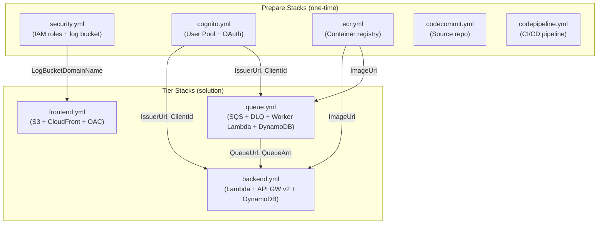

# infra/

CloudFormation templates and container definitions for all IPA infrastructure. Templates are organized into **tier stacks** that consolidate related AWS services and **prepare stacks** that wrap single prerequisite services. A generated security stack provides shared IAM roles and a centralized log bucket.

## Overview



### Directory Structure

```
infra/
├── cfn/                             # CloudFormation templates
│   ├── backend/
│   │   ├── backend.yml              # Tier: Lambda + API GW v2 + DynamoDB + CloudWatch
│   │   └── CLAUDE.md                # 4-touchpoint DynamoDB workflow
│   ├── frontend/
│   │   ├── frontend.yml             # Tier: S3 + CloudFront + OAC
│   │   └── CLAUDE.md                # Post-deploy integration points
│   ├── queue/
│   │   ├── queue.yml                # Tier: SQS + DLQ + Worker Lambda + DynamoDB + CloudWatch
│   │   └── CLAUDE.md                # SQS customization + DynamoDB workflow
│   ├── cognito/
│   │   ├── cognito.yml              # Prepare: User Pool + OAuth 2.0 Hosted UI
│   │   └── CLAUDE.md
│   ├── ecr/
│   │   └── ecr.yml                  # Prepare: ECR repository
│   ├── codecommit/
│   │   ├── codecommit.yml           # Prepare: CodeCommit repository
│   │   └── CLAUDE.md
│   ├── codepipeline/
│   │   ├── codepipeline.yml         # Prepare: CodePipeline + CodeBuild CI/CD
│   │   └── CLAUDE.md
│   └── generated/
│       └── security.yml             # Generated by /ipa.security (IAM roles + log bucket)
├── containers/
│   └── rest-lambda/
│       └── Dockerfile               # Python 3.12 + FastAPI + Lambda Web Adapter
├── cdk/                             # CDK constructs (placeholder)
└── tf/                              # Terraform definitions (placeholder)
```

Each template directory contains a companion `CLAUDE.md` that documents the feature-addition workflow, parameters, and integration points. These files are the authoritative reference for modifying a stack.

## Key Concepts

### Tier Stacks vs Prepare Stacks

IPA templates fall into two categories with different lifecycles and characteristics:

| | Tier Stacks | Prepare Stacks |
|---|---|---|
| **Purpose** | Consolidate related AWS services for a system tier | Wrap a single prerequisite service |
| **Examples** | backend, frontend, queue | cognito, ecr, codecommit, codepipeline |
| **Feature flags** | Yes — `Enable*` parameters toggle resources | No — all resources always created |
| **Internal wiring** | `!Ref` / `!GetAtt` between resources | N/A (single service) |
| **Makefile** | `scripts/deploy.mk` | `scripts/prepare.mk` |
| **Lifecycle** | Deploy per solution | Deploy once, shared across solutions |
| **Capabilities** | `CAPABILITY_NAMED_IAM` | Varies |

The generated security stack (`generated/security.yml`) is a special case — it is produced by the `/ipa.security` skill and deployed as a prepare stack, providing shared IAM execution roles and a centralized S3 log bucket.

### Feature Flag System

Tier stacks use `Enable*` boolean parameters to toggle resource creation via CloudFormation Conditions. All flags default to `false` — the `/ipa.compose` skill sets which flags to activate based on the chosen pattern.

The pattern for each flagged resource follows four CloudFormation sections:

```yaml
# 1. Parameter — declare the flag
Parameters:
  EnablePassengersTable:
    Type: String
    Default: 'false'
    AllowedValues: ['true', 'false']

# 2. Condition — convert to boolean
Conditions:
  HasPassengersTable: !Equals [!Ref EnablePassengersTable, 'true']

# 3. Resource — conditional creation
Resources:
  PassengersTable:
    Type: AWS::DynamoDB::Table
    Condition: HasPassengersTable
    Properties:
      TableName: !Sub '${Namespace}_${Environment}_passengers'
      BillingMode: PAY_PER_REQUEST
      # ...

# 4. Output — conditional export
Outputs:
  PassengersTableArn:
    Condition: HasPassengersTable
    Value: !GetAtt PassengersTable.Arn
```

IAM policies for conditional resources use `!If` with `AWS::NoValue` to exclude themselves when the flag is off:

```yaml
Policies:
  - !If
    - HasPassengersTable
    - PolicyName: !Sub '${Namespace}-${Environment}-dynamodb-passengers'
      PolicyDocument:
        Statement:
          - Effect: Allow
            Action: [dynamodb:PutItem, dynamodb:GetItem, dynamodb:Query, ...]
            Resource: !GetAtt PassengersTable.Arn
    - !Ref 'AWS::NoValue'
```

### Cross-Tier Access

Resources in different tier stacks access each other through **convention-based ARN construction**, not CloudFormation exports or cross-stack parameter passing.

The naming contract is `{Namespace}_{Environment}_{suffix}` for DynamoDB tables and `{Namespace}-{Environment}-{service}` for stack names.

For example, the backend tier accesses the queue tier's jobs table by constructing its ARN:

```yaml
# In backend.yml — cross-tier IAM policy for jobs table (lives in queue tier)
Resource: !Sub 'arn:aws:dynamodb:${AWS::Region}:${AWS::AccountId}:table/${Namespace}_${Environment}_jobs'
```

This eliminates cross-stack wiring for DynamoDB. The naming convention is the contract — if both sides agree on the format, no runtime discovery is needed.

### Wirable Parameters

Cross-stack configuration that cannot be derived from naming conventions (URIs, ARNs that include generated IDs) flows through **wirable parameters**. The generated Makefiles resolve these at deploy time using `aws cloudformation describe-stacks`:

```makefile
# scripts/deploy.mk — backend fetches queue outputs before deploying
deploy-backend: deploy-queue
    $(eval SQS_QUEUE_URL := $(shell aws cloudformation describe-stacks \
        --stack-name $(APP_NAMESPACE)-$(APP_ENV)-queue \
        --query 'Stacks[0].Outputs[?OutputKey==`QueueUrl`].OutputValue' \
        --output text))
    aws cloudformation deploy ... \
        --parameter-overrides ... SqsQueueUrl=$(SQS_QUEUE_URL) ...
```

The dependency chain in the Makefile ensures upstream stacks deploy first:

```
prepare: prepare-cognito prepare-ecr
deploy: deploy-queue deploy-backend deploy-frontend
deploy-backend: deploy-queue
```

### Stack Naming Convention

All stack names follow `{Namespace}-{Environment}-{service}`:

| Stack | Example Name |
|-------|-------------|
| Backend | `myapp-dev-backend` |
| Frontend | `myapp-dev-frontend` |
| Queue | `myapp-dev-queue` |
| Cognito | `myapp-dev-cognito` |
| ECR | `myapp-dev-ecr` |
| Security | `myapp-dev-security` |

`Namespace` and `Environment` originate from the `.env` file (`APP_NAMESPACE`, `APP_ENV`).

### Template Sections

Tier templates (backend, queue) follow a consistent internal structure:

| Section | Contents |
|---------|----------|
| Parameters | Core (Namespace, Environment), Wirable (ImageUri, AuthIssuer), Lambda config, Feature flags |
| Conditions | `Has*` conditions derived from feature flags |
| DynamoDB | Conditional tables with PAY_PER_REQUEST billing, SSE enabled |
| Lambda | Execution role with conditional IAM policies, function definition, log group |
| API Gateway / ESM | HTTP API with JWT authorizer (backend) or Event Source Mapping (queue) |
| CloudWatch | Metric filters, alarms, dashboard |
| Outputs | Stack outputs for downstream consumption |

## Usage

### Skill-to-Template Mapping

Each template maps to an IPA skill and a Makefile target:

| Skill | Template | Makefile | Lifecycle |
|-------|----------|----------|-----------|
| `/ipa.security` | `generated/security.yml` | `prepare.mk` | prepare |
| `/ipa.stack.cognito` | `cognito/cognito.yml` | `prepare.mk` | prepare |
| `/ipa.stack.ecr` | `ecr/ecr.yml` | `prepare.mk` | prepare |
| `/ipa.stack.codecommit` | `codecommit/codecommit.yml` | `prepare.mk` | prepare |
| `/ipa.stack.codepipeline` | `codepipeline/codepipeline.yml` | `prepare.mk` | prepare |
| `/ipa.stack.backend` | `backend/backend.yml` | `deploy.mk` | deploy |
| `/ipa.stack.frontend` | `frontend/frontend.yml` | `deploy.mk` | deploy |
| `/ipa.stack.queue` | `queue/queue.yml` | `deploy.mk` | deploy |

The `/ipa.compose` skill reads pattern definitions and generates the Makefiles that wire these templates together with the correct parameters and deployment order.

### Validating a Template

To validate a template before deploying:

```bash
aws cloudformation validate-template --template-body file://infra/cfn/backend/backend.yml
```

### Adding a DynamoDB Table (4-Touchpoint Pattern)

Adding a new table requires coordinated changes across four locations. The canonical reference for this workflow is the companion `CLAUDE.md` in the template directory (e.g., `infra/cfn/backend/CLAUDE.md`).

1. **CloudFormation template** — Add the `Enable*` parameter, `Has*` condition, table resource, IAM policy, and output (see [Feature Flag System](#feature-flag-system) above).

2. **PynamoDB model** — Create the model in `app-lib/src/app_lib/features/{name}/model/` using `PynamodbUtil.env_table_name("{suffix}")`. The suffix must match the CloudFormation table suffix.

3. **Makefile** — Add `Enable{Name}Table=true` to the `deploy-backend` parameter-overrides in `scripts/deploy.mk`.

4. **App registration** — Import and register the feature router in `app-lib/src/app_lib/common/app.py`.

:::warning
The PynamoDB `env_table_name()` suffix and the CloudFormation `TableName` suffix must match exactly. A mismatch causes the application to look up a table that does not exist.
:::

## Extending / Maintaining

### Key Files

| File | Purpose |
|------|---------|
| `infra/cfn/backend/backend.yml` | Backend tier — Lambda + API GW v2 + DynamoDB |
| `infra/cfn/frontend/frontend.yml` | Frontend tier — S3 + CloudFront |
| `infra/cfn/queue/queue.yml` | Queue tier — SQS + Worker Lambda + DynamoDB |
| `infra/cfn/cognito/cognito.yml` | Cognito User Pool + OAuth |
| `infra/cfn/ecr/ecr.yml` | ECR container registry |
| `infra/cfn/generated/security.yml` | Shared IAM roles + log bucket (generated) |
| `infra/cfn/*/CLAUDE.md` | Per-template companion docs — authoritative for modification workflows |
| `infra/containers/rest-lambda/Dockerfile` | Container image for Lambda (Python 3.12 + FastAPI) |
| `scripts/deploy.mk` | Generated Makefile for tier stack deployment |
| `scripts/prepare.mk` | Generated Makefile for prerequisite stack deployment |
| `scripts/post-deploy.mk` | Generated Makefile for post-deployment configuration |

### Non-Obvious Coupling

- **Table name contract** — DynamoDB table names use underscores (`{Namespace}_{Environment}_{suffix}`) while stack names use hyphens (`{Namespace}-{Environment}-{service}`). Mixing these conventions causes lookup failures.
- **Deploy ordering** — The queue tier deploys before the backend tier because backend receives queue outputs (QueueUrl, QueueArn) as wirable parameters. Changing the Makefile dependency order breaks SQS integration.
- **Post-deploy chain** — `scripts/post-deploy.mk` runs after all tier stacks deploy. It fetches stack outputs to generate `config.js` for the frontend, upload the SPA to S3, invalidate the CloudFront cache, and update the Cognito callback URL with the production domain. Skipping post-deploy leaves the frontend misconfigured.
- **Security stack is generated** — `generated/security.yml` is produced by `/ipa.security`, not hand-edited. Manual edits are overwritten on the next skill invocation.
- **OpenAPI codegen dependency** — Adding or changing backend routes requires re-running `npm run codegen` in `web-client/` to regenerate typed API hooks. This is not triggered by infrastructure changes but by the route definitions that run on the deployed infrastructure.

## References

- [AWS CloudFormation documentation](https://docs.aws.amazon.com/AWSCloudFormation/latest/UserGuide/)
- `infra/cfn/backend/CLAUDE.md` — backend tier modification workflow
- `infra/cfn/frontend/CLAUDE.md` — post-deploy integration points
- `infra/cfn/queue/CLAUDE.md` — queue tier modification workflow
- `infra/cfn/codepipeline/CLAUDE.md` — CI/CD pipeline stages and configuration
- `scripts/deploy.mk` — tier stack deployment with cross-tier wiring
- `scripts/prepare.mk` — prerequisite stack deployment
- `scripts/post-deploy.mk` — post-deployment configuration chain
