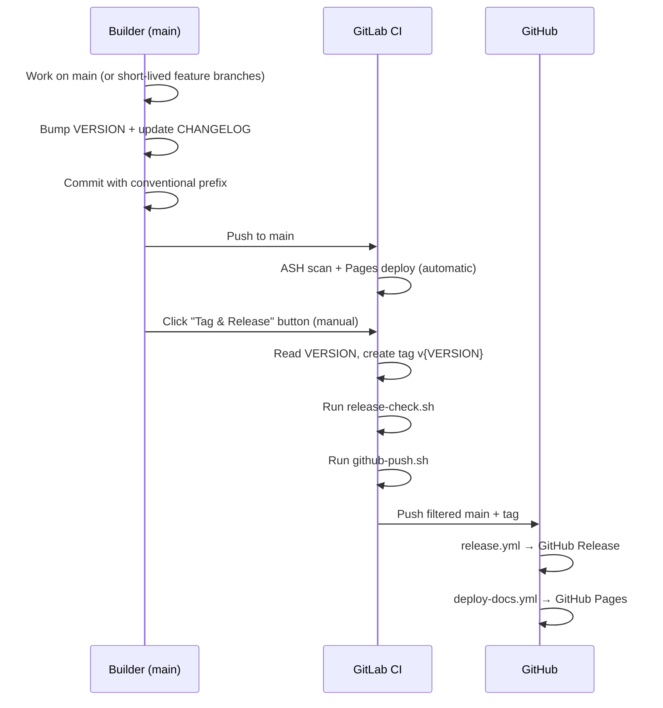

# Releasing

How to cut a release of the IPA framework, from VERSION bump through GitHub mirror.

## TL;DR — Release in 5 Steps

```bash
# 1. Bump VERSION and generate CHANGELOG
make -f infra/scripts/release.mk release-prep VERSION=0.2.0

# 2. Review and edit CHANGELOG.md
#    (git-cliff output is a starting point — clean up grouping, add highlights)

# 3. Commit
git commit -am 'chore: release v0.2.0'

# 4. Push to main
git push origin main

# 5. Open the GitLab pipeline for that commit → click "Tag & Release" play button
```

## Prerequisites

- **`git-cliff`** installed locally — `brew install git-cliff`
- Push access to `main` on GitLab
- `GITHUB_DEPLOY_KEY` configured as a CI/CD variable in GitLab (see [CI Variables](#reference-ci-variables) below)

## Background: Trunk-Based Workflow

The project uses **trunk-based development** on `main`. Daily work lands directly on `main` (or via short-lived feature branches merged back to `main`). There is no `develop` branch.

Prior to v0.1.7, the project used a Gitflow-lite model: `develop` was the default branch, and releases required merging `develop` into `main`, then reconciling SHAs back. The trunk-based model eliminates the merge ceremony and SHA reconciliation overhead.

For the full design rationale, see the [016-trunk-based-release spec](../../../../working/specs/016-trunk-based-release/README.md) (local working directory — not deployed).

## Background: Tools

### VERSION File

`VERSION` at the repo root is the single source of truth for the IPA framework version. It contains a bare semver string (e.g., `0.2.0`) with no `v` prefix. The release pipeline reads this file to determine the tag name (`v0.2.0`).

VERSION is manually bumped — there is no automated version increment.

### git-cliff

[git-cliff](https://git-cliff.org/) is a Rust binary that generates a CHANGELOG from git history by parsing Conventional Commit messages.

**Why git-cliff:**
- Keep-a-Changelog output format out of the box
- No Node.js dependencies (important for a Python/Make-centric project)
- Single binary, no runtime requirements

**Installation:**

```bash
brew install git-cliff
```

**Configuration:** `cliff.toml` at the repo root maps Conventional Commit types to Keep-a-Changelog sections (Added, Fixed, Changed, etc.). Non-conventional commits (e.g., older `Update: modify N file(s)` messages) are preserved under "Changed" rather than dropped.

**Standalone usage:**

```bash
git-cliff --tag v0.2.0 -o CHANGELOG.md
```

### Conventional Commits

All commits follow [Conventional Commits](https://www.conventionalcommits.org/) format. See the public reference page at [Commit Messages](../../../../developer-docs/contributing/commit-messages.md) for the full type/scope table.

Quick reference:

| Type | CHANGELOG Section |
|------|-------------------|
| `feat` | Added |
| `fix` | Fixed |
| `docs` | Documentation |
| `perf` | Performance |
| `refactor` | Changed |
| `ci`, `build` | CI/Build |
| `revert` | Reverted |
| `style`, `test`, `chore` | (skipped) |

### infra/scripts/release.mk

| Target | What it does |
|--------|--------------|
| `release-prep` | Stamps VERSION, runs `release-changelog`, prints next steps |
| `release-changelog` | Runs `git-cliff --tag vX.Y.Z -o CHANGELOG.md` |
| `release-check` | Verifies VERSION file matches the current git tag |

### infra/scripts/github-push.sh

Filters internal-only paths from the release commit before pushing to GitHub. Paths in `EXCLUDE_PATHS` (including `.gitlab-ci.yml`, `docs/docs/developer-docs/internal/`, and generated Makefiles) are removed from the GitHub mirror. The script amends the commit and retags to maintain commit SHA stability between the filtered tree and the GitHub tag.

Uses `--force-with-lease` for mirror safety — if GitHub has unexpected commits, the push fails rather than overwriting.

### .gitlab-ci.yml tag-and-release Job

**Trigger:** Manual play button on pipelines running on the default branch (`main`).

**What it does:**
1. Reads VERSION from the file
2. Checks if the tag already exists (fails if it does — bump VERSION first)
3. Creates an annotated tag `v{VERSION}`
4. Pushes the tag to GitLab origin
5. Runs `release-check` to validate VERSION matches tag
6. Runs `github-push.sh` to mirror to GitHub (triggers GitHub Actions for Release + Pages)

## Procedure: Cutting a Release

### Step 1: Decide the Version Bump

Follow [Semantic Versioning](https://semver.org/):

| Change type | Bump | Example |
|-------------|------|---------|
| New feature (`feat`) | Minor | 0.1.6 → 0.2.0 |
| Bug fix (`fix`) | Patch | 0.1.6 → 0.1.7 |
| Breaking change (`!`) | Major | 0.1.6 → 1.0.0 |

### Step 2: Run release-prep

```bash
make -f infra/scripts/release.mk release-prep VERSION=0.2.0
```

This stamps `VERSION` and regenerates `CHANGELOG.md` from the full commit history.

### Step 3: Review and Edit CHANGELOG.md

The `git-cliff` output is a starting point. Review and clean up:

- Group related entries if git-cliff split them
- Add a release highlights paragraph at the top of the version section if the release has a theme
- Remove noise entries that are not meaningful to users

### Step 4: Commit and Push

```bash
git commit -am 'chore: release v0.2.0'
git push origin main
```

### Step 5: Click Tag & Release

1. Open the GitLab pipeline for the commit you just pushed
2. Find the `tag-and-release` job in the `release` stage
3. Click the play button

### Step 6: Verify Outcomes

- [ ] GitLab tag `v0.2.0` exists on the repository
- [ ] GitHub release page shows the new version at `github.com/aws-samples/sample-innovation-patterns/releases`
- [ ] GitHub Pages updated with latest docs

## Procedure: Hotfix on Main

For urgent fixes that cannot wait for normal development flow:

1. Create a short-lived feature branch from `main`:
   ```bash
   git checkout -b fix/critical-bug main
   ```
2. Make the fix, commit with `fix: ...` prefix
3. Open an MR targeting `main`, get review, merge
4. Follow the standard release procedure above

## Troubleshooting

### release-check fails: VERSION does not match tag

The VERSION file content does not match the git tag on the current commit.

**Fix:** Ensure `VERSION` contains exactly the version that matches the tag (without `v` prefix). For example, if the tag is `v0.2.0`, VERSION must contain `0.2.0`.

### "Tag already exists" when clicking Tag & Release

The tag for the current VERSION already exists on the remote. This means VERSION was not bumped before clicking the button.

**Fix:** Bump VERSION to the next release number, regenerate the CHANGELOG, commit, push, and click Tag & Release again.

### github-push fails: force-with-lease rejected

The GitHub remote has commits that do not exist in GitLab. This should not happen if GitHub is a read-only mirror.

**Fix:** Investigate what diverged. If GitHub received direct commits or PRs, they need to be cherry-picked back to GitLab or discarded. After resolving, re-run the pipeline.

### GitHub Release is empty (no changelog body)

The CHANGELOG.md section header format does not match what the extraction script expects.

**Fix:** Ensure the section header is exactly `## [X.Y.Z]` (with brackets, no extra text after the date).

### Deploy Key authentication fails

**Check:**
- The `GITHUB_DEPLOY_KEY` variable exists in GitLab CI/CD variables and is protected
- The matching public key is still in GitHub Deploy Keys with write access
- The key has not expired

### git-cliff not installed locally

`release-prep` and `release-changelog` require `git-cliff` to be installed.

**Fix:** Install with Homebrew:
```bash
brew install git-cliff
```

### Pipeline missing the manual button

The Tag & Release button only appears on pipelines running on the default branch (`$CI_DEFAULT_BRANCH`).

**Check:** Ensure you are viewing a pipeline on `main` (the default branch). Pipelines on feature branches do not show the release button.

## Reference: CI Variables

### GITHUB_DEPLOY_KEY

An SSH private key with push access to `github.com:aws-samples/sample-innovation-patterns`.

**Setup steps:**

1. Generate an SSH keypair:
   ```bash
   ssh-keygen -t ed25519 -C "gitlab-ci-deploy" -f deploy_key -N ""
   ```

2. Add the **public key** to GitHub:
   - Go to `github.com/aws-samples/sample-innovation-patterns` → Settings → Deploy Keys
   - Add `deploy_key.pub` with **write access** enabled

3. Base64-encode the private key (GitLab rejects masking for values containing whitespace/newlines):
   ```bash
   base64 -i deploy_key | tr -d '\n'
   ```
   Copy the resulting single-line string.

4. Add it to GitLab:
   - Go to your GitLab project → Settings → CI/CD → Variables
   - Add variable:
     - Key: `GITHUB_DEPLOY_KEY`
     - Value: the base64 string from step 3
     - Type: Variable
     - Flags: **Masked**, **Protected**

5. Delete the local keypair:
   ```bash
   rm deploy_key deploy_key.pub
   ```

The CI job decodes the variable at runtime: `printf '%s' "$GITHUB_DEPLOY_KEY" | base64 -di | ssh-add -`.

## Reference: Release Flow Diagram



## Migration History

v0.1.6 was the last release under the develop → main merge flow. Starting with v0.1.7, the project uses trunk-based development on `main` with a manual Tag & Release trigger in GitLab CI. The `develop` branch was consolidated into `main` and deleted from all remotes (GitLab, GitHub, CodeCommit).
