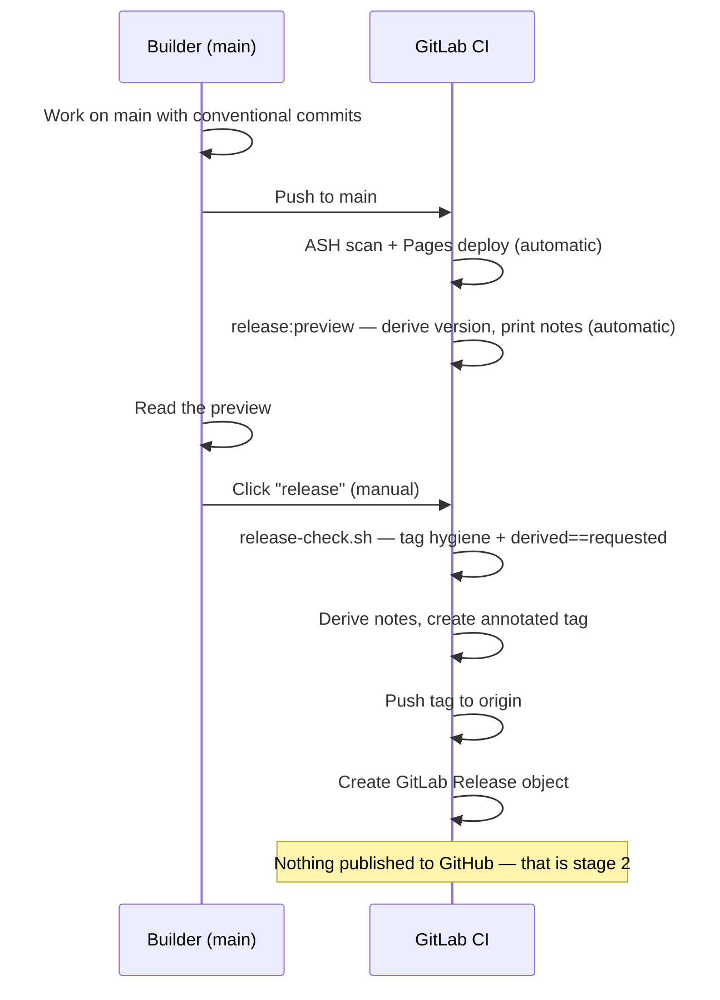

# Releasing

How to cut a release of the IPA framework. The version is **derived** from Conventional Commit history — there is nothing to type and no file to bump.

## TL;DR

```bash
# 1. Land your work on main with conventional commit messages.
git push origin main

# 2. Read the release:preview job output on that pipeline. It runs automatically
#    and prints the version that would be cut plus the exact release notes.

# 3. Click the "release" job in the same pipeline.
```

That is the whole flow. No `VERSION` file, no version argument, no changelog edit required before tagging — the notes are generated from commit messages and attached to the tag.

## Prerequisites

- Push access to `main` on GitLab
- **`git-cliff`** installed locally, only if you want to preview or regenerate `CHANGELOG.md` by hand — `brew install git-cliff`. CI installs its own pinned copy.

## The Three Jobs

The job names are the documentation. All three are jobs on a **branch** pipeline for `main`.

| Job | Trigger | What it does |
|-----|---------|--------------|
| `release:preview` | **Automatic**, every push to `main` | Prints the derived version and the exact notes. Creates nothing. Non-blocking. |
| `release` | Manual | Derives minor/patch, tags `origin`, creates a GitLab Release. |
| `release:major` | Manual, gated | Forces a major bump. Requires `CONFIRM_VERSION`. |

### release:preview

Runs on its own, so the answer to "what would a release look like right now?" is always already on screen. When nothing in the window affects the version it prints *nothing to release* and passes — a preview that failed on most pushes would be a preview everybody learned to ignore.

### release

Derives the version with `git-cliff --bumped-version`, asserts tag hygiene and that the derived version agrees with history, tags, pushes to `origin`, and creates a GitLab Release whose body is the generated notes.

**It publishes nothing to GitHub.** That is deliberate — see [Publishing to GitHub](#publishing-to-github) below.

### release:major

While the project is pre-1.0, `cliff.toml` sets `breaking_always_bump_major = false`, so a `feat!:` commit derives `0.x+1` rather than `1.0.0`. Reaching a major version therefore requires this job, and this job requires confirmation:

```
error: major release requires explicit confirmation
would cut: v1.0.0
hint: re-run this job with CONFIRM_VERSION=v1.0.0
```

Run it once to learn the value, then re-run it with that value supplied as a CI variable. It fails before creating anything.

:::note Post-1.0 behavior
`breaking_always_bump_major = false` is **inert** once the major reaches 1 — at `v1.0.0` a `feat!:` commit derives `v2.0.0` normally. After the 1.0 transition the ordinary `release` job will coin majors, and `release:major` becomes decorative. That is the correct semantic: past 1.0, a breaking change genuinely should mean a major, and `release:preview` is what keeps it from being a surprise.
:::

## Publishing to GitHub

Cutting an internal release and publishing to the public mirror are **separate acts**. The `release` job pushes nothing public.

| Job | Trigger | What it does |
|-----|---------|--------------|
| `publish:github:plan` | Manual | Prints the tag, the floor, the full notes body, the filtered-path report, and the `CONFIRM_TAG` value. Publishes nothing. |
| `publish:github` | Manual, gated | Publishes. Requires `CONFIRM_TAG`. The one irreversible act in the release path. |

### Procedure

1. Run `publish:github:plan`. Set the `TAG` variable to publish something other than the newest internal tag; leave it unset for the newest.
2. Read its output — the notes body is exactly what the public Release will carry.
3. Run `publish:github` with `CONFIRM_TAG` set to the value the plan printed.

### Publishing an older tag

Supply `TAG=v0.3.0` to either job. Nothing is retagged internally: the internal tag already exists and is correct, and only the public side is brought forward. The operator's local tags are byte-identical before and after a publish run.

### What a gap in the public tag sequence means

The public tag sequence is allowed to be gapped — `v0.1.7` then `v0.4.0` with nothing between — and it carries a specific meaning worth being precise about.

**Publishing does not withhold code.** The publish path amends the tip and force-pushes `main`, so the code of a release you never published reaches the public repository the next time you publish anything. What is withheld is the **tag and the Release object**.

So a gap describes real, already-public code that no Release object documents. That is why the notes for a publish cover everything since the last publish rather than just the newest version: the release notes for `v0.4.0` published over a floor of `v0.1.7` contain a section per intervening version, so nothing that shipped goes undescribed.

The floor is resolved from GitHub itself — GitHub is the only authority on what GitHub already has, so there is no "last published" record to drift.

For the mechanisms and their hazards, see [`internal/release/README.md`](https://code.aws.dev/proserve/genaiid/other/candidate-reusable-assets/innovation-patterns/-/blob/main/internal/release/README.md).

## Background: Trunk-Based Workflow

The project uses **trunk-based development** on `main`. Daily work lands directly on `main` (or via short-lived feature branches merged back to `main`). There is no `develop` branch.

Prior to v0.1.7, the project used a Gitflow-lite model: `develop` was the default branch, and releases required merging `develop` into `main`, then reconciling SHAs back. The trunk-based model eliminates the merge ceremony and SHA reconciliation overhead.

## Background: Version Derivation

There is **no `VERSION` file**. It was retired because it conflated two different questions — "what is the next version?" (a release-time derivation) and "what is the current version?" (a build-time display) — and because being hand-maintained, it was routinely wrong: it read `0.1.8` while the newest tag was `v0.1.7` and no `v0.1.8` ever existed.

Tags are the single source of truth. `git-cliff --bumped-version` answers the first question; `git describe` answers the second.

Two configured behaviors matter when reading a derivation:

- **`Update:`-prefixed commits are skipped entirely.** They affect neither the version nor any changelog section. A batch of these predates the convention.
- **A breaking change stays within `0.x` while pre-1.0.** See `release:major` above.

### git-cliff

[git-cliff](https://git-cliff.org/) generates the CHANGELOG from git history by parsing Conventional Commit messages, and derives the next version from the same history. Configuration is `cliff.toml` at the repo root.

CI installs a pinned `git-cliff==2.10.1` — the version every mechanism in the release path was verified against.

### Conventional Commits

See the public [Commit Messages](../../../../developer-docs/contributing/commit-messages.md) reference for the full type/scope table. Quick reference:

| Type | CHANGELOG Section |
|------|-------------------|
| `feat` | Added |
| `fix` | Fixed |
| `docs` | Documentation |
| `perf` | Performance |
| `refactor` | Changed |
| `ci`, `build` | CI/Build |
| `revert` | Reverted |
| `style`, `test`, `chore`, `Update:` | (skipped) |

### infra/scripts/release.mk

| Target | What it does |
|--------|--------------|
| `release-preview` | Prints the derived version and notes. Creates nothing. The local counterpart of `release:preview`. |
| `release-changelog` | Regenerates `CHANGELOG.md` through the derived version |
| `release-prep` | Confirms the derived version, then runs `release-changelog` |
| `release-check` | Asserts tag hygiene and that a tag matches the derived version |

All of them derive `VERSION` by default. Override explicitly when you need to: `VERSION=0.3.0`.

### infra/scripts/release-check.sh

Two assertions:

1. **Tag hygiene** — every local release tag must point at the same commit as `origin`'s tag of the same name. This is a reachable state, not a hypothetical: the mirror push amends the release commit and force-moves the tag locally, so any clone that has run a release carries the disagreement. A disagreeing tag poisons both version derivation and any publish range.
2. **Derived matches requested** — the tag about to be created must equal what history derives.

It runs **before** the tag is created. Both assertions exist to fail without leaving a wrong tag behind.

## Procedure: Cutting a Release

### Step 1: Land your work

Commit with Conventional Commit messages and push to `main`. The message format is what determines the version and the release notes — a non-conventional commit derives no bump and appears in no section.

### Step 2: Read release:preview

Open the pipeline for your commit. The `release:preview` job has already run. It prints:

```
current release: v0.1.7
would release:   v0.2.0

--- release notes for v0.2.0 ---
...
--- end release notes ---
```

If it says *nothing to release*, no commit in the window affects the version.

### Step 3: Click release

Find the `release` job in the `release` stage of the same pipeline and click the play button. For a major release, click `release:major` instead and supply `CONFIRM_VERSION`.

### Step 4: Verify

- [ ] The tag exists on GitLab
- [ ] A GitLab **Release object** exists for that tag, not just a bare tag
- [ ] The Release body carries the generated notes with headings intact
- [ ] Nothing changed on GitHub — publishing is separate

### Optional: Update the committed CHANGELOG

The published release notes come from the tag annotation, so no changelog commit is required to release. To refresh the committed `CHANGELOG.md`:

```bash
make -f infra/scripts/release.mk release-prep
git commit -am 'docs: update changelog'
```

## Procedure: Hotfix on Main

1. Create a short-lived feature branch from `main`:
   ```bash
   git checkout -b fix/critical-bug main
   ```
2. Make the fix, commit with a `fix:` prefix
3. Open an MR targeting `main`, get review, merge
4. Follow the standard release procedure above — the `fix:` commit derives a patch bump

## Troubleshooting

### release-check fails: local tag disagrees with origin

Your clone has a tag pointing at a different commit than `origin`'s tag of the same name. Almost always caused by having run a mirror push, which force-moves tags locally by design.

**Fix:** the error prints it — `git fetch origin --tags --force`.

### release-check fails: tag does not match the derived version

You asked for a version that history does not derive. The error names both values.

**Fix:** release the derived version, or add the commits that would justify the one you wanted.

### "Nothing to release"

No commit since the last tag affects the version. Most often every commit in the window is `chore:`, `test:`, `style:`, or `Update:`-shaped — all of which are configured to derive no bump.

**Fix:** if the work deserves a release, it deserves a conventional commit message. Nothing is wrong with the pipeline.

### release:major fails without creating anything

Expected — that is the gate. Read the `hint:` line, which names the exact `CONFIRM_VERSION` value, and re-run with it.

### The GitLab Release object is missing but the tag exists

The tag push succeeded and the Release API call failed. The tag is fine.

**Fix:** re-run the job, or call `infra/scripts/gitlab-release.sh <tag> <notes-file>` directly. It is idempotent — an existing Release is reported as success rather than an error.

### git-cliff not installed locally

Only the local `make` targets need it; CI installs its own.

```bash
brew install git-cliff
```

### Pipeline missing the manual buttons

The release jobs only appear on pipelines running on the default branch (`main`). Pipelines on feature branches do not show them.

## Reference: CI Variables

### CONFIRM_VERSION

Supplied at job-run time to `release:major` only. Not a stored variable — run the job once, read the value from the failure message, re-run with it.

### GITHUB_DEPLOY_KEY

An SSH private key with push access to `github.com:aws-samples/sample-innovation-patterns`. Used only by the **publishing** jobs (stage 2), not by any job in this runbook.

**Setup steps:**

1. Generate an SSH keypair:
   ```bash
   ssh-keygen -t ed25519 -C "gitlab-ci-deploy" -f deploy_key -N ""
   ```

2. Add the **public key** to GitHub:
   - Go to `github.com/aws-samples/sample-innovation-patterns` → Settings → Deploy Keys
   - Add `deploy_key.pub` with **write access** enabled

3. Base64-encode the private key (GitLab rejects masking for values containing whitespace/newlines):
   ```bash
   base64 -i deploy_key | tr -d '\n'
   ```

4. Add it to GitLab under Settings → CI/CD → Variables:
   - Key: `GITHUB_DEPLOY_KEY`
   - Value: the base64 string from step 3
   - Flags: **Masked**, **Protected**

5. Delete the local keypair:
   ```bash
   rm deploy_key deploy_key.pub
   ```

The CI job decodes it at runtime: `printf '%s' "$GITHUB_DEPLOY_KEY" | base64 -di | ssh-add -`.

## Reference: Release Flow Diagram


```mermaid
sequenceDiagram
    participant Dev as Builder (main)
    participant CI as GitLab CI

    Dev->>Dev: Work on main with conventional commits
    Dev->>CI: Push to main
    CI->>CI: ASH scan + Pages deploy (automatic)
    CI->>CI: release:preview — derive version, print notes (automatic)
    Dev->>Dev: Read the preview
    Dev->>CI: Click "release" (manual)
    CI->>CI: release-check.sh — tag hygiene + derived==requested
    CI->>CI: Derive notes, create annotated tag
    CI->>CI: Push tag to origin
    CI->>CI: Create GitLab Release object
    Note over CI: Nothing published to GitHub — that is stage 2
```

## Migration History

v0.1.6 was the last release under the develop → main merge flow. Starting with v0.1.7, the project uses trunk-based development on `main`.

Before this revision, one manual `tag-and-release` job read the `VERSION` file, tagged, and mirrored to GitHub in consecutive lines of a single script — so an internal release could not be cut without also publishing publicly, and an older tag could not be published at all. That job is now three named jobs, the `VERSION` file is gone, and public publishing is a separate stage.
