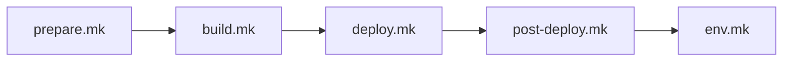

# scripts/

Generated Makefiles that encode the build, deploy, and teardown lifecycle for an IPA-composed project. Every file in this directory is produced by `/ipa.compose` — do not edit them manually.

## Overview

The `scripts/` directory is the execution layer of IPA. When `/ipa.compose` resolves a pattern (for example, `react-rest-lambda + sqs-lambda`), it generates a set of Makefiles that encode the exact `aws` CLI calls, stack ordering, and parameter wiring for that composition. These Makefiles are the contract between the builder, the AI agent, and CI/CD pipelines — all three execute the same targets.

Makefiles contain direct `aws` CLI calls inline. There are no helper functions, no abstraction layer, and no external dependencies beyond the AWS CLI and GNU Make. A customer can open any target and see exactly what AWS command runs.

## Contents

| File | Purpose | Generated by |
|------|---------|--------------|
| `prepare.mk` | One-time prerequisite stacks (Cognito, ECR) | `/ipa.compose` |
| `build.mk` | Container image builds, frontend bundling | `/ipa.compose` |
| `deploy.mk` | Application stack deployment in dependency order | `/ipa.compose` |
| `post-deploy.mk` | Frontend upload, CloudFront invalidation, Cognito callback wiring, CORS configuration | `/ipa.compose` |
| `env.mk` | Syncs deployed stack outputs to `.env` for local development | `/ipa.compose` |
| `test.mk` | Template validation and security scanning | `/ipa.compose` |
| `INSTALL-RUNBOOK.md` | Step-by-step deployment guide for the composed project | `/ipa.compose` |
| `SECURITY-DISPOSITION.md` | Security findings register with dispositions | `/ipa.compose` |
| `util/` | Build helpers and utility scripts (see below) | `/ipa.compose` or manual |

## Execution Phases

The Makefiles execute in a defined order that mirrors the IPA lifecycle:



| Phase | Makefile | When to run | Idempotent |
|-------|----------|-------------|------------|
| **Prepare** | `prepare.mk` | Once per environment setup | Yes |
| **Build** | `build.mk` | Before each deploy (if composition includes containers) | Yes |
| **Deploy** | `deploy.mk` | Each deployment | Yes |
| **Post-deploy** | `post-deploy.mk` | After each deploy | Yes |
| **Env sync** | `env.mk` | After deploy to update local `.env` | Yes |

All targets use `--no-fail-on-empty-changeset`, making every phase safe to re-run.

## Variable Resolution

Every Makefile begins with `-include .env` and `export`, which provides a dual-environment resolution strategy:

- **Local development:** Variables load from the `.env` file at the project root.
- **CI/CD (CodeBuild):** The `-include` directive silently skips the missing `.env` file. Make inherits environment variables set by CodeBuild.

This means the same Makefile targets work identically in both environments with no conditional logic.

Key variables consumed by all Makefiles:

| Variable | Source | Description |
|----------|--------|-------------|
| `APP_NAMESPACE` | `.env` | Project name prefix for stack naming |
| `APP_ENV` | `.env` | Environment name (e.g., `dev`) |
| `AWS_ACCOUNT_ID` | `.env` | 12-digit AWS account ID |
| `AWS_REGION` | `.env` | Target AWS region |
| `ECR_REPO_URI` | `env.mk` output | ECR repository URI (populated after prepare) |
| `OIDC_ISSUER` | `env.mk` output | Cognito OIDC issuer URL (populated after prepare) |
| `OIDC_CLIENT_ID` | `env.mk` output | Cognito app client ID (populated after prepare) |

## Stack Naming Convention

All CloudFormation stack names follow the pattern `{APP_NAMESPACE}-{APP_ENV}-{service}`:

```
myapp-dev-cognito       # Prepare stack
myapp-dev-ecr           # Prepare stack
myapp-dev-queue         # Deploy stack (tier)
myapp-dev-backend       # Deploy stack (tier)
myapp-dev-frontend      # Deploy stack (tier)
```

## util/ Subdirectory

The `util/` directory contains the only abstractions permitted in `scripts/`. These helpers are used exclusively by `build.mk` — they are never included by `deploy.mk`, `prepare.mk`, or `test.mk`.

| File | Purpose |
|------|---------|
| `docker.mk` | ECR authentication (`ecr-login`) and Docker build/tag/push (`docker-build-push`) macros |
| `version.py` | Reads version from `app-lib/pyproject.toml` + git SHA; produces Docker tags, semver strings |
| `configure_frontend.py` | Generates `web-client/dist/config.js` with runtime configuration (`window.__CONFIG__`) |
| `openapi-codegen.mk` | API client generation helper (placeholder) |

## Generated Documentation

Two Markdown files are generated alongside the Makefiles:

**`INSTALL-RUNBOOK.md`** — A self-contained deployment guide that walks through environment configuration, template validation, prepare, build, deploy, and teardown. This document works without IPA or Claude Code — a customer can follow it using only the AWS CLI and Make.

**`SECURITY-DISPOSITION.md`** — Tracks security findings from the composed pattern with their dispositions (accepted, deferred, mitigated). Pattern-level deferrals are generated automatically; project-specific findings are added manually in the "Custom Dispositions" section, which is preserved across re-composition.

## Teardown

Teardown targets exist in both `deploy.mk` and `prepare.mk`, executing stack deletions in reverse dependency order:

```bash
# Tear down application stacks (safe, repeatable)
make -f scripts/deploy.mk teardown

# Tear down prepare stacks (manual only — never auto-deleted by /ipa.destroy)
make -f scripts/prepare.mk teardown-prepare
```

Prepare stacks require explicit teardown because they may contain persistent data (for example, ECR images).
