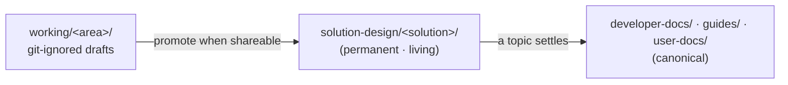

# Solution Design

The permanent home for a solution's **living** design and requirements documents — vision, requirements, exploration, and architecture. The section name is stable and final; the documents inside evolve as the POC develops.

A builder copies the [`template/`](template/) directory into `solution-design/<solution-name>/` and starts writing. There are no structural decisions to make per engagement — the menu of documents and the living-doc conventions are already set.

## What Belongs Here

Solution Design holds the documents that shape one deployed solution: why it is being built, what it must do, what was investigated along the way, and how it is put together. It sits between two existing locations:

- **Upstream:** `docs/docs/working/` — git-ignored local drafts authored with the `/ai-doc-*` and `/ai-code-*` skills. Working drafts are scratch; they are never committed.
- **Downstream:** `developer-docs/`, `guides/`, and `user-docs/` — the canonical published reference. A topic graduates here once it fully settles.

Promotion is **copy, not move** — a working draft is copied here when it is shareable, and a settled topic is copied onward to canonical reference. The Solution Design document remains in place as the living record.

## The Document Menu

The `template/` directory ships four documents. This is a **suggested menu, not a mandated set** — a builder picks the documents that fit the engagement and ignores the rest. IPA produces evolvable POC systems, so a heavyweight requirements-then-design waterfall is the wrong default.

| Document | Answers | Typical artifact |
|---|---|---|
| [Vision](template/vision.md) | Why build this? What is the dream? | Vision / PRFAQ |
| [Requirements](template/requirements.md) | What must it do? | BRD / PRD / SRS — pick the flavor |
| [Exploration](template/exploration.md) | What was investigated and learned? | Spikes, domain primers, findings |
| [Architecture](template/architecture.md) | How is it built? | SDD, with ADRs embedded as decisions settle |

The [`template/`](template/) directory renders in this sidebar as a worked example. Read it to see the conventions in place, then copy it for a new solution.

## Living-Doc Conventions

Every document under a solution carries, near the top:

- A **status** line — `Status: 🔬 Exploring · 📝 Drafting · ✅ Stable` (mark the current one).
- A **last-updated** date — `> Last updated: YYYY-MM-DD`.
- A one-line note that the document is living, and that the canonical settled version (if any) lives in `developer-docs/`, `guides/`, or `user-docs/`.

Each solution's landing page (`solution-design/<solution>/index.md`) carries a **status table** (Document · Status · Last-updated · Description) so the state of the whole set is visible at a glance. This reuses the manifest pattern already used in the working root's spec manifest (`working/legacy/specs/README.md`) — no new convention.

## Public or Internal

Design and requirements documents often hold customer-specific or pre-decision material. Choose placement deliberately:

- **Public** (this section, `developer-docs/solution-design/`) — shipped to the public GitHub release. Appropriate for a generic or open solution.
- **Internal** (`developer-docs/internal/`) — committed to the source repository but filtered out of the public GitHub release by `infra/scripts/github-push.sh`. Appropriate for customer-specific solution content.

When a solution's design documents contain anything a customer would not want published, place that solution's directory under `developer-docs/internal/` instead of here.

## Vision and the IPA PRFAQ

A solution's `vision.md` (or PRFAQ) describes the *deployed solution* — the application a builder is shipping for an engagement. This is distinct from IPA's own PRFAQ, planned for `getting-started/concepts/prfaq.md`, which describes *IPA itself* as a product. Keep the two separate: the solution vision belongs here; IPA's vision belongs in Concepts.

## Next Steps

- Read the [how-to guide](/guides/solution-design) for which document to write when, living-doc upkeep, and the promotion workflow.
- See the [Documentation Structure](/developer-docs/docs/documentation-structure) reference for where this section sits in the site taxonomy.
