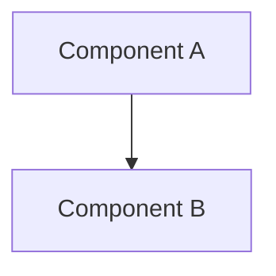

# Architecture

> Status: 🔬 Exploring · 📝 Drafting · ✅ Stable — (mark the current one)
> Last updated: 2026-06-25

This is a living document. When the architecture stabilizes, the canonical version graduates to `developer-docs/`, `guides/`, or `user-docs/`.

This is the *how* — the system design for the deployed solution. Describe the components, how they fit together, and the data they hold. Embed Architecture Decision Records (ADRs) inline under Decisions as choices settle, recording why one option was chosen over another.

## Overview

## Components

## Data Model

## Deployment

## Decisions (ADRs)
