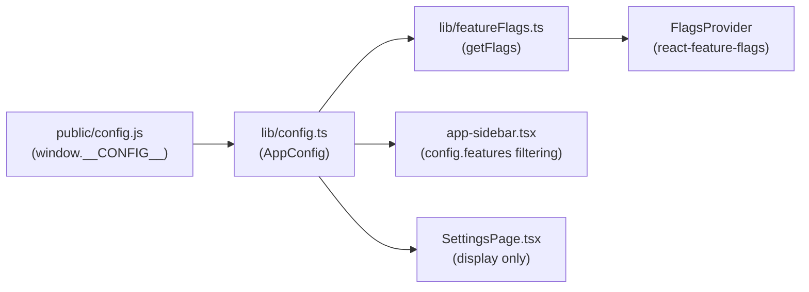

# Feature Flags

The web-client uses runtime feature flags to control which pages appear in the sidebar navigation. Flags are defined in `window.__CONFIG__.features` (loaded from `public/config.js`) and evaluated at render time. Disabled features are hidden from the sidebar but their routes remain accessible via direct URL.

## Overview



Feature flags flow through two parallel paths:

1. **Sidebar filtering** — `app-sidebar.tsx` reads `config.features` directly and filters navigation items. Items with a `flag` property are hidden when that flag is `false`.
2. **React context** — `FlagsProvider` from `react-feature-flags` wraps the app in `main.tsx`, making flags available to any component via the `<Flags>` component. This path is currently unused in the codebase but available for component-level gating.

## Key Concepts

### Flag Definitions

Flags are declared as boolean properties on the `FeatureFlags` interface in `lib/config.ts`:

```typescript
// web-client/src/lib/config.ts
interface FeatureFlags {
  chat: boolean
  jobs: boolean
  playground: boolean
  kb_playground: boolean
  kitchen_sink: boolean
}
```

Each flag maps to a page or feature in the sidebar. The current flags and their defaults:

| Flag | Default | Controls |
|------|---------|----------|
| `chat` | `false` | Chat page (LLM streaming) |
| `jobs` | `false` | Jobs page (background job queue) |
| `playground` | `true` | Playground page (Bedrock inference) |
| `kb_playground` | `false` | Knowledge Base Playground page |
| `kitchen_sink` | `true` | Kitchen Sink demo page (Samples section) |

### Sidebar-Only Visibility

Feature flags control **sidebar navigation visibility only**. Routes in `routes.ts` are always registered regardless of flag state. A user who navigates directly to `/chat` can access the page even when the `chat` flag is `false`. This is intentional — flags are a UI convenience for decluttering the sidebar, not an access control mechanism.

### Runtime Configuration

Flags are part of the `window.__CONFIG__` object loaded via a `<script>` tag in `index.html` before the app bundle executes. This means flag values can change per environment without rebuilding the application:

- **Local development** — `public/config.js` is committed with defaults (`playground: true`, `kitchen_sink: true`, others `false`).
- **Production** — At deploy time, `config_helper.py` or the configure-web-client MCP tool overwrites `dist/config.js` with environment-specific values.

## Usage

### Flagging a Sidebar Item

To gate a navigation item behind a feature flag, add a `flag` property to the item definition in `app-sidebar.tsx`:

```typescript
// web-client/src/components/app-sidebar.tsx
const data = {
  navMain: [
    { title: 'Dashboard', url: '/', icon: IconDashboard },
    { title: 'Chat', url: '/chat', icon: IconMessageCircle, flag: 'chat' as const },
    // Items without a flag property are always visible
  ],
}
```

The `NavMain` component filters items before rendering:

```typescript
// web-client/src/components/app-sidebar.tsx
const visibleItems = items.filter((item) => !item.flag || config.features[item.flag])
```

Items with no `flag` property pass the filter unconditionally. Items with a `flag` property are shown only when `config.features[flag]` is `true`.

### Adding a New Feature Flag

1. Add the boolean property to the `FeatureFlags` interface in `lib/config.ts`.
2. Add the default value to the fallback object in `lib/config.ts` (used when `window.__CONFIG__` is not set).
3. Add the default value to `public/config.js` and `public/config.production-example.js`.
4. Add the `flag` property to the relevant sidebar item in `app-sidebar.tsx`.

```typescript
// Step 1–2: lib/config.ts
interface FeatureFlags {
  chat: boolean
  jobs: boolean
  playground: boolean
  kb_playground: boolean
  kitchen_sink: boolean
  my_feature: boolean     // new flag
}

export const config: AppConfig = window.__CONFIG__ ?? {
  // ...
  features: {
    // ...existing flags...
    my_feature: false,    // new default
  },
}
```

```javascript
// Step 3: public/config.js
window.__CONFIG__ = {
  // ...
  features: {
    // ...existing flags...
    my_feature: false,
  },
};
```

```typescript
// Step 4: app-sidebar.tsx
{ title: 'My Feature', url: '/my-feature', icon: IconStar, flag: 'my_feature' as const },
```

### Viewing Flag State at Runtime

The Settings page (`/settings`) displays all current feature flag values in a table. This is useful for verifying which flags are active in a deployed environment.

## Extending / Maintaining

### Key Files

| File | Purpose |
|------|---------|
| `src/lib/config.ts` | `FeatureFlags` interface and fallback defaults |
| `src/lib/featureFlags.ts` | `getFlags()` — converts `config.features` to `react-feature-flags` array format |
| `src/main.tsx` | Wraps the app in `FlagsProvider` |
| `src/components/app-sidebar.tsx` | Filters sidebar items based on `config.features` |
| `src/pages/SettingsPage.tsx` | Displays flag state in the UI |
| `public/config.js` | Local development defaults |
| `public/config.production-example.js` | Documents all configurable values |
| `src/types/react-feature-flags.d.ts` | TypeScript type declarations for `react-feature-flags` |

### Two Consumption Paths

The codebase has two mechanisms for reading flags, each suited to a different use case:

1. **Direct config access** (`config.features.flagName`) — Used by `app-sidebar.tsx` and `SettingsPage.tsx`. Simpler and appropriate when the consuming component already imports `config`.

2. **`<Flags>` component** from `react-feature-flags` — Available via `FlagsProvider` in `main.tsx` but not currently used. Provides declarative `authorizedFlags` / `renderOn` / `renderOff` props for conditional rendering within components:

   ```tsx
   import { Flags } from 'react-feature-flags'

   <Flags authorizedFlags={['chat']} renderOff={() => null}>
     <ChatWidget />
   </Flags>
   ```

   Use the `<Flags>` component when gating content inside a page that is not itself flag-gated in the sidebar.

### Coupling with CloudFormation

Feature flags in the web-client correspond to backend capabilities that may or may not be deployed. For example, the `jobs` flag should be `true` only when the queue tier stack is deployed (which provides SQS + DynamoDB jobs table + worker Lambda). The `chat` flag requires a Bedrock model endpoint. Enabling a flag without the backing infrastructure results in a functional UI that returns API errors.

## References

- `web-client/src/lib/config.ts` — flag interface and runtime config
- `web-client/src/components/app-sidebar.tsx` — sidebar flag filtering
- `web-client/src/lib/featureFlags.ts` — `getFlags()` adapter
- `web-client/public/config.js` — local development defaults
- [react-feature-flags](https://www.npmjs.com/package/react-feature-flags) — React context-based flag library
