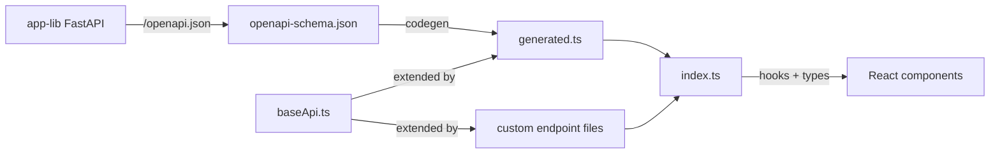

# RTK Query and OpenAPI Codegen

The web-client uses Redux Toolkit Query (RTK Query) for server state management and auto-generates typed API hooks from the backend's OpenAPI schema. Running `npm run codegen` produces a complete typed API layer — every backend endpoint becomes a React hook with request/response types.

## Overview

The API layer lives in `src/services/api/` and follows a layered architecture:

```
src/services/api/
├── baseApi.ts        # createApi() foundation — auth, error handling, cache tags
├── generated.ts      # Auto-generated endpoints + hooks + types (DO NOT EDIT)
├── enhancedApi.ts    # Override generated endpoints without editing generated.ts
├── jobsApi.ts        # Custom: SSE streaming via onCacheEntryAdded
├── projectsApi.ts    # Custom: full CRUD example with all cache tag patterns
├── uploadApi.ts      # Custom: FormData file uploads
└── index.ts          # Barrel exports
```

The data flows in one direction:



## Key Concepts

### The Codegen Pipeline

Three npm scripts compose the pipeline:

| Script | Command | Effect |
|--------|---------|--------|
| `update:openapi` | `curl -o openapi-schema.json http://localhost:8000/openapi.json` | Downloads the schema from the running backend |
| `generate:api` | `npx @rtk-query/codegen-openapi openapi-config.cjs` | Generates `generated.ts` from the schema |
| `codegen` | Runs both in sequence | End-to-end: download schema then generate code |

The codegen configuration in `openapi-config.cjs` tells the generator where to find the schema, which base API to extend, and where to write output:

```javascript
const config = {
  schemaFile: './openapi-schema.json',
  apiFile: './src/services/api/baseApi.ts',
  apiImport: 'baseApi',
  outputFile: './src/services/api/generated.ts',
  exportName: 'appApi',
  hooks: true,
  tag: true,
}
```

Setting `hooks: true` generates React hooks for every endpoint. Setting `tag: true` generates cache tags from OpenAPI operation tags.

### Base API

`baseApi.ts` creates the RTK Query API instance with `createApi()`. It handles two cross-cutting concerns:

**Authentication** — `prepareHeaders` reads a JWT token from the auth provider and attaches it as a Bearer token on every request.

**Error handling** — a `globalErrorHandler` setter allows React components to register error callbacks without circular imports. The base query wrapper invokes this handler on any failed request.

The `tagTypes` array in `baseApi.ts` declares cache tag categories used by custom endpoints. Generated endpoints add their own tags via `enhanceEndpoints({ addTagTypes })`.

The `reducerPath: 'appApi'` must match the key used in the Redux store at `src/store/store.ts`:

```typescript
export const store = configureStore({
  reducer: {
    [baseApi.reducerPath]: baseApi.reducer,
  },
  middleware: (getDefaultMiddleware) =>
    getDefaultMiddleware().concat(baseApi.middleware),
})
```

### Generated vs Custom Endpoints

Two mechanisms exist for defining endpoints, and each serves a different purpose:

**Generated endpoints** (`generated.ts`) are auto-generated from OpenAPI. They cover standard REST operations and should never be edited by hand. Regenerating overwrites the file entirely.

**Custom endpoints** (individual `.ts` files) use `baseApi.injectEndpoints()` to define endpoints that the codegen cannot produce — SSE streaming, FormData uploads, or endpoints requiring custom cache logic. Each custom endpoint file imports `baseApi` directly.

### Cache Tag Patterns

RTK Query uses cache tags to know when to refetch data. Four patterns appear in the codebase:

| Pattern | Code | Effect |
|---------|------|--------|
| List-level provide | `providesTags: ['projects']` | Marks this query as providing `projects` data |
| Item-level provide | `providesTags: (_r, _e, id) => [{ type: 'projects', id }]` | Marks as providing data for a specific ID |
| List-level invalidate | `invalidatesTags: ['projects']` | Refetches all queries tagged with `projects` |
| Item + list invalidate | `invalidatesTags: (_r, _e, { id }) => ['projects', { type: 'projects', id }]` | Refetches both lists and the specific item |

When a mutation invalidates a tag, RTK Query automatically refetches any active query that provides that tag. No manual refetch calls needed.

### SSE Streaming with onCacheEntryAdded

For server-sent events (SSE), RTK Query's `onCacheEntryAdded` lifecycle hook opens an `EventSource` connection and updates the cache in real time. `jobsApi.ts` demonstrates this pattern:

```typescript
getJob: build.query<JobResponse, string>({
  query: (jobId) => `/api/v1/jobs/${jobId}`,
  async onCacheEntryAdded(jobId, { updateCachedData, cacheEntryRemoved }) {
    const es = new EventSource(`${API_BASE_URL}/api/v1/sse/jobs/${jobId}`, {
      fetch: (input, init) => {
        const token = getIdToken()
        return fetch(input, {
          ...init,
          headers: { ...init?.headers, ...(token && { Authorization: `Bearer ${token}` }) },
        })
      },
    })
    es.onmessage = (event) => {
      if (event.data === '[DONE]') { es.close(); return }
      const data = JSON.parse(event.data) as JobResponse
      if (data.job_id) updateCachedData(() => data)
    }
    await cacheEntryRemoved
    es.close()
  },
}),
```

The initial REST call populates the cache, then the SSE connection pushes updates until the component unmounts (triggering `cacheEntryRemoved`).

### Endpoint Overrides

`enhancedApi.ts` provides a pattern for fixing codegen issues without editing `generated.ts`. Use `appApi.injectEndpoints({ overrideExisting: true })` to replace a generated endpoint with a corrected version — for example, adding `encodeURIComponent` to path parameters that the codegen does not encode.

## Usage

### Running Codegen

The backend must be running locally on port 8000 before codegen can download the schema.

```bash
# Start the backend (from app-lib/)
cd src/app_lib/common && make dev

# Run codegen (from web-client/)
npm run codegen
```

After codegen completes, `generated.ts` contains typed hooks for every endpoint the backend exposes. Import them in components:

```typescript
import { useListPassengersApiV1PassengersGetQuery } from '@/services/api/generated'

function PassengersPage() {
  const { data, isLoading } = useListPassengersApiV1PassengersGetQuery({ limit: 500 })
}
```

### Adding a Custom Endpoint

1. Create a new file in `src/services/api/` (for example, `myFeatureApi.ts`).

2. Import `baseApi` and use `injectEndpoints()`:

   ```typescript
   import { baseApi } from './baseApi'

   export const myFeatureApi = baseApi.injectEndpoints({
     endpoints: (build) => ({
       listItems: build.query<ItemResponse[], void>({
         query: () => '/api/v1/items',
         providesTags: ['items'],
       }),
     }),
   })

   export const { useListItemsQuery } = myFeatureApi
   ```

3. Add the new tag type to the `tagTypes` array in `baseApi.ts`.

4. Re-export the hooks from `index.ts`.

### When to Use Generated vs Custom Endpoints

| Scenario | Use |
|----------|-----|
| Standard REST CRUD (GET, POST, PUT, DELETE) | Generated — run `npm run codegen` after adding backend routes |
| SSE streaming | Custom — requires `onCacheEntryAdded` lifecycle hook |
| FormData uploads | Custom — requires non-JSON body handling |
| Complex cache invalidation | Custom — when codegen tags are insufficient |
| Path parameter encoding fixes | Override in `enhancedApi.ts` |

### Key Files

| File | Role |
|------|------|
| `openapi-config.cjs` | Codegen configuration — schema path, output path, options |
| `openapi-schema.json` | Downloaded OpenAPI schema (committed, refreshed by codegen) |
| `src/services/api/baseApi.ts` | `createApi()` instance — auth, error handling, tag types |
| `src/services/api/generated.ts` | Auto-generated endpoints — never edit |
| `src/store/store.ts` | Redux store — registers the API reducer and middleware |
