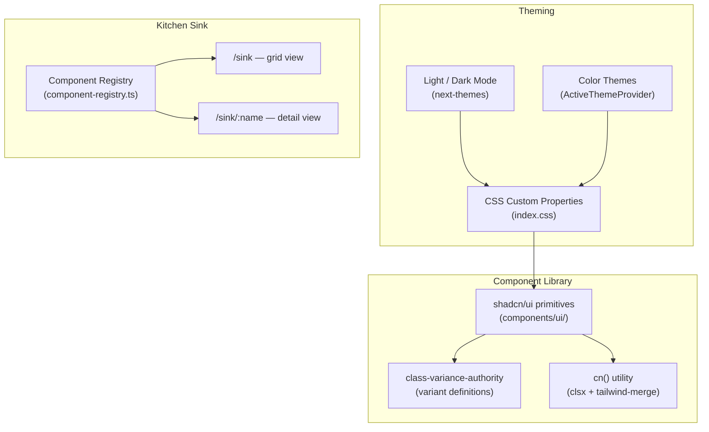

# ShadCN UI / Kitchen Sink

The web-client uses [shadcn/ui](https://ui.shadcn.com/) as its component library — copy-pasted Radix UI primitives styled with Tailwind CSS. Components live in `src/components/ui/` and are configured via `components.json`. A built-in Kitchen Sink page at `/sink` renders a live demo of every component for visual testing and theme previewing.

## Overview



| Concern | Technology | Location |
|---------|-----------|----------|
| UI primitives | shadcn/ui + Radix UI | `src/components/ui/` |
| Variant system | class-variance-authority (CVA) | Component files |
| Class merging | `cn()` — clsx + tailwind-merge | `src/lib/utils.ts` |
| Icons | Lucide React | Inline imports |
| Light/dark mode | next-themes | `src/providers/ThemeProvider.tsx` |
| Color themes | ActiveThemeProvider | `src/components/active-theme.tsx` |
| Kitchen Sink | Component registry + React Router | `src/pages/sink/` |

## Key Concepts

### shadcn/ui Configuration

The `components.json` at the web-client root configures how `npx shadcn` installs components:

```json
{
  "style": "new-york",
  "rsc": false,
  "tsx": true,
  "tailwind": {
    "css": "src/index.css",
    "baseColor": "neutral",
    "cssVariables": true
  },
  "iconLibrary": "lucide",
  "aliases": {
    "components": "@/components",
    "ui": "@/components/ui",
    "utils": "@/lib/utils",
    "lib": "@/lib",
    "hooks": "@/hooks"
  }
}
```

Key settings:

- **Style** — `new-york` (sharper, more compact than the `default` style).
- **RSC** — `false` (no React Server Components — this is a Vite SPA).
- **CSS variables** — `true`. All colors are CSS custom properties in OKLch color space, not hardcoded Tailwind classes.
- **Aliases** — Match `tsconfig.json` path aliases so `@/components/ui/button` resolves correctly.

### Component Anatomy

Every shadcn component follows the same pattern: Radix UI headless primitive + Tailwind styles + CVA variants + the `cn()` utility for class merging.

```typescript
// src/components/ui/button.tsx
import { cva, type VariantProps } from 'class-variance-authority'
import { Slot } from 'radix-ui'
import { cn } from '@/lib/utils'

const buttonVariants = cva(
  'inline-flex shrink-0 items-center justify-center gap-2 rounded-md ...',
  {
    variants: {
      variant: {
        default: 'bg-primary text-primary-foreground hover:bg-primary/90',
        destructive: 'bg-destructive text-white hover:bg-destructive/90 ...',
        outline: 'border bg-background shadow-xs hover:bg-accent ...',
        secondary: 'bg-secondary text-secondary-foreground ...',
        ghost: 'hover:bg-accent hover:text-accent-foreground ...',
        link: 'text-primary underline-offset-4 hover:underline',
      },
      size: {
        default: 'h-9 px-4 py-2',
        xs: 'h-6 gap-1 rounded-md px-2 text-xs',
        sm: 'h-8 gap-1.5 rounded-md px-3',
        lg: 'h-10 rounded-md px-6',
        icon: 'size-9',
      },
    },
    defaultVariants: { variant: 'default', size: 'default' },
  },
)

function Button({ className, variant, size, asChild, ...props }) {
  const Comp = asChild ? Slot.Root : 'button'
  return (
    <Comp className={cn(buttonVariants({ variant, size, className }))} {...props} />
  )
}
```

The pattern has three parts:

1. **CVA** — `cva()` defines a mapping from variant props to Tailwind classes.
2. **`cn()`** — Merges the CVA output with any additional `className` prop, deduplicating conflicting Tailwind classes via `tailwind-merge`.
3. **`asChild`** — Radix `Slot` pattern that renders the component's styles on its child element instead of wrapping it in an extra DOM node.

### Component Inventory

56 UI primitives are installed in `src/components/ui/`. The table below groups them by category:

| Category | Components |
|----------|-----------|
| **Layout** | Card, Separator, Resizable, Aspect Ratio, Scroll Area, Collapsible, Sidebar |
| **Navigation** | Breadcrumb, Navigation Menu, Menubar, Pagination, Tabs |
| **Forms** | Button, Button Group, Input, Input Group, Input OTP, Textarea, Checkbox, Radio Group, Select, Native Select, Switch, Slider, Calendar, Label, Field, Form |
| **Feedback** | Alert, Alert Dialog, Dialog, Drawer, Sheet, Popover, Hover Card, Tooltip, Sonner (toast), Progress, Skeleton, Spinner, Empty |
| **Data** | Table, Badge, Avatar, Carousel, Chart, Accordion |
| **Actions** | Dropdown Menu, Context Menu, Command, Toggle, Toggle Group |
| **Typography** | Kbd, Item |

Components marked custom (not from the shadcn registry): Empty, Field, Input Group, Item, Kbd, Button Group, Native Select, Spinner.

### Theming

The theming system has two independent layers:

**Layer 1 — Light/Dark Mode.** Managed by `next-themes` via `ThemeProvider` in `src/providers/ThemeProvider.tsx`. Toggles the `.dark` class on the root element. A `ModeToggle` button (sun/moon icon) in the Kitchen Sink header switches modes.

**Layer 2 — Color Themes.** Managed by `ActiveThemeProvider` in `src/components/active-theme.tsx`. Applies a `.theme-{name}` class to `document.body`, which overrides the `--primary` and `--primary-foreground` CSS custom properties.

Available color themes:

| Theme | Class | Primary Color |
|-------|-------|--------------|
| Default | `.theme-default` | Neutral 600 |
| Blue | `.theme-blue` | Blue 600 |
| Green | `.theme-green` | Lime 600 |
| Amber | `.theme-amber` | Amber 600 |
| Amazon | `.theme-amazon` | OKLch orange |
| Mono | `.theme-mono` | Neutral 600 + monospace font, no border radius |

Each color theme has a `-scaled` variant (e.g., `.theme-blue-scaled`) that applies responsive typography and tighter spacing at `min-width: 1024px`. The default active theme is `blue-scaled`.

All color definitions use the OKLch color space and are declared as CSS custom properties in `src/index.css`:

```css
:root {
  --primary: oklch(0.205 0 0);
  --primary-foreground: oklch(0.985 0 0);
  /* ... */
}

.theme-blue,
.theme-blue-scaled {
  --primary: var(--color-blue-600);
  --primary-foreground: var(--color-blue-50);
}
```

The semantic color tokens (background, foreground, primary, muted, accent, destructive, etc.) are mapped into Tailwind via `@theme inline` in `index.css`. Components reference these tokens (`bg-primary`, `text-muted-foreground`) rather than raw color values.

### Kitchen Sink Architecture

The Kitchen Sink is a standalone page tree at `/sink` with its own layout, sidebar navigation, and component registry. It uses lazy-loaded routes outside the main `RootLayout`.

**Routes** (in `src/routes.ts`):

| Path | Component | Purpose |
|------|-----------|---------|
| `/sink` | `SinkLayout` | Layout shell with sidebar, theme controls |
| `/sink` (index) | `SinkIndexPage` | Grid of all component demos |
| `/sink/:name` | `SinkDetailPage` | Individual component demo |

**Component Registry** (`src/pages/sink/component-registry.ts`):

A typed record mapping kebab-case keys to demo components:

```typescript
type ComponentConfig = {
  name: string                              // Display name
  component: React.ComponentType            // Demo component
  className?: string                        // Optional CSS class override
  type: 'registry:ui' | 'registry:page'    // Grid item vs full page
  href: string                              // Route path
  label?: string                            // "New" badge indicator
}

export const componentRegistry: Record<string, ComponentConfig> = {
  button: {
    name: 'Button',
    component: ButtonDemo,
    type: 'registry:ui',
    href: '/sink/button',
  },
  // ... 55 more UI components + 3 form pages
}
```

Entries with `type: 'registry:ui'` appear in the index grid. Entries with `type: 'registry:page'` (Forms, React Hook Form, TanStack Form) are full-page demos accessible from the sidebar only.

**Layout** (`SinkLayout.tsx`):

The layout shell renders a collapsible sidebar with component search, a sticky header with breadcrumbs, a theme selector dropdown, and a light/dark mode toggle. The main content area renders via `<Outlet />`.

**Component Wrapper** (`component-wrapper.tsx`):

Each demo in the index grid is wrapped in a `ComponentWrapper` that provides a labeled card border and a `ComponentErrorBoundary`. If a demo throws, the error boundary catches it and renders a fallback message without crashing the entire page.

**Demo files** live at `src/pages/sink/components/{name}-demo.tsx`. Each exports a single named component (e.g., `ButtonDemo`) that demonstrates the UI primitive with representative props and states.

## Usage

### Using a shadcn Component

Import from `@/components/ui/` and pass variant props:

```tsx
import { Button } from '@/components/ui/button'
import { SendIcon } from 'lucide-react'

<Button variant="outline" size="sm">
  <SendIcon /> Send
</Button>
```

Composition components (Card, Dialog, Sheet, etc.) use multiple named exports:

```tsx
import { Card, CardContent, CardHeader, CardTitle } from '@/components/ui/card'

<Card>
  <CardHeader>
    <CardTitle>Title</CardTitle>
  </CardHeader>
  <CardContent>Body</CardContent>
</Card>
```

### Adding a New shadcn Component

Run the shadcn CLI from the web-client directory:

```bash
cd web-client
npx shadcn add <component-name>
```

This installs the component to `src/components/ui/` with all Radix dependencies. No manual configuration is needed — `components.json` tells the CLI where to put files and which aliases to use.

### Adding a Component to the Kitchen Sink

1. Create a demo file at `src/pages/sink/components/{name}-demo.tsx`:

   ```tsx
   // src/pages/sink/components/my-widget-demo.tsx
   import { MyWidget } from '@/components/ui/my-widget'

   export function MyWidgetDemo() {
     return <MyWidget variant="default">Demo content</MyWidget>
   }
   ```

2. Register it in `src/pages/sink/component-registry.ts`:

   ```typescript
   import { MyWidgetDemo } from './components/my-widget-demo'

   export const componentRegistry = {
     // ... existing entries
     'my-widget': {
       name: 'My Widget',
       component: MyWidgetDemo,
       type: 'registry:ui',
       href: '/sink/my-widget',
       label: 'New',               // optional — shows a blue dot badge
     },
   }
   ```

The component appears automatically in the index grid, the sidebar navigation, and is accessible at `/sink/my-widget`. No route changes are needed — the `:name` dynamic route resolves from the registry.

### Switching Themes at Runtime

The Kitchen Sink header includes a theme selector and dark mode toggle. To use theming in application code:

```tsx
import { useThemeConfig } from '@/components/active-theme'

function MyComponent() {
  const { activeTheme, setActiveTheme } = useThemeConfig()
  // activeTheme is a string like "blue-scaled"
  // setActiveTheme("amazon") switches to the Amazon color theme
}
```

For light/dark mode, use the `useTheme()` hook from `next-themes`:

```tsx
import { useTheme } from 'next-themes'

function MyComponent() {
  const { theme, setTheme } = useTheme()
  // theme is "light", "dark", or "system"
}
```

## Extending / Maintaining

### Key Files

| File | Purpose |
|------|---------|
| `components.json` | shadcn CLI configuration (style, aliases, output paths) |
| `src/index.css` | CSS custom properties, theme definitions, Tailwind imports |
| `src/lib/utils.ts` | `cn()` class merging utility |
| `src/components/ui/` | All shadcn + custom UI primitives |
| `src/components/active-theme.tsx` | Color theme context provider |
| `src/providers/ThemeProvider.tsx` | Light/dark mode provider |
| `src/components/theme-selector.tsx` | Theme picker dropdown |
| `src/components/mode-toggle.tsx` | Light/dark mode toggle button |
| `src/pages/sink/component-registry.ts` | Kitchen Sink component registry |
| `src/pages/sink/SinkLayout.tsx` | Kitchen Sink layout shell |

### Adding a New Color Theme

1. Add a `.theme-{name}` class in `src/index.css` that overrides `--primary` and `--primary-foreground`:

   ```css
   .theme-purple,
   .theme-purple-scaled {
     --primary: var(--color-purple-600);
     --primary-foreground: var(--color-purple-50);

     @variant dark {
       --primary: var(--color-purple-500);
       --primary-foreground: var(--color-purple-50);
     }
   }
   ```

2. Add the theme to the appropriate array in `src/components/theme-selector.tsx`:

   ```typescript
   const DEFAULT_THEMES = [
     // ... existing themes
     { name: 'Purple', value: 'purple' },
   ]
   ```

### Non-Obvious Coupling

- **`data-slot` attributes** — Some shadcn components use `data-slot="card"`, `data-slot="button"`, etc. The scaled theme CSS targets these attributes to adjust spacing. Removing `data-slot` from a component can break scaled theme rendering.
- **OKLch color space** — All theme colors use OKLch. Mixing in hex or HSL values for custom themes causes visual inconsistency because the perceptual lightness model differs.
- **Provider ordering** — `ThemeProvider` must wrap `ActiveThemeProvider` in the provider tree (`src/main.tsx`). Reversing them breaks the dark mode class detection.

## References

- [shadcn/ui documentation](https://ui.shadcn.com/)
- [Radix UI primitives](https://www.radix-ui.com/primitives)
- [class-variance-authority](https://cva.style/docs)
- [Tailwind CSS v4](https://tailwindcss.com/docs)
- `web-client/components.json` — shadcn CLI configuration
- `web-client/src/index.css` — theme definitions and CSS custom properties
- `web-client/src/pages/sink/` — Kitchen Sink page tree
- `web-client/src/components/ui/` — component library
