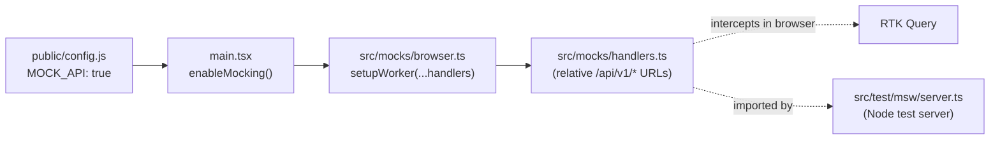

# UX-First Mocking

The web-client can run entirely against mocked API responses, with no backend, so screens can be built and refined before any service exists. A runtime toggle (`MOCK_API`) turns this "mock-UX mode" on and off, a single shared handler set serves both the browser and the test suite, and the mocks themselves become the contract from which the real backend is later scaffolded.

## Overview

Mock-UX mode is built on [MSW (Mock Service Worker)](https://mswjs.io/), which intercepts HTTP requests at the network layer. The same MSW handlers already power the unit test suite; mock-UX mode promotes them to a browser worker that runs during `npm run dev`.



The work is a closed three-stage loop: enter mock-UX mode, iterate on UX while the mocks accumulate into an API contract, then scaffold the real backend from that contract and flip mocking off so the same screens hit real services.

## Key Concepts

### Two independent switches

Mock-UX mode introduces one switch and reuses another. They are deliberately separate.

| Switch | Controls | Type | Default |
|--------|----------|------|---------|
| `MOCK_API` | Data source: MSW mocks vs. real backend | Top-level `window.__CONFIG__` key | `false` |
| `features.<name>` | UI visibility of a feature | `features.*` flag | per flag |

`MOCK_API` is a *data-source* switch, so it lives at the top level of the config object — not under `features`, which holds *product-visibility* flags (see [Feature Flags](feature-flags)). A builder typically sets `MOCK_API: true` and a new feature flag `true` together while building, then flips each independently as the feature matures.

### Mode detection

The canonical signal is **`config.MOCK_API === true`**. This is the single source of truth that both human builders and code agents use to determine whether the app is in mock-UX mode. It is read through `@/lib/config` (which reads `window.__CONFIG__`), surfaced read-only in the Settings page, and referenced by the co-located agent context in `src/mocks/`.

### Why mocking cannot ship to production

Three layers prevent mocking from leaking into a production build:

1. **Build-time guard** — `main.tsx` short-circuits on `import.meta.env.PROD`, so the worker never starts in a production build even if `MOCK_API` were somehow `true`.
2. **Lazy import** — the worker is imported dynamically (`await import('@/mocks/browser')`), so MSW is code-split out of the production bundle entirely. The guard makes the import dead code, and the bundler removes it.
3. **Deploy default** — `infra/scripts/configure_frontend.py` always writes `MOCK_API: false` into the deployed `dist/config.js`.

### One shared handler set

The handlers live in `src/mocks/handlers.ts` and are imported by both the browser worker (`src/mocks/browser.ts`) and the Node test server (`src/test/msw/server.ts`). There is no second copy to keep in sync.

Handler URLs are **relative** (`/api/v1/...`). A relative path resolves against `location.origin` in the browser and against jsdom's origin (`http://localhost`) under Vitest. The test origin is pinned to `http://localhost` in `vitest.config.ts`, and `API_BASE_URL` is `http://localhost` in `src/test/setup.ts`, so RTK Query issues `http://localhost/api/v1/...` requests that the relative handlers match by path. This is the single detail that lets one handler set serve both environments.

## Usage

### Enabling mock-UX mode

To develop against mocks with no backend running, set `MOCK_API` to `true` and start the dev server:

```javascript
// public/config.js (or public/config.local.js for a gitignored local default)
window.__CONFIG__ = {
  // ...
  MOCK_API: true,
  // ...
};
```

```bash
cd web-client
npm run dev
```

The browser worker registers and intercepts every `/api/v1/*` call. The Settings page (`/settings`) shows `MOCK_API: true` in the Runtime Configuration table. To leave mock-UX mode, set `MOCK_API: false` and reload — requests fall through the Vite proxy to the real backend on port 8000.

### Adding a handler

When adding a page that fetches data, add its handler in the same change. A page without a handler shows a network error in mock-UX mode.

```typescript
// src/mocks/handlers.ts
import { http, HttpResponse } from 'msw'

export const handlers = [
  // ...existing handlers...
  http.get('/api/v1/trips', () => {
    return HttpResponse.json([
      { id: 't1', destination: 'Lisbon', date: '2026-07-01', status: 'BOOKED' },
    ])
  }),
]
```

Return JSON in the shape the real DTO will return. The handler is the API contract — see the next section.

### The handler is the contract

For the mock-to-real migration to be lossless, a handler's response shape must mirror how the corresponding `app-lib` feature serializes its DTO (the Pydantic model in `routes/{name}_dto.py`). Author handlers as if a real Pydantic model produced them: same field names, same types, same nullability. When the backend is later scaffolded, [codegen](rtk-codegen) regenerates a typed client that drops straight into the screens already built against the mock.

## Migrating a mock to a real backend

This recipe converts one mocked endpoint into a real `app-lib` feature and re-types the client against it. It assumes the mock-UX work is approved and the endpoint should become real.

1. **Identify the handler.** Find the endpoint's handler in `src/mocks/handlers.ts` (for example, `GET /api/v1/trips`). Its JSON response shape is the target DTO shape.

2. **Scaffold the `app-lib` feature.** Copy and adapt `app-lib/src/app_lib/features/passengers/` into a new feature directory. In `routes/{name}_dto.py`, define a Pydantic response model whose fields exactly mirror the handler JSON. The router prefix is `/api/v1` by convention, matching the handler URL. The full recipe is in `app-lib/src/app_lib/features/CLAUDE.md`.

3. **Register and run the backend.** Add the two registration lines to `common/app.py` (import the router, call `app.include_router`), then run the backend locally:

   ```bash
   cd app-lib/src/app_lib/common && make dev
   ```

4. **Regenerate the typed client.** From `web-client/`, run codegen against the running backend:

   ```bash
   cd web-client && npm run codegen
   ```

   This curls the backend's `openapi.json` and regenerates `src/services/api/generated.ts` with typed hooks matching the previously-mocked shape, with no hand edits. See [RTK / Codegen](rtk-codegen).

5. **Flip mocking off.** Set `MOCK_API: false` in `config.js` and reload. The worker does not register; requests fall through to the real backend. The same screens now render live data.

:::note
For a step-by-step walkthrough of the full three-stage workflow — including feature-flag gating and the rationale for each switch — see the **UX-First Acceleration** guide in the Guides section.
:::

## Extending / Maintaining

### Key files

| File | Role |
|------|------|
| `src/mocks/handlers.ts` | Shared request handlers (relative URLs) — the source of truth for dev and tests |
| `src/mocks/browser.ts` | `setupWorker(...handlers)` — the browser worker |
| `src/mocks/AGENTS.md` | Terse do/don't rules for handler authoring |
| `src/mocks/README.md` | Structured agent context for the workflow |
| `src/test/msw/server.ts` | `setupServer(...handlers)` — the Node test server (imports the shared handlers) |
| `src/main.tsx` | `enableMocking()` — conditional worker start behind the PROD guard |
| `src/lib/config.ts` | `MOCK_API` on the `AppConfig` interface and fallback |
| `public/mockServiceWorker.js` | Generated worker script (via `npx msw init public/` in `postinstall`) — gitignored, do not edit |
| `infra/scripts/configure_frontend.py` | Deploy-time config writer — always writes `MOCK_API: false` |

### The generated worker script

`public/mockServiceWorker.js` is generated, not committed. The `postinstall` script regenerates it (alongside the OIDC worker) so a fresh `npm install` produces a working dev environment. Do not edit it by hand.

## References

- `web-client/src/mocks/` — handlers, browser worker, and agent context
- `web-client/src/main.tsx` — conditional worker bootstrap and PROD guard
- `app-lib/src/app_lib/features/CLAUDE.md` — feature-from-handler scaffold recipe
- [Feature Flags](feature-flags) — the `features.*` visibility switch
- [RTK / Codegen](rtk-codegen) — the OpenAPI-to-client pipeline that closes the loop
- [MSW](https://mswjs.io/) — the request-interception library
