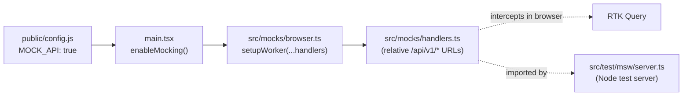

# UX-First Mocking

The web-client can serve every `/api/v1/*` request from in-browser mocks, with no backend running, when the `MOCK_API` runtime flag is set. This page documents how that mechanism is built. For the end-to-end workflow — building a feature against mocks and migrating it to a real backend — see the [UX-First Acceleration](/guides/ux-first-acceleration) guide.

## How It Works

Mock-UX mode is built on [MSW (Mock Service Worker)](https://mswjs.io/), which intercepts HTTP requests at the network layer. MSW was already wired for the unit test suite (`setupServer` in Node); this feature adds a browser worker (`setupWorker`) that runs during `npm run dev` and reuses the same handlers.



### Bootstrap

`src/main.tsx` starts the worker before the React tree renders. The worker is only started when `config.MOCK_API` is set and the build is non-production:

```typescript
// src/main.tsx
async function enableMocking() {
  if (import.meta.env.PROD || !config.MOCK_API) return
  const { worker } = await import('@/mocks/browser')
  await worker.start({ onUnhandledRequest: 'warn' })
}

void enableMocking().then(() => {
  createRoot(document.getElementById('root')!).render(/* ...provider tree... */)
})
```

`enableMocking()` is awaited before `createRoot` so no request can fire before the worker is intercepting. `onUnhandledRequest: 'warn'` mirrors the test server's behavior — an un-mocked call is logged, not silently dropped.

### Shared handler set

The handlers live in `src/mocks/handlers.ts` and are imported by both the browser worker (`src/mocks/browser.ts`) and the Node test server (`src/test/msw/server.ts`). There is no second copy to keep in sync:

```typescript
// src/mocks/browser.ts
import { setupWorker } from 'msw/browser'
import { handlers } from './handlers'
export const worker = setupWorker(...handlers)
```

Handler URLs are **relative** (`/api/v1/...`). A relative path resolves against `location.origin` in the browser and against jsdom's origin under Vitest. jsdom's origin is pinned to `http://localhost` in `vitest.config.ts`, and `API_BASE_URL` is `http://localhost` in `src/test/setup.ts`, so RTK Query issues `http://localhost/api/v1/...` requests that the relative handlers match by path. This is the single detail that lets one handler set serve both the browser and the test runner.

### Runtime toggle

`MOCK_API` is a top-level key on `window.__CONFIG__`, read through `@/lib/config` and surfaced read-only on the Settings page. It is a *data-source* switch — distinct from the `features.*` product-visibility flags (see [Feature Flags](feature-flags)):

```typescript
// src/lib/config.ts
interface AppConfig {
  // ...
  MOCK_API: boolean // when true (non-prod only), MSW intercepts /api/v1/*
  features: FeatureFlags
}
```

The key is declared in the `AppConfig` interface, the fallback object, all three `public/config.*.js` copies, and the test config in `src/test/setup.ts`. It defaults to `false` everywhere.

### Production safety

Three independent layers prevent mocking from reaching production:

1. **Build-time guard** — the `import.meta.env.PROD` short-circuit in `enableMocking()` means the worker never starts in a production build, even if `MOCK_API` were somehow `true`.
2. **Lazy import** — `await import('@/mocks/browser')` code-splits MSW out of the production bundle. Because the guard makes the import unreachable in a prod build, the bundler tree-shakes it away entirely (verified: no `setupWorker`/`msw/browser` reference in `dist/`).
3. **Deploy default** — `infra/scripts/configure_frontend.py` always writes `MOCK_API: false` into the deployed `dist/config.js`.

## Usage

To run the web-client against mocks with no backend, set `MOCK_API` to `true` and start the dev server:

```javascript
// public/config.js (or public/config.local.js for a gitignored local default)
window.__CONFIG__ = {
  // ...
  MOCK_API: true,
};
```

```bash
cd web-client && npm run dev
```

The browser worker registers and intercepts every `/api/v1/*` call; the Settings page (`/settings`) shows `MOCK_API: true`. Setting it back to `false` and reloading lets requests fall through the Vite proxy to the real backend on port 8000.

### Adding a handler

When adding a page that fetches data, add its handler in `src/mocks/handlers.ts` in the same change — a page without a handler shows a network error in mock-UX mode. Use a relative URL and return JSON in the shape the real DTO will produce:

```typescript
// src/mocks/handlers.ts
http.get('/api/v1/trips', () => {
  return HttpResponse.json([
    { id: 't1', destination: 'Lisbon', date: '2026-07-01', status: 'BOOKED' },
  ])
}),
```

The response shape is the API contract: it must mirror how the corresponding `app-lib` feature serializes its DTO (the Pydantic model in `routes/{name}_dto.py`) so that [codegen](rtk-codegen) later produces a typed client matching the screens already built against the mock. Per-directory authoring rules live in `src/mocks/AGENTS.md`.

## Extending / Maintaining

### Key files

| File | Role |
|------|------|
| `src/mocks/handlers.ts` | Shared request handlers (relative URLs) — source of truth for dev and tests |
| `src/mocks/browser.ts` | `setupWorker(...handlers)` — the browser worker |
| `src/mocks/AGENTS.md` | Terse do/don't rules for handler authoring |
| `src/mocks/README.md` | Structured agent context for the mode |
| `src/test/msw/server.ts` | `setupServer(...handlers)` — the Node test server (imports the shared handlers) |
| `src/main.tsx` | `enableMocking()` — conditional worker start behind the PROD guard |
| `src/lib/config.ts` | `MOCK_API` on the `AppConfig` interface and fallback |
| `vitest.config.ts` | Pins jsdom origin to `http://localhost` so relative handlers match in tests |
| `public/mockServiceWorker.js` | Generated worker script — gitignored, do not edit |
| `infra/scripts/configure_frontend.py` | Deploy-time config writer — always writes `MOCK_API: false` |

### The generated worker script

`public/mockServiceWorker.js` is generated, not committed. The `postinstall` script regenerates it via `msw init public/` (alongside the OIDC worker) so a fresh `npm install` produces a working dev environment. Do not edit it by hand; to upgrade it, bump `msw` and re-run `postinstall`.

### Coupling to watch

- **Adding a config key** requires touching all four copies plus the test config — the interface and fallback in `src/lib/config.ts`, all three `public/config.*.js` files, and `src/test/setup.ts`. The recipe is documented inline in `config.ts`.
- **The jsdom origin pin** in `vitest.config.ts` is load-bearing. Removing it breaks every data-fetching test, because relative handlers would resolve against jsdom's default `http://localhost:3000` while RTK requests `http://localhost`.
- **Handler URLs must stay relative.** An absolute URL works in tests but not in the browser, where the origin differs.

## References

- `web-client/src/mocks/` — handlers, browser worker, and agent context
- `web-client/src/main.tsx` — conditional worker bootstrap and PROD guard
- [UX-First Acceleration](/guides/ux-first-acceleration) — the end-to-end build-and-migrate workflow
- [Feature Flags](feature-flags) — the `features.*` visibility switch
- [RTK / Codegen](rtk-codegen) — the OpenAPI-to-client pipeline that closes the loop
- [MSW](https://mswjs.io/) — the request-interception library
