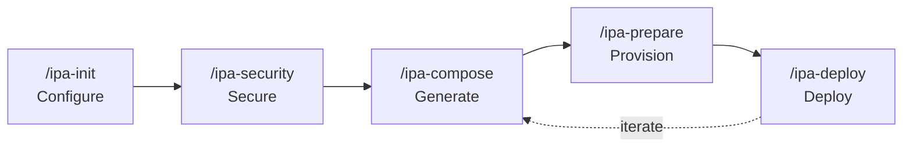

# IPA Lifecycle

IPA deploys infrastructure through a pipeline of five skills. A builder runs the full pipeline once to set up a project, then re-enters selectively as the project evolves — changing code, adding patterns, or adjusting configuration. Every skill in the pipeline is idempotent, so re-running any step is always safe.

This page covers the pipeline sequence, the two stack lifecycle stages (`prepare` and `deploy`), and the iterative cycle that accelerates building and deploying full-stack solutions. It does not cover individual skill parameters or stack internals — see the skill reference pages for those details.



## The Pipeline

The five skills execute in dependency order. Each skill reads artifacts produced by upstream skills and writes artifacts consumed by downstream skills.

| Skill | Phase | What It Produces |
|-------|-------|------------------|
| `/ipa-init` | Configure | `.env` file with project namespace, environment, region, and AWS account ID |
| `/ipa-security` | Secure | CloudFormation security stack (IAM roles + S3 log bucket); role ARNs written to `.env` |
| `/ipa-compose` | Generate | Six Makefiles (`prepare.mk`, `deploy.mk`, `build.mk`, `post-deploy.mk`, `env.mk`, `test.mk`) and a security disposition register |
| `/ipa-prepare` | Provision | One-time prerequisite CloudFormation stacks (e.g., Cognito, ECR) |
| `/ipa-deploy` | Deploy | Application CloudFormation stacks, built container images, and post-deploy wiring |

The `.env` file acts as the shared configuration bus. Every skill reads it; `/ipa-init`, `/ipa-security`, and `/ipa-prepare` write to it. A skill is a Claude Code instruction document in `.claude/skills/` that the builder invokes as a slash command (e.g., `/ipa-compose`). A pattern is a reusable deployment template in `patterns/` that defines a multi-stack architecture, its dependencies, and parameter wiring.

Two transitions in the pipeline are automatic. `/ipa-init` chains to `/ipa-security` when security infrastructure has not been provisioned. `/ipa-deploy` chains to `/ipa-prepare` when prerequisite stacks are not yet deployed. These auto-chains mean that on a fresh project, the builder can run `/ipa-init`, `/ipa-compose`, and `/ipa-deploy` — the intermediate steps trigger themselves.

## Stack Lifecycle Stages

Every stack in a pattern is classified as either `prepare` or `deploy`. This classification determines which Makefile receives the stack's targets and how the stack is managed over time.

| Stage | Deployed By | Frequency | Teardown |
|-------|-------------|-----------|----------|
| `prepare` | `/ipa-prepare` (or auto-triggered by `/ipa-deploy`) | Once per project setup | Manual only: `make -f scripts/prepare.mk teardown-prepare` |
| `deploy` | `/ipa-deploy` | Every deployment | `/ipa-destroy` or `make -f scripts/deploy.mk teardown` |

In a typical full-stack composition, Cognito and ECR are prepare stacks; backend and frontend are deploy stacks. The distinction exists because some infrastructure must be provisioned before build and deploy can run — ECR must exist before container images can be pushed, and Cognito must exist before OIDC configuration can be wired into the backend.

`/ipa-compose` reads the `(prepare)` annotation in each pattern's stack sequence and routes targets to the corresponding Makefile. Prepare stacks go into `prepare.mk`; deploy stacks go into `deploy.mk`. The builder does not need to manage this routing — composition handles it automatically.

## The Iterative Cycle

After the first deployment, the builder does not re-run the full five-step pipeline. Instead, the builder re-enters at the skill that corresponds to what changed and runs forward from there. Downstream skills handle the rest — unchanged stacks report "no updates" and succeed silently.

| What Changed | Re-Entry Point | What Happens |
|-------------|----------------|--------------|
| Application code | `/ipa-deploy` | Rebuilds containers and frontend; redeploys stacks (unchanged stacks are skipped) |
| New pattern added | `/ipa-compose` → `/ipa-deploy` | Regenerates Makefiles with merged patterns; deploy auto-prepares any new prerequisite stacks |
| CloudFormation template modified | `/ipa-compose` → `/ipa-deploy` | Regenerates Makefiles from updated templates; deploys changes |
| Namespace or environment changed | `/ipa-init` → `/ipa-compose` → `/ipa-deploy` | Reconfigures `.env`; regenerates Makefiles with new naming; full redeploy |
| IAM permissions changed | `/ipa-security` → `/ipa-deploy` | Updates security stack; redeploys with new role |

Every skill is idempotent. Re-running a skill that has nothing new to do succeeds without side effects. CloudFormation handles state diffing — the builder does not need to track which stacks changed or which parameters differ. This idempotency is what makes the cycle safe to repeat: when in doubt, re-run the pipeline from wherever it makes sense and let the tools sort out what actually needs to change.

### Extending a Deployment

Stacks can be layered. Adding the queue stack extends an existing composition without rewriting it. The compose skill merges stack sequences, combines wiring, and applies shared-stack modifications automatically.

```
/ipa-compose                                # Compose with frontend + backend stacks
/ipa-compose                                # Re-compose with queue stack added
/ipa-deploy                                 # Deploys new queue stack, updates backend with SQS integration
```

Running `/ipa-compose` with no arguments when a previous composition exists triggers an idempotent refresh — the skill extracts the pattern name from the existing Makefile header and regenerates all artifacts. This propagates template or skill changes without the builder needing to remember which pattern was originally composed.

## Beyond the Core Cycle

`/ipa-codepipeline` deploys a CI/CD pipeline (CodeCommit + CodePipeline) that executes the same `scripts/*.mk` Makefiles the builder runs locally. Local development and pipeline deployments use identical build and deploy logic — there is no separate CI/CD configuration to maintain.

`/ipa-destroy` tears down deploy-lifecycle stacks in reverse dependency order but preserves prepare and security stacks. The builder can destroy the application layer, modify code or templates, re-compose, and redeploy without re-provisioning prerequisites. This supports an experiment-and-iterate workflow where the cost of tearing down and rebuilding is low.
