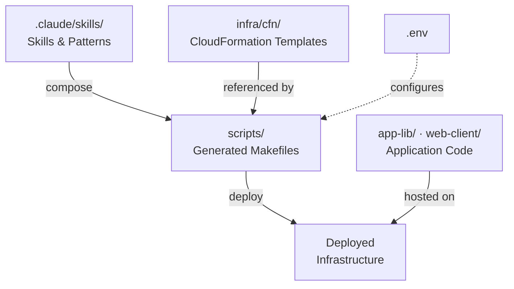

# How IPA Is Organized

Innovation Patterns Agent (IPA) is an AI-assisted infrastructure-as-code framework that uses Claude Code **skills** — Markdown instruction documents that Claude reads and follows when invoked — to orchestrate AWS CloudFormation deployments. This page describes the major areas of an IPA repository and how they relate. It does not cover individual skills or step-by-step workflows; those are documented in the [Skills](/developer-docs/skills) and [Guides](/guides) sections respectively.

## Key Areas

### Skills (`.claude/skills/`)

A skill is a Markdown file (`SKILL.md`) inside `.claude/skills/` that defines a specific capability. When a user invokes a skill (for example, `/ipa-compose`), Claude reads the file and executes the instructions it contains. Skills are not executable code — they are structured instructions for an AI agent.

Skills fall into three categories:

- **Process skills** orchestrate multi-step workflows. Examples include `/ipa-init` (project configuration), `/ipa-compose` (deployment artifact generation), and `/ipa-deploy` (infrastructure deployment).
- **Stack skills** define individual CloudFormation stacks — their parameters, outputs, and wiring contracts. Each stack skill corresponds to one template in `infra/cfn/`. Examples include `ipa-stack-backend` and `ipa-stack-frontend`.
- **Authoring skills** help create new stack skills. The `ipa-author-stack` skill generates a new stack skill directory from a description of the desired infrastructure.

The `/ipa-compose` skill manages stack composition — it determines deployment order, resolves inter-stack wiring, and generates executable Makefiles from the selected stacks.

### Infrastructure Templates (`infra/cfn/`)

CloudFormation templates are organized by stack name, one template per subdirectory (for example, `infra/cfn/backend/backend.yml`). Each template defines the AWS resources for a single tier of the application.

Stacks have two lifecycle classifications. **Prepare** stacks (Cognito, ECR, CodeCommit) are deployed once during initial setup and rarely change. **Deploy** stacks (Backend, Frontend, Queue, CodePipeline) are deployed on every release.

### Generated Scripts (`scripts/`)

The `scripts/` directory contains Makefiles generated by the `/ipa-compose` skill. These Makefiles are the executable deployment contract — they contain the actual `aws cloudformation deploy` commands, build steps, and post-deploy tasks. The `/ipa-prepare` and `/ipa-deploy` skills execute these Makefiles but never read skill files or pattern definitions directly. The scripts are generated artifacts; do not edit them by hand.

### Application Code (`app-lib/`, `web-client/`)

The backend application library (`app-lib/`) is a Python project using FastAPI, deployed as a Lambda container image. The frontend (`web-client/`) is a React single-page application built with TypeScript and Vite, deployed to S3 and served through CloudFront.

### Documentation (`docs/`)

The `docs/` directory contains this Docusaurus documentation site.

## How Areas Connect

The following diagram shows how the major areas feed into each other during composition and deployment.

The `/ipa-compose` skill reads pattern definitions and stack skills, then generates Makefiles in `scripts/`. Those Makefiles reference CloudFormation templates in `infra/cfn/` and, when executed by `/ipa-deploy`, deploy them as AWS stacks. The deployed infrastructure hosts the application code from `app-lib/` and `web-client/`. The `.env` file stores project configuration (namespace, environment, AWS region, credentials) and is read by the generated Makefiles at every stage.

## Next Steps

- **[Quickstart](../quickstart.md)** — Install dependencies, compose a pattern, and deploy infrastructure in a single walkthrough.
- **[Installation](../installation.md)** — Detailed prerequisite setup for Python, Node.js, and AWS CLI.
