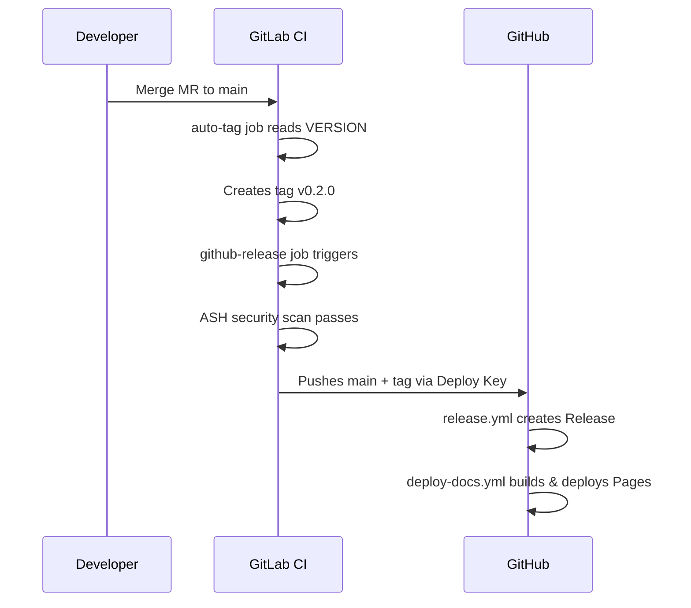

# Release Process

This guide documents how IPA releases are created, what happens automatically, and how to troubleshoot failures.

## Version Hierarchy

IPA uses separate version tracks for different components:

| Component | Source of Truth | Scheme | Example |
|-----------|----------------|--------|---------|
| IPA Framework | `VERSION` (repo root) | Semantic Versioning | `0.1.0` |
| app-lib | `app-lib/pyproject.toml` | Semantic Versioning | `0.1.0` |
| web-client | `web-client/package.json` | Semantic Versioning | `0.1.0` |

The **framework version** (`VERSION`) is what triggers releases and appears in GitHub Releases. It represents the overall IPA system — skills, stacks, patterns, and documentation combined.

## How to Release

### Step-by-step

1. **Update `VERSION`** — set the new version (no `v` prefix):
   ```bash
   echo "0.2.0" > VERSION
   ```
   Or use the convenience target:
   ```bash
   make -f scripts/release.mk release-prep VERSION=0.2.0
   ```

2. **Update `CHANGELOG.md`** — add a new section under `[Unreleased]`:
   ```markdown
   ## [0.2.0] - 2026-05-01

   ### Added
   - New feature description

   ### Changed
   - Modified behavior description
   ```
   Update the comparison links at the bottom of the file.

3. **Create an MR to `main`** — include the VERSION bump, CHANGELOG update, and any associated changes in a single MR.

4. **Merge** — once CI passes and the MR is approved, merge to `main`.

That's it. Everything else is automated.

### What happens after merge



1. **GitLab `auto-tag` job** — reads `VERSION`, checks if `v{VERSION}` tag exists. If not, creates the tag.
2. **GitLab `github-release` job** — triggered by the new tag. Runs `release-check` to verify VERSION matches the tag, then pushes `main` branch and tag to GitHub via Deploy Key.
3. **GitHub `release.yml`** — triggered by the tag push. Extracts the matching CHANGELOG section and creates a GitHub Release.
4. **GitHub `deploy-docs.yml`** — triggered by the tag push. Builds Docusaurus with `DOCS_TARGET=github` and deploys to GitHub Pages.

### When VERSION is NOT bumped

If you merge to `main` without changing `VERSION`, the `auto-tag` job detects the existing tag and exits cleanly. No release is created.

## CI Variables Setup

The release pipeline requires one GitLab CI/CD variable:

### `GITHUB_DEPLOY_KEY`

An SSH private key with push access to `github.com:aws-samples/sample-innovation-patterns`.

**Setup steps:**

1. Generate an SSH keypair:
   ```bash
   ssh-keygen -t ed25519 -C "gitlab-ci-deploy" -f deploy_key -N ""
   ```

2. Add the **public key** to GitHub:
   - Go to `github.com/aws-samples/sample-innovation-patterns` → Settings → Deploy Keys
   - Add `deploy_key.pub` with **write access** enabled

3. Add the **private key** to GitLab:
   - Go to your GitLab project → Settings → CI/CD → Variables
   - Add variable:
     - Key: `GITHUB_DEPLOY_KEY`
     - Value: contents of `deploy_key`
     - Type: File
     - Flags: **Masked**, **Protected**

4. Delete the local keypair:
   ```bash
   rm deploy_key deploy_key.pub
   ```

## Troubleshooting

### `release-check` fails: VERSION does not match tag

The VERSION file content doesn't match the git tag on the current commit.

**Fix:** Ensure `VERSION` contains exactly the version that matches the tag (without `v` prefix). For example, if the tag is `v0.2.0`, VERSION must contain `0.2.0`.

### `auto-tag` says "tag already exists"

This is normal — it means VERSION wasn't bumped in the merge. No release is created.

### `github-release` fails: force-with-lease rejected

The GitHub remote has commits that don't exist in GitLab. This shouldn't happen if GitHub is a read-only mirror.

**Fix:** Investigate what diverged. If GitHub received direct commits or PRs, they need to be either cherry-picked back to GitLab or discarded. After resolving, re-run the pipeline.

### GitHub Release is empty (no changelog body)

The CHANGELOG.md section header format doesn't match what the extraction script expects.

**Fix:** Ensure the section header is exactly `## [X.Y.Z]` (with brackets, no extra text after the date).

### Deploy Key authentication fails

**Check:**
- The `GITHUB_DEPLOY_KEY` variable exists and is protected
- The matching public key is still in GitHub Deploy Keys with write access
- The key hasn't expired

## GitHub Pages Configuration

The Docusaurus site supports both GitLab Pages and GitHub Pages via the `DOCS_TARGET` environment variable:

- **GitLab Pages** (default): `url: https://code.aws.dev`, `baseUrl: /innovation-patterns-0a90b6/`
- **GitHub Pages** (`DOCS_TARGET=github`): `url: https://aws-samples.github.io`, `baseUrl: /sample-innovation-patterns/`

The GitHub Actions workflow sets `DOCS_TARGET=github` automatically during the Pages build.
