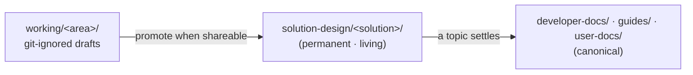

# Solution Design Docs

## Overview

This guide walks through standing up and maintaining a solution's design and requirements documents in the [Solution Design](/developer-docs/solution-design) section. By the end, a solution has its own living document set — copied from the shipped template — with the right documents for the engagement, living-doc status tracking in place, and a clear path for promoting settled content to canonical reference.

## When to Use This Guide

Use this guide when:

- A new engagement needs a home for its vision, requirements, exploration, and architecture documents
- A design or requirements draft in `docs/docs/working/` is shareable and should be promoted to a permanent location
- A solution's design documents need living-doc upkeep (status, last-updated) as the POC evolves
- A decision must be made about whether a solution's design content ships publicly or stays internal

Do not use this guide to write an engineering feature spec — those live in `working/specs/<feature>/` and are authored with the `/ai-code-*` skills.

## Before You Start

Before starting, confirm the following:

- The docs site runs locally: `cd docs && npm install && npm start` serves on port 3001
- Familiarity with the [Solution Design](/developer-docs/solution-design) section overview and its document menu
- Familiarity with the [Documentation Structure](/developer-docs/docs/documentation-structure) reference, the authoritative taxonomy for the site
- The solution has a short, lowercase-hyphenated name (for example, `policy-intelligence`)

## Before / Target State

| Before | After |
|--------|-------|
| No design/requirements home for the solution; structure invented per engagement | Solution has `solution-design/<solution-name>/` with the documents the engagement needs |
| Drafts (if any) live only in git-ignored `working/` | Shareable drafts copied into the permanent, living Solution Design section |
| No at-a-glance view of document state | Per-solution landing page carries a living-doc status table |

## Steps

### 1. Copy the template

To create the solution's document set, copy the shipped `template/` directory to a new directory named for the solution. In the `docs/docs/developer-docs/solution-design/` directory, run:

```bash
cp -r template <solution-name>
```

The `template/` directory renders in the site as a worked example, so its contents and conventions are visible before copying. The copy produces `solution-design/<solution-name>/` with `index.md` and the four menu stubs.

### 2. Rename the headings and trim the menu

Open `solution-design/<solution-name>/index.md` and change the H1 from "Solution Design Template" to the solution name. The document set is a **suggested menu, not a mandated set** — keep the documents the engagement needs and delete the rest.

| Document | Answers | When to use |
|---|---|---|
| `vision.md` | Why build this? What is the dream? | Almost always — a short Vision or PRFAQ frames the solution |
| `requirements.md` | What must it do? | When scope needs to be explicit; pick one flavor (BRD / PRD / SRS) |
| `exploration.md` | What was investigated and learned? | When spikes, domain primers, or open questions need a record |
| `architecture.md` | How is it built? | Once a system shape emerges; embed ADRs as decisions settle |

For a POC, a Vision plus a short product-flavored Requirements document is often enough to start. Add Exploration and Architecture as the work produces them.

### 3. Set the living-doc headers

Each document carries living-doc conventions near the top. Set them for the solution's current state:

```markdown
> Status: 🔬 Exploring · 📝 Drafting · ✅ Stable — (mark the current one)
> Last updated: 2026-06-25
```

Update the status table in `index.md` to match — it is the at-a-glance view of where each document stands:

```markdown
| Document | Status | Last updated | Description |
|---|---|---|---|
| [Vision](vision.md) | 📝 Drafting | 2026-06-25 | Why build this; the dream |
```

### 4. Choose public or internal placement

Decide where the solution's documents live based on their content:

- **Public** — leave the solution directory under `developer-docs/solution-design/`. It ships in the public GitHub release. Appropriate for a generic or open solution.
- **Internal** — move the solution directory to `developer-docs/internal/`. It is committed to the source repository but filtered out of the public release by `infra/scripts/github-push.sh`. Appropriate for customer-specific solution content.

:::warning
Design and requirements documents often hold customer-specific or pre-decision material. When in doubt, place the solution's directory under `developer-docs/internal/`.
:::

### 5. Promote drafts and settled topics

Author rough drafts in git-ignored `working/` using the `/ai-doc-*` skills, then promote by **copy, not move**:

- When a working draft is shareable, copy it into the solution's Solution Design directory. The draft stays in `working/` as scratch.
- When a topic in a Solution Design document fully settles, copy the canonical version onward to `developer-docs/`, `guides/`, or `user-docs/`. The Solution Design document remains as the living record.



## Verification

To confirm the solution's document set renders and is wired correctly, run the docs site. In the `docs/` directory, run:

```bash
npm start
```

Then check:

1. The `<solution-name>` directory appears under **Solution Design** in the Developer Docs sidebar at `http://localhost:3001`.
2. The solution's landing page shows the status table, and each document shows a status line and a last-updated date.
3. The console shows no new broken-link warnings (`onBrokenLinks: 'warn'`).

## Next Steps

- **Section reference** — see [Solution Design](/developer-docs/solution-design) for the document menu and living-doc conventions
- **Site taxonomy** — see [Documentation Structure](/developer-docs/docs/documentation-structure) for where this section sits and its content conventions
- **Draft authoring** — use the `/ai-doc-*` skills in `working/` to draft before promoting
- **IPA vision** — a solution's vision is distinct from IPA's own PRFAQ, planned for `getting-started/concepts/prfaq.md`
