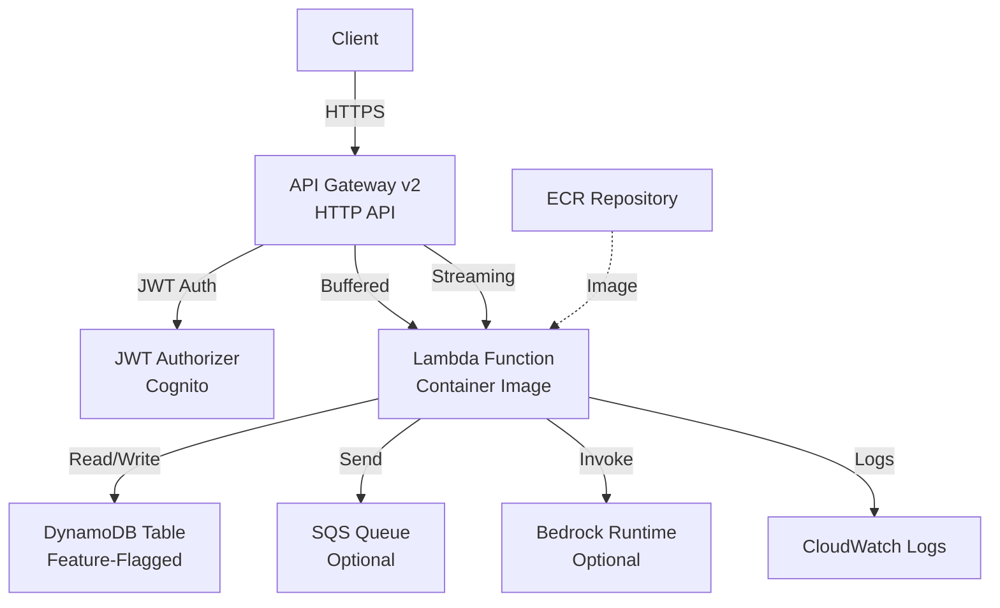

# Deployment Architecture

## Diagram

## Resources

The backend stack provisions 16 resources. Conditional resources are created only when their associated feature flag is enabled.

| Logical ID | Type | Description |
|------------|------|-------------|
| `PassengersTable` | `AWS::DynamoDB::Table` | DynamoDB table for passenger data with PAY_PER_REQUEST billing and SSE enabled. **Conditional:** created only when `EnablePassengersTable=true`. |
| `LambdaExecutionRole` | `AWS::IAM::Role` | Per-function execution role with least-privilege policies. Includes conditional policies for DynamoDB, SQS, and always-on policies for ECR pull and Bedrock invocation. |
| `LambdaFunction` | `AWS::Lambda::Function` | Container-packaged Lambda function. Receives environment variables for auth configuration, invoke mode, namespace, environment, and optionally SQS queue URL. Reserved concurrency set to 50. |
| `LambdaLogGroup` | `AWS::Logs::LogGroup` | CloudWatch log group for Lambda function output. Retention set to 30 days. |
| `HttpApi` | `AWS::ApiGatewayV2::Api` | HTTP API (API Gateway v2) with CORS configuration allowing GET, POST, PUT, DELETE, and OPTIONS methods. |
| `JwtAuthorizer` | `AWS::ApiGatewayV2::Authorizer` | JWT authorizer configured with the Cognito issuer URL and client ID. Extracts tokens from the `Authorization` header. |
| `BufferedIntegration` | `AWS::ApiGatewayV2::Integration` | AWS_PROXY integration for standard (buffered) routes. 30-second timeout. Payload format version 2.0. |
| `StreamingIntegration` | `AWS::ApiGatewayV2::Integration` | AWS_PROXY integration for SSE streaming routes. 30-second timeout. Payload format version 2.0. |
| `GetRoute` | `AWS::ApiGatewayV2::Route` | `GET /{proxy+}` route using the buffered integration with JWT authorization. |
| `PostRoute` | `AWS::ApiGatewayV2::Route` | `POST /{proxy+}` route using the buffered integration with JWT authorization. |
| `PutRoute` | `AWS::ApiGatewayV2::Route` | `PUT /{proxy+}` route using the buffered integration with JWT authorization. |
| `DeleteRoute` | `AWS::ApiGatewayV2::Route` | `DELETE /{proxy+}` route using the buffered integration with JWT authorization. |
| `SseRoute` | `AWS::ApiGatewayV2::Route` | `GET /api/v1/sse/{proxy+}` route using the streaming integration with JWT authorization. |
| `DefaultStage` | `AWS::ApiGatewayV2::Stage` | `prod` stage with auto-deploy enabled and structured JSON access logging. |
| `LambdaInvokePermission` | `AWS::Lambda::Permission` | Grants API Gateway permission to invoke the Lambda function. Scoped to the specific HTTP API. |
| `ApiGatewayLogGroup` | `AWS::Logs::LogGroup` | CloudWatch log group for API Gateway access logs. Retention set to 30 days. |
