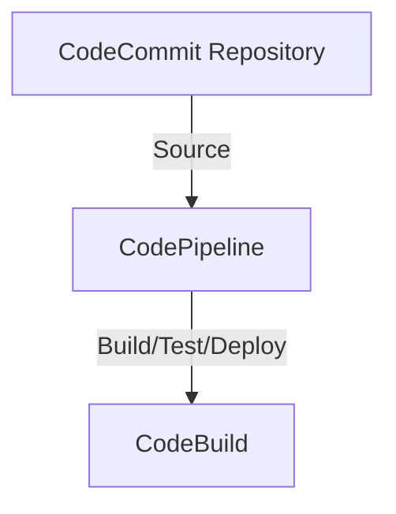

# Deployment Architecture

## Diagram

## Resources

The CodeCommit stack provisions 1 resource.

| Logical ID | Type | Description |
|------------|------|-------------|
| `Repository` | `AWS::CodeCommit::Repository` | CodeCommit Git repository. Configured with the specified name and description. When `KmsKeyArn` is provided, encryption at rest uses the customer-managed KMS key (condition: `HasKmsKey`). |

## Security

- **Encryption at rest:** Optional. When the `KmsKeyArn` parameter is provided, the repository is encrypted with the specified customer-managed KMS key. When omitted, CodeCommit applies its default server-side encryption.
- **Private by default:** The repository has no public access configuration. Access is controlled entirely through IAM policies.
- **No IAM capabilities required:** The stack does not create IAM roles or policies, so it does not require `CAPABILITY_IAM` or `CAPABILITY_NAMED_IAM`.
