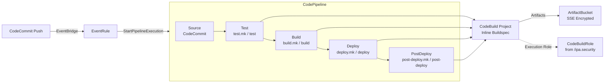

# Deployment Architecture

## Diagram

## Resources

The CodePipeline stack provisions 7 resources.

| Logical ID | Type | Description |
|------------|------|-------------|
| `ArtifactBucket` | `AWS::S3::Bucket` | S3 bucket for pipeline artifacts. All four PublicAccessBlock flags enabled. Default encryption is SSE-S3 (AES256); switches to SSE-KMS when `KmsKeyArn` is provided. Bucket name follows the pattern `{Namespace}-{Environment}-pipeline-artifacts-{AccountId}`. |
| `ArtifactBucketPolicy` | `AWS::S3::BucketPolicy` | Denies all S3 actions (`s3:*`) when `aws:SecureTransport` is `false`, enforcing SSL-only access to the artifact bucket. |
| `CodeBuildProject` | `AWS::CodeBuild::Project` | Build project with an inline buildspec that runs `make -f "scripts/${IPA_MAKEFILE}" ${IPA_TARGET}`. Uses privileged mode for Docker builds. Installs Python 3.12 and Node.js 22 runtimes. The execution role is provided externally via the `CodeBuildRoleArn` parameter. |
| `Pipeline` | `AWS::CodePipeline::Pipeline` | Five-stage pipeline: Source (CodeCommit), Test, Build, Deploy, and PostDeploy. All four CodeBuild stages share a single project and override `IPA_MAKEFILE` and `IPA_TARGET` per action. Artifacts are stored in the `ArtifactBucket`. |
| `EventRule` | `AWS::Events::Rule` | EventBridge rule that triggers the pipeline on `referenceCreated` and `referenceUpdated` events for the configured branch on the CodeCommit repository. Replaces polling-based source detection. |
| `EventRuleRole` | `AWS::IAM::Role` | IAM role assumed by EventBridge. Grants `codepipeline:StartPipelineExecution` scoped to the pipeline ARN. |
| `PipelineRole` | `AWS::IAM::Role` | IAM role assumed by CodePipeline. Permissions are scoped to specific resource ARNs: CodeBuild project, artifact bucket, CodeCommit repository, and optionally a KMS key. |

## CodeBuild Environment Variables

The CodeBuild project defines 9 environment variables. The first 7 are set at project creation and remain constant across all pipeline stages. The last 2 are overridden per stage action to select the appropriate Makefile and target.

| Variable | Value | Override Per Stage |
|----------|-------|--------------------|
| `APP_NAMESPACE` | `Namespace` parameter | No |
| `APP_ENV` | `Environment` parameter | No |
| `AWS_ACCOUNT_ID` | `AccountId` parameter | No |
| `ECR_REPO_URI` | `EcrRepoUri` parameter | No |
| `OIDC_ISSUER` | `OidcIssuer` parameter | No |
| `OIDC_CLIENT_ID` | `OidcClientId` parameter | No |
| `OIDC_END_SESSION_ENDPOINT` | `OidcEndSessionEndpoint` parameter | No |
| `IPA_MAKEFILE` | Stage-specific Makefile (e.g., `test.mk`, `build.mk`, `deploy.mk`, `post-deploy.mk`) | Yes |
| `IPA_TARGET` | Stage-specific Make target (e.g., `test`, `build`, `deploy`, `post-deploy`) | Yes |

### Stage-to-Makefile Mapping

| Stage | `IPA_MAKEFILE` | `IPA_TARGET` |
|-------|----------------|--------------|
| Test | `test.mk` | `test` |
| Build | `build.mk` | `build` |
| Deploy | `deploy.mk` | `deploy` |
| PostDeploy | `post-deploy.mk` | `post-deploy` |

## Security Summary

- **No wildcard IAM resources** -- all IAM policy statements in `PipelineRole` and `EventRuleRole` are scoped to specific resource ARNs
- **Artifact bucket isolation** -- all four `PublicAccessBlockConfiguration` flags are enabled; a bucket policy denies any request where `aws:SecureTransport` is `false`
- **Encryption at rest** -- artifacts use SSE-S3 by default; when `KmsKeyArn` is provided, the bucket and pipeline switch to SSE-KMS and the `PipelineRole` receives conditional `kms:Decrypt` and `kms:GenerateDataKey` permissions
- **Separation of execution roles** -- the CodeBuild project uses an external execution role from `/ipa.security`, keeping build-time permissions (ECR pull, CloudFormation deploy, S3 sync) separate from the pipeline orchestration role
- **Privileged mode** -- enabled on the CodeBuild project to support Docker-in-Docker container image builds; the execution role controls what the build environment can access
- **Event-driven triggers** -- `PollForSourceChanges` is set to `false`; the EventBridge rule provides push-based triggering with no polling interval
