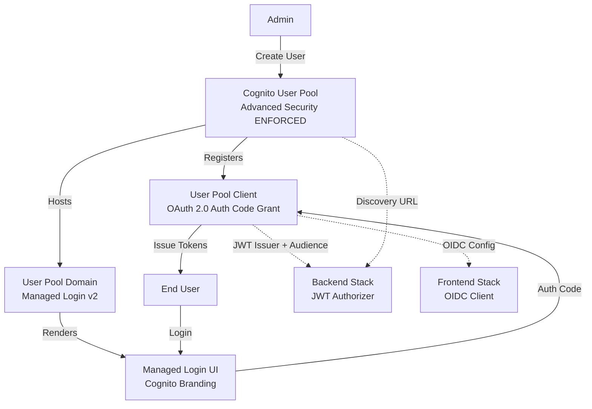

# Deployment Architecture

## Diagram

## Resources

The Cognito stack provisions 4 resources.

| Logical ID | Type | Description |
|------------|------|-------------|
| `CognitoUserPool` | `AWS::Cognito::UserPool` | User Pool with Advanced Security Mode set to ENFORCED. Self-registration is disabled (`AllowAdminCreateUserOnly: true`). Email is auto-verified. Password policy requires uppercase, lowercase, numbers, symbols, and a configurable minimum length. Deletion protection is parameterized. |
| `CognitoUserPoolClient` | `AWS::Cognito::UserPoolClient` | App client configured for OAuth 2.0 Authorization Code Grant only. Scopes: `openid`, `profile`, `email`. Access and ID tokens valid for 8 hours; refresh tokens valid for 24 hours. `PreventUserExistenceErrors` is enabled. No client secret is generated (public client for SPA use). Supports `USER_PASSWORD_AUTH`, `USER_SRP_AUTH`, and `REFRESH_TOKEN_AUTH` explicit auth flows. |
| `CognitoUserPoolDomain` | `AWS::Cognito::UserPoolDomain` | Custom domain prefix for the Cognito Hosted UI. Uses Managed Login version 2. The domain prefix must be globally unique and must not contain reserved words (`cognito`, `aws`, `amazon`). |
| `ManagedLoginBranding` | `AWS::Cognito::ManagedLoginBranding` | Managed Login UI branding configuration. Uses Cognito-provided default values. Depends on the domain resource to ensure the domain is registered before branding is applied. |

## Security Summary

| Control | Configuration |
|---------|---------------|
| Advanced Security Mode | ENFORCED -- enables adaptive authentication, compromised credential detection, and risk-based challenges. |
| Self-Registration | Disabled. Only administrators can create user accounts (`AllowAdminCreateUserOnly: true`). |
| User Enumeration Prevention | Enabled. `PreventUserExistenceErrors` returns generic error messages to prevent attackers from discovering valid usernames. |
| OAuth Flow | Authorization Code Grant only. Implicit grant and client credentials grant are not permitted. |
| OIDC Scopes | Restricted to `openid`, `profile`, and `email`. No custom scopes are defined. |
| Password Policy | Requires uppercase, lowercase, numbers, and symbols. Minimum length defaults to 8 (configurable up to 99). |
| Token Validity | Access and ID tokens: 8 hours. Refresh tokens: 24 hours. Values are hardcoded in the template. |
| MFA | Not enabled. Mitigated by Advanced Security Mode adaptive challenges and admin-only user creation. |
| IAM | No IAM roles or policies are created by this stack. No `--capabilities` flag is required for deployment. |
| Deletion Protection | Parameterized. Set to `ACTIVE` for production environments to prevent accidental stack deletion from destroying the User Pool. |
