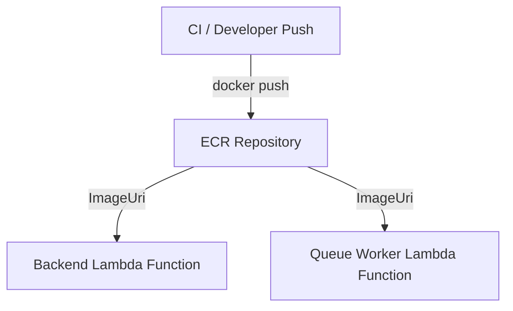

# Deployment Architecture

## Diagram

## Resources

| Resource | Type | Description |
|----------|------|-------------|
| ECRRepository | `AWS::ECR::Repository` | Container image repository named `{ns}-{env}-ecr`. Configured with mutable image tags, scan-on-push vulnerability scanning, and AES256 server-side encryption. |

## Security Properties

- **Encryption at rest**: AES256 (SSE-S3) server-side encryption is applied to all stored container images.
- **Scan-on-push**: Amazon ECR image scanning runs automatically on every push, surfacing known vulnerabilities without manual intervention.
- **No public access**: The repository does not include a repository policy granting cross-account or public access. Only principals within the owning account can push or pull images.
- **Retention on delete**: The repository does not specify a `DeletionPolicy` override, so CloudFormation retains the resource by default when the stack is deleted. Images are not automatically destroyed.
- **No IAM roles**: The stack does not create IAM roles or require `CAPABILITY_IAM`.
