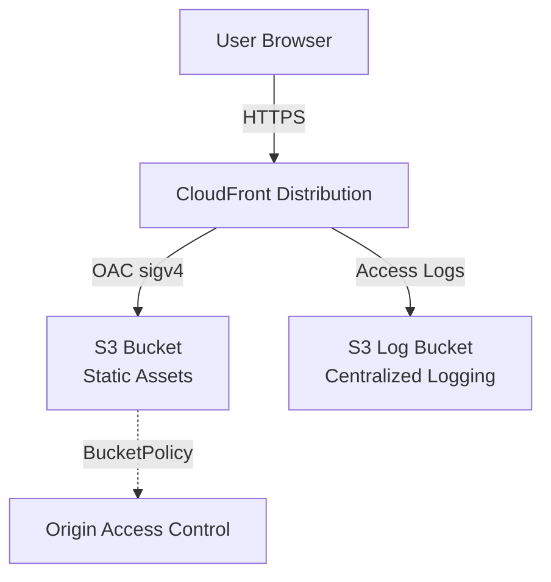

# Deployment Architecture

## Diagram

## Resources

| Resource | Type | Description |
|----------|------|-------------|
| WebBucket | `AWS::S3::Bucket` | Private bucket for static web assets. Configured with AES256 server-side encryption, Block Public Access on all four settings, and access logging to the centralized log bucket. Bucket name follows the pattern `{ns}-{env}-{suffix}-{account_id}`. |
| OriginAccessControl | `AWS::CloudFront::OriginAccessControl` | OAC with sigv4 signing protocol and `always` signing behavior. Grants CloudFront secure, identity-based access to the S3 origin without making the bucket public. |
| Distribution | `AWS::CloudFront::Distribution` | CloudFront CDN configured with HTTPS-only viewer policy (redirect-to-https), TLSv1.2_2021 minimum protocol version, HTTP/2 and HTTP/3 support, and `PriceClass_100` (North America and Europe edge locations). Custom error responses map 403 and 404 to `index.html` with status 200 for SPA client-side routing. CloudFront access logs are written to the centralized log bucket under the `cloudfront-logs/` prefix. |
| BucketPolicy | `AWS::S3::BucketPolicy` | Two-statement policy. The first statement allows `s3:GetObject` from the CloudFront service principal, scoped to the specific distribution ARN via the OAC condition key. The second statement denies all S3 actions when `aws:SecureTransport` is false, enforcing TLS for all requests. |

## Security Properties

- **Block Public Access**: All four block-public-access settings are enabled on the S3 bucket. No public read or write access is possible.
- **Encryption at rest**: AES256 (SSE-S3) server-side encryption is applied to all objects by default.
- **Origin Access Control**: CloudFront uses OAC with sigv4 signing. The bucket policy restricts access to the specific CloudFront distribution ARN, preventing access from other distributions or direct S3 requests.
- **Transport encryption**: The bucket policy includes a `DenyInsecureTransport` statement that rejects any request made over plain HTTP. CloudFront enforces HTTPS with a minimum TLS version of TLSv1.2_2021.
- **No IAM roles**: The stack does not create IAM roles or require `CAPABILITY_IAM`. The only principals are the CloudFront service and the OAC identity.
