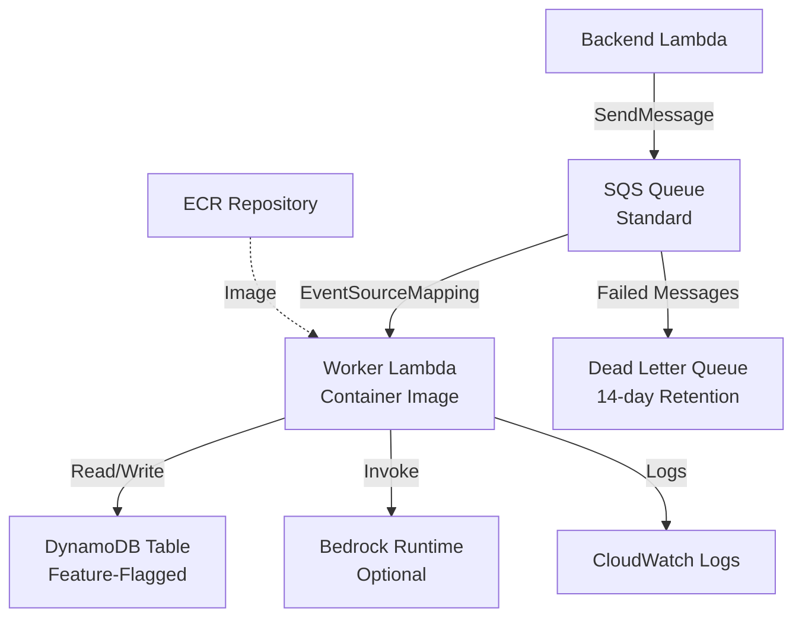

# Deployment Architecture

## Diagram

## Deploy Ordering

The queue tier deploys **before** the backend tier. After the queue stack completes, its `QueueUrl` and `QueueArn` outputs are wired into the backend stack as parameters, granting the backend Lambda permission to send messages to the queue. This ordering is enforced by the generated Makefile targets.

## Resources

The template provisions 8 resources. Three are conditional based on feature flags.

| Logical ID | Type | Conditional | Description |
|------------|------|:-----------:|-------------|
| `JobsTable` | `AWS::DynamoDB::Table` | Yes (`EnableJobsTable`) | Pay-per-request DynamoDB table for job tracking. Table name follows the `{Namespace}_{Environment}_jobs` convention. SSE enabled. |
| `Queue` | `AWS::SQS::Queue` | No | Standard SQS queue with configurable visibility timeout and message retention. SQS-managed SSE enabled. Redrive policy configured when DLQ is present. |
| `DeadLetterQueue` | `AWS::SQS::Queue` | Yes (`CreateDLQ`) | Dead-letter queue with 14-day message retention and SQS-managed SSE. Receives messages after `MaxReceiveCount` failed processing attempts. |
| `QueuePolicy` | `AWS::SQS::QueuePolicy` | No | Denies all SQS actions when `aws:SecureTransport` is `false`, enforcing TLS-only access to the queue. |
| `WorkerExecutionRole` | `AWS::IAM::Role` | No | Per-function IAM execution role. Includes policies for SQS receive, ECR image pull, Bedrock model invocation, and conditionally DynamoDB access for the jobs table and the cross-tier passengers table. |
| `WorkerLambdaFunction` | `AWS::Lambda::Function` | No | Container-packaged Lambda function running in BUFFERED invoke mode. Reserved concurrency set to 10. Receives environment variables for auth configuration, namespace, and environment. |
| `WorkerLogGroup` | `AWS::Logs::LogGroup` | No | CloudWatch log group for the worker function with 30-day retention. |
| `EventSourceMapping` | `AWS::Lambda::EventSourceMapping` | No | Connects the SQS queue to the worker Lambda with a batch size of 1 and no batching window. |

## Security

- **Transport encryption** -- The `QueuePolicy` denies all actions when the request does not use SSL (`aws:SecureTransport: false`).
- **Encryption at rest** -- SQS-managed server-side encryption (`SqsManagedSseEnabled: true`) is enabled on both the main queue and the dead-letter queue. The DynamoDB jobs table uses SSE with the AWS-owned key.
- **Least-privilege IAM** -- The worker execution role grants SQS receive permissions scoped to `!GetAtt Queue.Arn`. DynamoDB policies are conditional and scoped to `!GetAtt JobsTable.Arn` (no wildcards). Bedrock permissions are scoped to foundation models in the deployment region.
- **Log retention** -- Worker logs are retained for 30 days.
